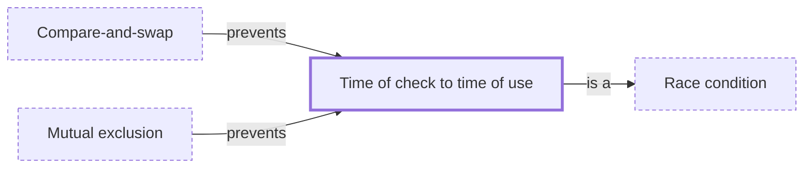

# Time of check to time of use

**Category:** [Hazards](../README.md) · **Status:** stub · **Lessons:** [chapter 02, Shared state](../../../02_Shared_State/README.md)

**One line:** Checking a condition and then acting on it as two separate steps, so that the condition can change in between — the classic check-then-act race.

Also called: TOCTOU, TOCTTOU, check-then-act.

## How it connects

- **Is a kind of:** [Race condition](../race_condition/README.md)
- **Is prevented by:** [Compare-and-swap](../../lock_free/compare_and_swap/README.md), [Mutual exclusion](../../synchronization/mutual_exclusion/README.md)

## In each language

| | |
|---|---|
| Rust | [`Path::exists` ↗](https://doc.rust-lang.org/std/path/struct.Path.html#method.exists) warns of TOCTOU bugs, and says `try_exists` cannot prevent them either |
| C | [`fopen` ↗](https://en.cppreference.com/w/c/io/fopen): the `x` flag makes `w` fail if the file already exists, so the check and the create are one step |
| C++ | [`std::ios_base::noreplace` ↗](https://en.cppreference.com/w/cpp/io/ios_base/openmode) (C++23) opens a file in exclusive mode |
| Java | [`Files.createFile` ↗](https://docs.oracle.com/en/java/javase/25/docs/api/java.base/java/nio/file/Files.html) checks for the file and creates it as a single atomic operation; `ConcurrentHashMap.putIfAbsent` does the same for a map entry |
| Python | [`os.access` ↗](https://docs.python.org/3/library/os.html#os.access) warns that checking before `open()` creates a security hole in the interval between the two |
| The operating system | [access(2) ↗](https://man7.org/linux/man-pages/man2/access.2.html) gives the same warning: the time between checking and `open(2)` can be exploited |

## Where to read more

- **In this library:** [Why is checking and then acting two steps too many?](../../../02_Shared_State/check_then_act/README.md)
- **In this library:** [How does initialization run exactly once with many threads racing to it?](../../../04_Waiting_For_Each_Other/run_exactly_once/README.md)
- **Notes:** [time of check to time of use bug (TOCTTOU) ↗](https://docs.google.com/document/d/1M9GFwMOuS4nCwMJugYkKT4fgPxCGEJbNvLidA-xOxH8/edit?tab=t.0)
- **Reference:** [Wikipedia: Time-of-check to time-of-use ↗](https://en.wikipedia.org/wiki/Time-of-check_to_time-of-use)

<!-- Generated above this line by tools/build_concepts.py from TOML data — edit the data, not the page. Hand-written notes go below it and are kept. -->
