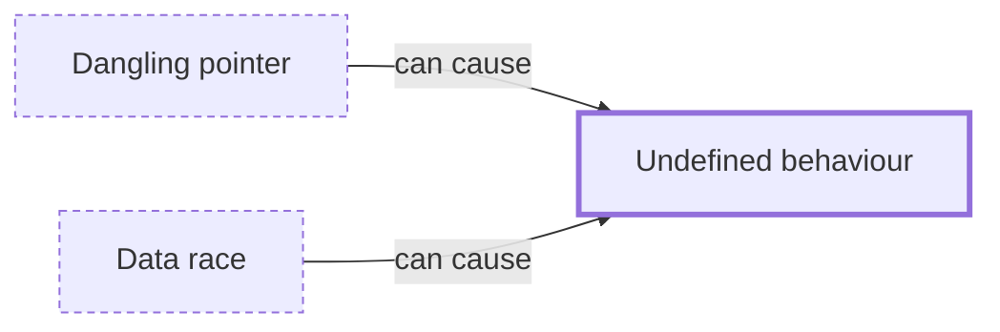

# Undefined behaviour

**Category:** [Hazards](../README.md) · **Status:** stub · **Lessons:** [chapter 02, Shared state](../../../02_Shared_State/README.md)

**One line:** A program the language standard stops describing: once it has one, no requirement is placed on what it does, so a right answer on this build is not evidence of anything.

Also called: UB, undefined behavior.

## How it connects

- **Can be caused by:** [Dangling pointer](../dangling_pointer/README.md), [Data race](../data_race/README.md)
- **See also:** [Heisenbug](../heisenbug/README.md), [Weak memory models and reordering](../weak_memory_model/README.md)

## In each language

| | |
|---|---|
| Rust | [Behavior considered undefined ↗](https://doc.rust-lang.org/reference/behavior-considered-undefined.html) lists what `unsafe` code must not do; safe code cannot reach any of it |
| Go | There is none of this kind for a racing program: the [memory model ↗](https://go.dev/ref/mem) defines what a racy read may observe rather than abandoning the program |
| C | [Undefined behaviour ↗](https://en.cppreference.com/w/c/language/behavior): the standard imposes no requirements, and a data race or a dead-frame read is one |
| C++ | [Undefined behaviour ↗](https://en.cppreference.com/w/cpp/language/ub), with the same consequence |
| Java | Also none: [JLS 17.4 ↗](https://docs.oracle.com/javase/specs/jls/se25/html/jls-17.html#jls-17.4) gives unsynchronized reads weak guarantees, not undefined ones |

## Where to read more

- **In this library:** [Data race or race condition?](../../../02_Shared_State/data_race_or_race_condition/README.md)
- **In this library:** [Can a thread borrow a local variable?](../../../01_Threads/lending_a_local_to_a_thread/README.md)
- **Reference:** [Wikipedia: Undefined behavior ↗](https://en.wikipedia.org/wiki/Undefined_behavior)

<!-- Generated above this line by tools/build_concepts.py from TOML data — edit the data, not the page. Hand-written notes go below it and are kept. -->
