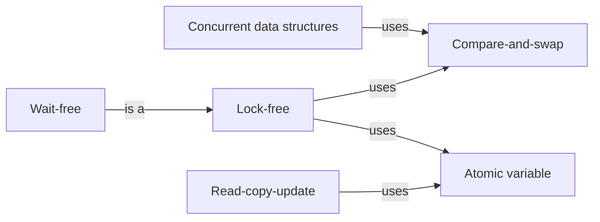

# Lock-free

Sharing without locks: atomic operations, the algorithms built on them, and the memory rules that decide what one thread can see of another's writes.

[All categories](../README.md) · [How they connect](../schema/README.md)

- [Atomic variable](atomic_variable/README.md) — A number or pointer whose reads, writes and increments each happen as one indivisible CPU operation, so threads can share it without a lock.
- [Compare-and-swap](compare_and_swap/README.md) — Replace a value only if it still holds what you last read, in one atomic step; if another thread changed it first, read again and retry.
- [Lock-free](lock_free/README.md) — A progress guarantee for a shared data structure: however the threads are scheduled, some thread always completes an operation, and there is no lock to deadlock on.
    - [Wait-free](wait_free/README.md) — Stronger than lock-free: every thread finishes its own operation in a bounded number of its own steps, whatever the other threads do.
- [Read-copy-update](rcu/README.md) — Readers use shared data without any lock while a writer publishes a modified copy, and the old version is freed only after every reader that might still see it has finished.
- [Happens-before](happens_before/README.md) — The rule a memory model states for when one thread is guaranteed to see another thread's write: only when synchronization orders the write before the read.
- [Hazard pointers](hazard_pointers/README.md) — Each thread publishes the pointers it is about to use, and memory is freed only when no thread has it published — safe memory reclamation for lock-free data structures.
- [Transactional memory](transactional_memory/README.md) — Running a block of memory reads and writes as a transaction that either commits atomically or rolls back and retries, instead of taking locks.
- [Concurrent data structures](concurrent_data_structures/README.md) — Queues, maps, stacks and lists built to be used by many threads at once — with locks inside, lock-free algorithms, or both — so that their callers need no synchronization of their own.

## Inside this category

<!-- Generated above this line by tools/build_concepts.py from TOML data — edit the data, not the page. Hand-written notes go below it and are kept. -->
