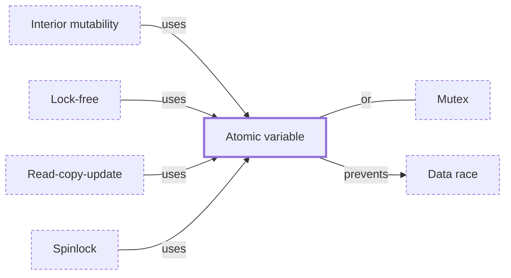

# Atomic variable

**Category:** [Lock-free](../README.md) · **Status:** stub · **Lessons:** chapter 02, Shared state *(planned)*

**One line:** A number or pointer whose reads, writes and increments each happen as one indivisible CPU operation, so threads can share it without a lock.

Also called: atomics, atomic integer, Interlocked.

## How it connects

- **Is used by:** [Interior mutability](../../safety_in_languages/interior_mutability/README.md), [Lock-free](../lock_free/README.md), [Read-copy-update](../rcu/README.md), [Spinlock](../../synchronization/spinlock/README.md)
- **Helps prevent:** [Data race](../../hazards/data_race/README.md)
- **An alternative to:** [Mutex](../../synchronization/mutex/README.md)
- **See also:** [Compare-and-swap](../compare_and_swap/README.md), [Concurrency primitives](../../foundations/concurrency_primitives/README.md)

## In each language

| | |
|---|---|
| Rust | [`std::sync::atomic` ↗](https://doc.rust-lang.org/std/sync/atomic/index.html): `AtomicBool`, `AtomicUsize`, `AtomicPtr` and more, each taking an `Ordering`; not every platform has every type |
| Go | [`sync/atomic` ↗](https://pkg.go.dev/sync/atomic) typed values such as `atomic.Int64`, `atomic.Bool` and `atomic.Pointer`, added in Go 1.19 |
| C | [`_Atomic` and `<stdatomic.h>` ↗](https://en.cppreference.com/w/c/atomic) (C11); a compiler that defines `__STDC_NO_ATOMICS__` does not provide them |
| C++ | [`std::atomic<T>` ↗](https://en.cppreference.com/w/cpp/atomic/atomic) for integers, pointers and other trivially copyable types |
| Java | [`AtomicInteger` ↗](https://docs.oracle.com/en/java/javase/25/docs/api/java.base/java/util/concurrent/atomic/AtomicInteger.html) and the rest of [`java.util.concurrent.atomic` ↗](https://docs.oracle.com/en/java/javase/25/docs/api/java.base/java/util/concurrent/atomic/package-summary.html) |
| C# | [`Interlocked` ↗](https://learn.microsoft.com/en-us/dotnet/api/system.threading.interlocked) provides atomic operations for variables shared by multiple threads |
| JavaScript | [`Atomics` ↗](https://developer.mozilla.org/en-US/docs/Web/JavaScript/Reference/Global_Objects/Atomics) operations on typed arrays over a `SharedArrayBuffer` |
| Swift | [`Atomic` ↗](https://developer.apple.com/documentation/synchronization/atomic) in the Synchronization module |
| Haskell | [`atomicModifyIORef'` ↗](https://hackage.haskell.org/package/base/docs/Data-IORef.html) modifies an `IORef` atomically; plain `modifyIORef` is not atomic |

## Where to read more

- **In a sibling library:** [Rust: RwLock and atomics ↗](https://masiarek.github.io/rust-learning-library/09_Advanced/rwlock_and_atomics/index.html)
- **In a sibling library:** [Go: Atomic counters ↗](https://masiarek.github.io/go-learning-library/04_Sync/atomic_counters/index.html)
- **In the books:** [*Learn Concurrent Programming with Go*](../../../10_Resources/books_go/README.md#cutajar_learn_concurrent_programming_with_go), James Cutajar — ch. 12, 'Atomics, spin locks, and futexes'
- **In the books:** [*Rust Atomics and Locks*](../../../10_Resources/books_rust/README.md#bos_rust_atomics_and_locks), Mara Bos — ch. 2, 'Atomics'
- **In the books:** [*C++ Concurrency in Action*](../../../10_Resources/books_cpp/README.md#williams_cpp_concurrency_in_action), Anthony Williams — ch. 5, 'The C++ memory model and operations on atomic types'
- **In the books:** [*Java Concurrency in Practice*](../../../10_Resources/books_java/README.md#goetz_java_concurrency_in_practice), Brian Goetz, Tim Peierls, Joshua Bloch, Joseph Bowbeer, David Holmes, Doug Lea — ch. 15, 'Atomic Variables and Nonblocking Synchronization'
- **In the books:** [*Effective Concurrency in Go*](../../../10_Resources/books_go/README.md#serdar_effective_concurrency_in_go), Burak Serdar — ch. 9, 'Atomic Memory Operations'
- **In the books:** [*Hands-On Concurrency with Rust*](../../../10_Resources/books_rust/README.md#troutwine_hands_on_concurrency_with_rust), Brian L. Troutwine — ch. 6, 'Atomics – the Primitives of Synchronization'
- **Notes:** [Atomics - general ↗](https://docs.google.com/document/d/19N4Ry_RnheXiRNwdKV3n-xSuURTGSHRVLGxkmzVFNoE/edit?tab=t.0)
- **Notes:** [Atomics and Memory Ordering - crust of rust YouTube ↗](https://docs.google.com/document/d/1Jh73kXIDbkYt9NK3ogTXUuqwkCdu5KAh1Z2edHf1B2A/edit?tab=t.0)
- **Notes:** [missing atomic float - rust ↗](https://docs.google.com/document/d/1wa9j22J8FAkSLn3tBiVkEKZ8DGywoYxlvP3MZHZlHu8/edit?tab=t.0)
- **Notes:** [arc - box - atomics - rust ↗](https://docs.google.com/document/d/1KIy8e1NDtGrNfAfzoS_mRsfAzEzS-RwKzpE9Zh4y0SM/edit?tab=t.0)
- **Reference:** [Wikipedia: Linearizability — primitive atomic instructions ↗](https://en.wikipedia.org/wiki/Linearizability#Primitive_atomic_instructions)

<!-- Generated above this line by tools/build_concepts.py from TOML data — edit the data, not the page. Hand-written notes go below it and are kept. -->
