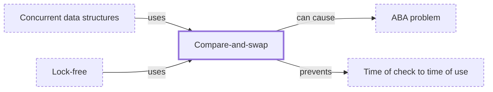

# Compare-and-swap

**Category:** [Lock-free](../README.md) · **Status:** stub · **Lessons:** [chapter 02, Shared state](../../../02_Shared_State/README.md)

**One line:** Replace a value only if it still holds what you last read, in one atomic step; if another thread changed it first, read again and retry.

Also called: CAS, compare-exchange, compare-and-set.

## How it connects

- **Is used by:** [Concurrent data structures](../concurrent_data_structures/README.md), [Lock-free](../lock_free/README.md)
- **Helps prevent:** [Time of check to time of use](../../hazards/toctou/README.md)
- **Can lead to:** [ABA problem](../../hazards/aba_problem/README.md)
- **See also:** [Atomic variable](../atomic_variable/README.md)

## In each language

| | |
|---|---|
| Rust | [`compare_exchange` ↗](https://doc.rust-lang.org/std/sync/atomic/struct.Atomic.html#method.compare_exchange), and [`compare_exchange_weak` ↗](https://doc.rust-lang.org/std/sync/atomic/struct.Atomic.html#method.compare_exchange_weak), which may fail spuriously even when the comparison succeeds |
| Go | [`CompareAndSwap` ↗](https://pkg.go.dev/sync/atomic#Int64.CompareAndSwap) on the typed values, returning whether it swapped |
| C | [`atomic_compare_exchange_strong` and `atomic_compare_exchange_weak` ↗](https://en.cppreference.com/w/c/atomic/atomic_compare_exchange); the weak forms may fail spuriously |
| C++ | [`compare_exchange_strong` and `compare_exchange_weak` ↗](https://en.cppreference.com/w/cpp/atomic/atomic/compare_exchange); the weak one may fail spuriously |
| Java | [`AtomicInteger.compareAndSet` ↗](https://docs.oracle.com/en/java/javase/25/docs/api/java.base/java/util/concurrent/atomic/AtomicInteger.html) and its siblings in `java.util.concurrent.atomic` |
| C# | [`Interlocked.CompareExchange` ↗](https://learn.microsoft.com/en-us/dotnet/api/system.threading.interlocked.compareexchange) compares two values and, if they are equal, replaces one as an atomic operation |
| JavaScript | [`Atomics.compareExchange` ↗](https://developer.mozilla.org/en-US/docs/Web/JavaScript/Reference/Global_Objects/Atomics/compareExchange) on a shared typed array |
| Swift | [`Atomic.compareExchange(expected:desired:ordering:)` ↗](https://developer.apple.com/documentation/synchronization/atomic) |

## Where to read more

- **In this library:** [The lost update in a database](../../../02_Shared_State/the_lost_update_in_a_database/README.md)
- **In a sibling library:** [Go: Atomic counters ↗](https://masiarek.github.io/go-learning-library/04_Sync/atomic_counters/index.html)
- **In the books:** [*Effective Concurrency in Go*](../../../10_Resources/books_go/README.md#serdar_effective_concurrency_in_go), Burak Serdar — ch. 9, 'Atomic Memory Operations' → 'Compare and swap'
- **In the books:** [*Rust Atomics and Locks*](../../../10_Resources/books_rust/README.md#bos_rust_atomics_and_locks), Mara Bos — ch. 2, 'Atomics' → 'Compare-and-Exchange Operations'
- **In the books:** [*Concurrent Programming: Algorithms, Principles, and Foundations*](../../../10_Resources/books_general/README.md#raynal_concurrent_programming_algorithms), Michel Raynal — ch. 17, 'The Alpha(s) and Omega of Consensus: Failure Detector-Based Consensus' → 'De-constructing Compare&Swap'
- **In the books:** [*The Art of Multiprocessor Programming*](../../../10_Resources/books_general/README.md#herlihy_shavit_art_of_multiprocessor_programming), Maurice Herlihy, Nir Shavit — ch. 5, 'The Relative Power of Primitive Synchronization Operations' → 'The compareAndSet() Operation'
- **Notes:** [atomic compare-and-swap (CAS) operations ↗](https://docs.google.com/document/d/1FxQ7O2Pcg9ZTxd_eKfJnS4mwyp7ydfv7Sv2mydqeCgI/edit?tab=t.0)
- **Reference:** [Wikipedia: Compare-and-swap ↗](https://en.wikipedia.org/wiki/Compare-and-swap)

<!-- Generated above this line by tools/build_concepts.py from TOML data — edit the data, not the page. Hand-written notes go below it and are kept. -->
