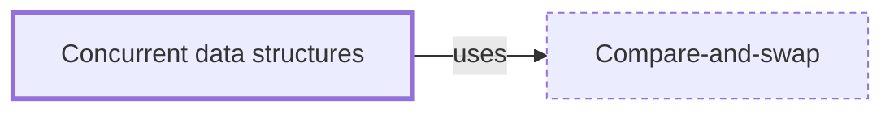

# Concurrent data structures

**Category:** [Lock-free](../README.md) · **Status:** stub · **Lessons:** [chapter 02, Shared state](../../../02_Shared_State/README.md)

**One line:** Queues, maps, stacks and lists built to be used by many threads at once — with locks inside, lock-free algorithms, or both — so that their callers need no synchronization of their own.

Also called: concurrent collections, thread-safe containers, ConcurrentHashMap.

## How it connects

- **Is built on:** [Compare-and-swap](../compare_and_swap/README.md)
- **See also:** [Hazard pointers](../hazard_pointers/README.md), [Lock-free](../lock_free/README.md), [Thread safety](../../safety_in_languages/thread_safety/README.md)

## In each language

| | |
|---|---|
| Rust | none in the standard library besides channels; [`crossbeam::queue` ↗](https://docs.rs/crossbeam/latest/crossbeam/queue/index.html) has lock-free queues |
| Go | [`sync.Map` ↗](https://pkg.go.dev/sync#Map), meant for keys that are written once and read many times; a plain map needs its own mutex |
| Java | [`ConcurrentHashMap` ↗](https://docs.oracle.com/en/java/javase/25/docs/api/java.base/java/util/concurrent/ConcurrentHashMap.html) and the other collections in `java.util.concurrent` |
| Python | [`queue.Queue` ↗](https://docs.python.org/3/library/queue.html), whose classes implement all the required locking |
| C# | [`System.Collections.Concurrent` ↗](https://learn.microsoft.com/en-us/dotnet/api/system.collections.concurrent): `ConcurrentDictionary`, `ConcurrentQueue`, `BlockingCollection` |

## Where to read more

- **In the books:** [*C++ Concurrency in Action*](../../../10_Resources/books_cpp/README.md#williams_cpp_concurrency_in_action), Anthony Williams — ch. 6, 'Designing lock-based concurrent data structures'
- **In the books:** [*Java Concurrency in Practice*](../../../10_Resources/books_java/README.md#goetz_java_concurrency_in_practice), Brian Goetz, Tim Peierls, Joshua Bloch, Joseph Bowbeer, David Holmes, Doug Lea — ch. 5, 'Building Blocks' → 'Concurrent Collections'
- **In the books:** [*The Art of Multiprocessor Programming*](../../../10_Resources/books_general/README.md#herlihy_shavit_art_of_multiprocessor_programming), Maurice Herlihy, Nir Shavit — ch. 3, 'Concurrent Objects'
- **In the books:** [*Concurrency with Modern C++*](../../../10_Resources/books_cpp/README.md#grimm_concurrency_with_modern_cpp), Rainer Grimm — ch. 11, 'Lock-Based Data Structures'
- **In the books:** [*Concurrent Programming on Windows*](../../../10_Resources/books_csharp_dotnet/README.md#duffy_concurrent_programming_on_windows), Joe Duffy — ch. 12, 'Parallel Containers'
- **In the books:** [*Rust Atomics and Locks*](../../../10_Resources/books_rust/README.md#bos_rust_atomics_and_locks), Mara Bos — ch. 10, 'Ideas and Inspiration' → 'Lock-Free Linked List'
- **Reference:** [Wikipedia: Concurrent data structure ↗](https://en.wikipedia.org/wiki/Concurrent_data_structure)

<!-- Generated above this line by tools/build_concepts.py from TOML data — edit the data, not the page. Hand-written notes go below it and are kept. -->
