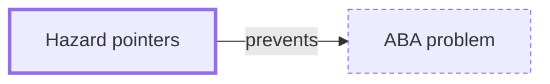

# Hazard pointers

**Category:** [Lock-free](../README.md) · **Status:** stub

**One line:** Each thread publishes the pointers it is about to use, and memory is freed only when no thread has it published — safe memory reclamation for lock-free data structures.

Also called: safe memory reclamation.

## How it connects

- **Helps prevent:** [ABA problem](../../hazards/aba_problem/README.md)
- **See also:** [Concurrent data structures](../concurrent_data_structures/README.md), [Lock-free](../lock_free/README.md), [Read-copy-update](../rcu/README.md)

## In each language

| | |
|---|---|
| C++ | [`<hazard_pointer>` ↗](https://en.cppreference.com/w/cpp/header/hazard_pointer) (C++26): `hazard_pointer_obj_base`, `hazard_pointer` and `make_hazard_pointer` |

## Where to read more

- **In this library:** [Can a compare-and-swap succeed when it should have failed?](../../../02_Shared_State/the_aba_problem/README.md)
- **In the books:** [*Hands-On Concurrency with Rust*](../../../10_Resources/books_rust/README.md#troutwine_hands_on_concurrency_with_rust), Brian L. Troutwine — ch. 7, 'Atomics – Safely Reclaiming Memory'
- **In the books:** [*The Art of Multiprocessor Programming*](../../../10_Resources/books_general/README.md#herlihy_shavit_art_of_multiprocessor_programming), Maurice Herlihy, Nir Shavit — ch. 10, 'Concurrent Queues and the ABA Problem' → 'Memory Reclamation and the ABA Problem'
- **Reference:** [Wikipedia: Hazard pointer ↗](https://en.wikipedia.org/wiki/Hazard_pointer)

<!-- Generated above this line by tools/build_concepts.py from TOML data — edit the data, not the page. Hand-written notes go below it and are kept. -->
