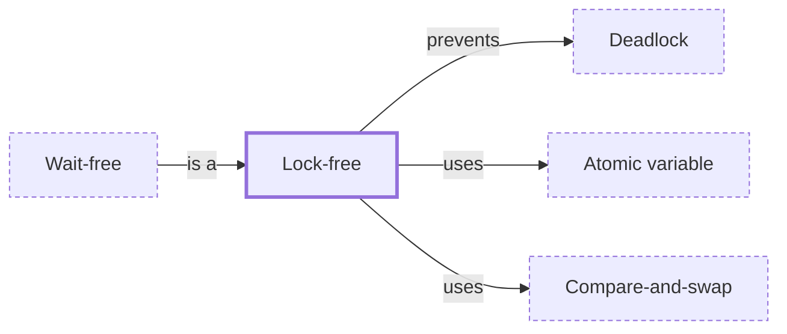

# Lock-free

**Category:** [Lock-free](../README.md) · **Status:** stub

**One line:** A progress guarantee for a shared data structure: however the threads are scheduled, some thread always completes an operation, and there is no lock to deadlock on.

Also called: non-blocking algorithm, lockless.

## How it connects

- **Kinds:** [Wait-free](../wait_free/README.md)
- **Is built on:** [Atomic variable](../atomic_variable/README.md), [Compare-and-swap](../compare_and_swap/README.md)
- **Helps prevent:** [Deadlock](../../hazards/deadlock/README.md)
- **See also:** [Concurrent data structures](../concurrent_data_structures/README.md), [Hazard pointers](../hazard_pointers/README.md)

## In each language

| | |
|---|---|
| Rust | [Portability ↗](https://doc.rust-lang.org/std/sync/atomic/index.html#portability): every atomic type in `std::sync::atomic` is guaranteed lock-free if it is available at all |
| C | [`ATOMIC_INT_LOCK_FREE` and its siblings ↗](https://en.cppreference.com/w/c/atomic/ATOMIC_LOCK_FREE_consts) say whether each atomic type is never, sometimes or always lock-free |
| C++ | [`std::atomic<T>::is_always_lock_free` ↗](https://en.cppreference.com/w/cpp/atomic/atomic/is_always_lock_free) (C++17); only [`std::atomic_flag` ↗](https://en.cppreference.com/w/cpp/atomic/atomic_flag) is guaranteed lock-free |
| Java | [`ConcurrentLinkedQueue` ↗](https://docs.oracle.com/en/java/javase/25/docs/api/java.base/java/util/concurrent/ConcurrentLinkedQueue.html) uses the non-blocking algorithm of Michael and Scott |

## Where to read more

- **In this library:** [Can a compare-and-swap succeed when it should have failed?](../../../02_Shared_State/the_aba_problem/README.md)
- **In this library:** [Can every interleaving of a small program be checked?](../../../09_Testing_and_Tools/model_checking_a_small_program/README.md)
- **In the books:** [*C++ Concurrency in Action*](../../../10_Resources/books_cpp/README.md#williams_cpp_concurrency_in_action), Anthony Williams — ch. 7, 'Designing lock-free concurrent data structures'
- **In the books:** [*Java Concurrency in Practice*](../../../10_Resources/books_java/README.md#goetz_java_concurrency_in_practice), Brian Goetz, Tim Peierls, Joshua Bloch, Joseph Bowbeer, David Holmes, Doug Lea — ch. 15, 'Atomic Variables and Nonblocking Synchronization'
- **In the books:** [*Concurrent Programming on Windows*](../../../10_Resources/books_csharp_dotnet/README.md#duffy_concurrent_programming_on_windows), Joe Duffy — ch. 10, 'Memory Models and Lock Freedom'
- **In the books:** [*Python Concurrency with asyncio*](../../../10_Resources/books_python/README.md#fowler_python_concurrency_with_asyncio), Matthew Fowler — ch. 5, 'Non-blocking database drivers'
- **In the books:** [*Concurrent Programming: Algorithms, Principles, and Foundations*](../../../10_Resources/books_general/README.md#raynal_concurrent_programming_algorithms), Michel Raynal — ch. 5, 'Mutex-Free Concurrent Objects'
- **In the books:** [*Learn Concurrent Programming with Go*](../../../10_Resources/books_go/README.md#cutajar_learn_concurrent_programming_with_go), James Cutajar — ch. 12, 'Atomics, spin locks, and futexes' → 'Lock-free synchronization with atomic variables'
- **Notes:** [Lock-Free - lock free ↗](https://docs.google.com/document/u/0/d/1i3FtfE2Tk77Md2ZeAK_p1Yqb7-vOzD6-ZKsdU9a4B7s/edit)
- **Notes:** [lock free vs wait free - rust ↗](https://docs.google.com/document/u/0/d/10HQckWXsY1XC1KCZ0ngQoGs5rkl-PScRv_Bust5hmYo/edit)
- **Notes:** [lockless concurrent programming ↗](https://docs.google.com/document/d/1zCP7ek5zcb6W5tERQNRPMlC-_zgAjU6LpQnuU4Wmt00/edit?tab=t.0)
- **Reference:** [Wikipedia: Non-blocking algorithm ↗](https://en.wikipedia.org/wiki/Non-blocking_algorithm)

<!-- Generated above this line by tools/build_concepts.py from TOML data — edit the data, not the page. Hand-written notes go below it and are kept. -->
