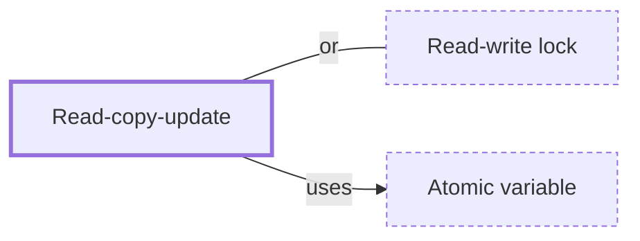

# Read-copy-update

**Category:** [Lock-free](../README.md) · **Status:** stub

**One line:** Readers use shared data without any lock while a writer publishes a modified copy, and the old version is freed only after every reader that might still see it has finished.

Also called: RCU, copy-on-write.

## How it connects

- **Is built on:** [Atomic variable](../atomic_variable/README.md)
- **An alternative to:** [Read-write lock](../../synchronization/read_write_lock/README.md)
- **See also:** [Hazard pointers](../hazard_pointers/README.md)

## In each language

| | |
|---|---|
| Go | The [`atomic.Value` ↗](https://pkg.go.dev/sync/atomic#Value) docs keep a frequently read, rarely updated map with a copy-on-write idiom |
| C++ | [`<rcu>` ↗](https://en.cppreference.com/w/cpp/header/rcu) (C++26): `rcu_obj_base`, `rcu_domain`, `rcu_synchronize` and `rcu_retire` |
| Java | [`CopyOnWriteArrayList` ↗](https://docs.oracle.com/en/java/javase/25/docs/api/java.base/java/util/concurrent/CopyOnWriteArrayList.html) makes a fresh copy of the underlying array for every mutation |
| The operating system | Linux kernel [RCU ↗](https://docs.kernel.org/RCU/whatisRCU.html), optimized for read-mostly data: an update frees the old version after a grace period |

## Where to read more

- **In the books:** [*Rust Atomics and Locks*](../../../10_Resources/books_rust/README.md#bos_rust_atomics_and_locks), Mara Bos — ch. 10, 'Ideas and Inspiration' → 'RCU'
- **Reference:** [Wikipedia: Read-copy-update ↗](https://en.wikipedia.org/wiki/Read-copy-update)

<!-- Generated above this line by tools/build_concepts.py from TOML data — edit the data, not the page. Hand-written notes go below it and are kept. -->
