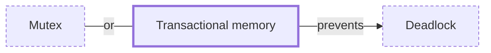

# Transactional memory

**Category:** [Lock-free](../README.md) · **Status:** stub

**One line:** Running a block of memory reads and writes as a transaction that either commits atomically or rolls back and retries, instead of taking locks.

Also called: STM, software transactional memory.

## How it connects

- **Helps prevent:** [Deadlock](../../hazards/deadlock/README.md)
- **An alternative to:** [Mutex](../../synchronization/mutex/README.md)
- **See also:** [Concurrency models](../../foundations/concurrency_models/README.md), [Multi-version concurrency control](../../distributed/mvcc/README.md)

## In each language

| | |
|---|---|
| C++ | The experimental [Transactional Memory TS ↗](https://en.cppreference.com/w/cpp/language/transactional_memory): `synchronized` blocks run as if under a global lock, atomic blocks run as transactions |
| Haskell | [`Control.Monad.STM` ↗](https://hackage.haskell.org/package/stm/docs/Control-Monad-STM.html): `atomically` runs a series of STM actions as one transaction, and `retry` abandons it when the `TVar` values it has seen mean it should not continue |
| Elsewhere | Clojure [refs ↗](https://clojure.org/reference/refs) share mutable storage locations safely through software transactional memory |

## Where to read more

- **In the books:** [*Programming Concurrency on the JVM*](../../../10_Resources/books_java/README.md#subramaniam_programming_concurrency_on_the_jvm), Venkat Subramaniam — ch. 6, 'Introduction to Software Transactional Memory'
- **In the books:** [*Learning Concurrent Programming in Scala*](../../../10_Resources/books_scala_jvm_functional/README.md#prokopec_learning_concurrent_programming_in_scala), Aleksandar Prokopec — ch. 7, 'Software Transactional Memory'
- **In the books:** [*Parallel and Concurrent Programming in Haskell*](../../../10_Resources/books_haskell/README.md#marlow_parallel_and_concurrent_programming_in_haskell), Simon Marlow — ch. 10, 'Software Transactional Memory'
- **In the books:** [*Concurrent Programming: Algorithms, Principles, and Foundations*](../../../10_Resources/books_general/README.md#raynal_concurrent_programming_algorithms), Michel Raynal — ch. 10, 'Transactional Memory'
- **In the books:** [*The Art of Multiprocessor Programming*](../../../10_Resources/books_general/README.md#herlihy_shavit_art_of_multiprocessor_programming), Maurice Herlihy, Nir Shavit — ch. 18, 'Transactional Memory'
- **In the books:** [*Concurrency with Modern C++*](../../../10_Resources/books_cpp/README.md#grimm_concurrency_with_modern_cpp), Rainer Grimm — ch. 6, 'The Future: C++20/23' → 'Transactional Memory'
- **Reference:** [Wikipedia: Software transactional memory ↗](https://en.wikipedia.org/wiki/Software_transactional_memory)

<!-- Generated above this line by tools/build_concepts.py from TOML data — edit the data, not the page. Hand-written notes go below it and are kept. -->
