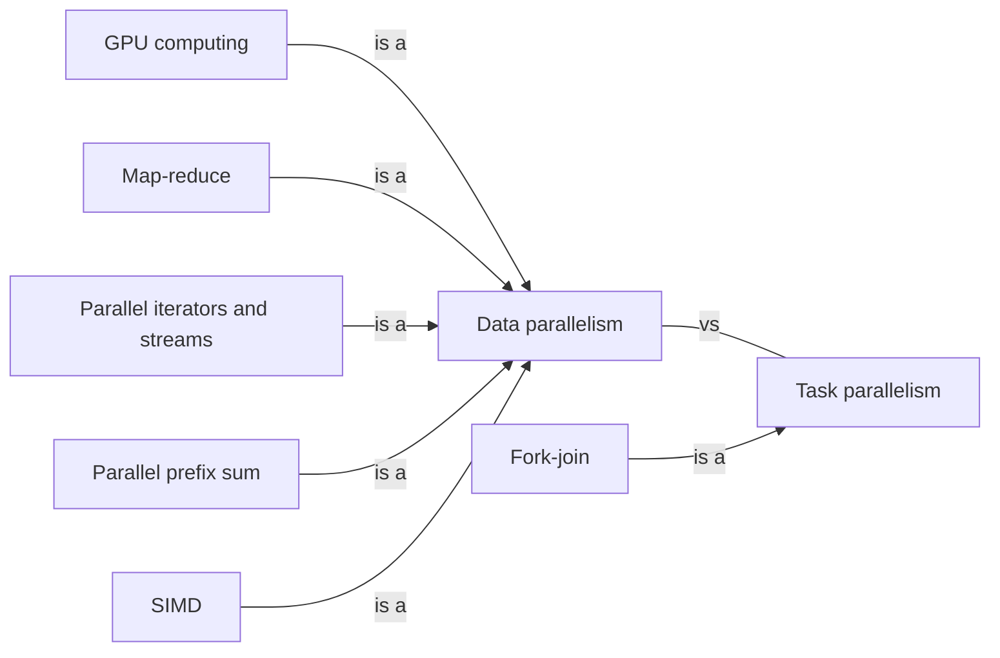

# Parallelism

Using more cores to finish sooner: splitting data and work across them, and the hardware facts that decide whether it helps.

[All categories](../README.md) · [How they connect](../schema/README.md)

- [Data parallelism](data_parallelism/README.md) — The same operation applied to many pieces of data at once, each piece on its own core or vector lane.
    - [Map-reduce](map_reduce/README.md) — Apply a function to every item independently, then combine the results with an associative operation, so that both halves can be split across workers.
    - [Parallel prefix sum](parallel_prefix_sum/README.md) — Computing every running total of a sequence in a number of rounds that grows with the logarithm of its length — a building block of many data-parallel algorithms.
    - [Parallel iterators and streams](parallel_iterators/README.md) — A library that spreads an iterator's work over a thread pool with one method call — Rayon's `par_iter`, Java's `parallelStream`.
    - [SIMD](simd/README.md) — One CPU instruction applied to several numbers at once: parallelism inside a single core.
    - [GPU computing](gpu_computing/README.md) — Running thousands of small data-parallel computations on a graphics processor instead of the CPU.
- [Task parallelism](task_parallelism/README.md) — Different tasks, possibly doing different things, running at the same time on different cores.
    - [Fork-join](fork_join/README.md) — Split a task into subtasks, run them in parallel, wait for all of them and combine their results — recursively, until the pieces are small enough to do directly.
- [OpenMP](openmp/README.md) — Compiler directives and a runtime that parallelize loops and sections of C, C++ and Fortran programs over shared memory.
- [MPI](mpi/README.md) — The Message Passing Interface: separate processes, often on separate machines, exchanging messages — the standard for distributed-memory parallel programs.
- [NUMA](numa/README.md) — Non-uniform memory access: on a multi-socket machine some memory is closer to some cores, so where a thread runs changes how fast its memory is.
- [Simultaneous multithreading](smt/README.md) — One physical core presenting two or more logical cores to the operating system, sharing its execution resources between them.
- [Cache coherence](cache_coherence/README.md) — Keeping several cached copies of the same data consistent when one of them is written — done in hardware between a CPU's cores, at a cost that false sharing exposes.
- [Global interpreter lock](gil/README.md) — A lock that lets only one thread run interpreter code at a time — CPython's, and Ruby's — so threads give concurrency but not CPU parallelism; CPython 3.13 added an optional build without it.
- [Multiprocessing](multiprocessing/README.md) — Using several processes instead of several threads — for isolation, or to get parallelism in a runtime whose threads share one global lock.
- [Parallel algorithms](parallel_algorithms/README.md) — Sorting, searching, graph and numeric algorithms rebuilt so that their work splits across cores — not always by the obvious split.

## Inside this category

<!-- Generated above this line by tools/build_concepts.py from TOML data — edit the data, not the page. Hand-written notes go below it and are kept. -->
