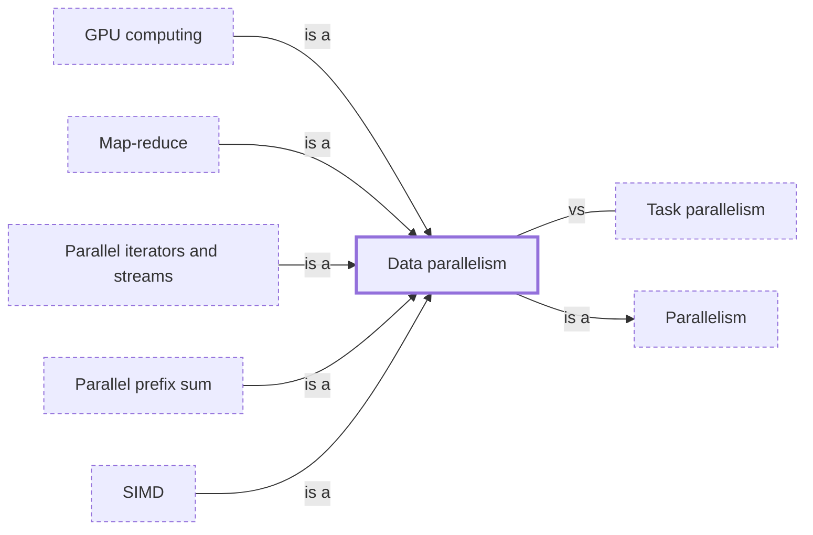

# Data parallelism

**Category:** [Parallelism](../README.md) · **Status:** stub · **Lessons:** chapter 07, Parallelism *(planned)*

**One line:** The same operation applied to many pieces of data at once, each piece on its own core or vector lane.

## How it connects

- **Is a kind of:** [Parallelism](../../foundations/parallelism/README.md)
- **Kinds:** [GPU computing](../gpu_computing/README.md), [Map-reduce](../map_reduce/README.md), [Parallel iterators and streams](../parallel_iterators/README.md), [Parallel prefix sum](../parallel_prefix_sum/README.md), [SIMD](../simd/README.md)
- **Often confused with:** [Task parallelism](../task_parallelism/README.md)
- **See also:** [Concurrency models](../../foundations/concurrency_models/README.md), [Parallel algorithms](../parallel_algorithms/README.md)

## In each language

| | |
|---|---|
| Rust | Rayon's [parallel iterators ↗](https://docs.rs/rayon/latest/rayon/iter/index.html); the standard library offers only [`thread::scope` ↗](https://doc.rust-lang.org/std/thread/fn.scope.html) |
| C++ | [`std::execution::par` ↗](https://en.cppreference.com/w/cpp/algorithm/execution_policy_tag_t) (C++17) on a standard algorithm, or `par_unseq` to allow vectorization as well |
| Java | [Parallel streams ↗](https://docs.oracle.com/en/java/javase/25/docs/api/java.base/java/util/stream/package-summary.html#Parallelism) |
| Python | [`multiprocessing.Pool.map` ↗](https://docs.python.org/3/library/multiprocessing.html#multiprocessing.pool.Pool.map) |
| C# | [Data parallelism ↗](https://learn.microsoft.com/en-us/dotnet/standard/parallel-programming/data-parallelism-task-parallel-library) with `Parallel.For` and `Parallel.ForEach` |
| Swift | [`DispatchQueue.concurrentPerform` ↗](https://developer.apple.com/documentation/dispatch/dispatchqueue/concurrentperform%28iterations:execute:%29) runs a block the given number of times, balanced across cores |
| Haskell | [`parMap` ↗](https://hackage.haskell.org/package/parallel/docs/Control-Parallel-Strategies.html#v:parMap) in the `parallel` package |

## Where to read more

- **In a sibling library:** [Go: Fan-out, fan-in ↗](https://masiarek.github.io/go-learning-library/06_Patterns/fan_out_fan_in/index.html)
- **In the books:** [*Data Parallel C++*](../../../10_Resources/books_cpp/README.md#reinders_data_parallel_cpp), James Reinders, Ben Ashbaugh, James Brodman, Michael Kinsner, John Pennycook, Xinmin Tian — ch. 4, 'Expressing Parallelism'
- **In the books:** [*Learning Concurrent Programming in Scala*](../../../10_Resources/books_scala_jvm_functional/README.md#prokopec_learning_concurrent_programming_in_scala), Aleksandar Prokopec — ch. 5, 'Data-Parallel Collections'
- **In the books:** [*Parallel and Concurrent Programming in Haskell*](../../../10_Resources/books_haskell/README.md#marlow_parallel_and_concurrent_programming_in_haskell), Simon Marlow — ch. 4, 'Dataflow Parallelism: The Par Monad'
- **In the books:** [*Concurrency in .NET*](../../../10_Resources/books_csharp_dotnet/README.md#terrell_concurrency_in_dotnet), Riccardo Terrell — ch. 4, 'The basics of processing big data: data parallelism, part 1'
- **In the books:** [*Seven Concurrency Models in Seven Weeks*](../../../10_Resources/books_general/README.md#butcher_seven_concurrency_models), Paul Butcher — ch. 7, 'Data Parallelism'
- **In the books:** [*C++ Concurrency in Action*](../../../10_Resources/books_cpp/README.md#williams_cpp_concurrency_in_action), Anthony Williams — ch. 10, 'Parallel algorithms' → 'Parallelizing the standard library algorithms'
- **Reference:** [Wikipedia: Data parallelism ↗](https://en.wikipedia.org/wiki/Data_parallelism)

<!-- Generated above this line by tools/build_concepts.py from TOML data — edit the data, not the page. Hand-written notes go below it and are kept. -->
