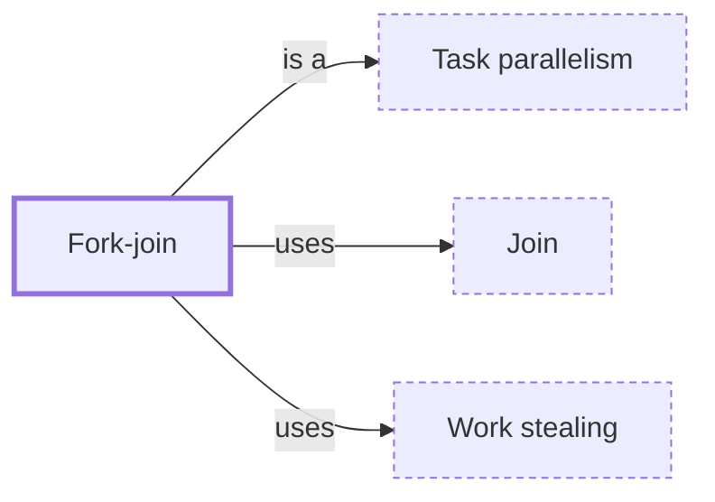

# Fork-join

**Category:** [Parallelism](../README.md) · **Status:** stub · **Lessons:** chapter 07, Parallelism *(planned)*

**One line:** Split a task into subtasks, run them in parallel, wait for all of them and combine their results — recursively, until the pieces are small enough to do directly.

Also called: divide and conquer in parallel, ForkJoinPool.

## How it connects

- **Is a kind of:** [Task parallelism](../task_parallelism/README.md)
- **Is built on:** [Join](../../async/join/README.md), [Work stealing](../../scheduling/work_stealing/README.md)
- **See also:** [Map-reduce](../map_reduce/README.md), [Parallel algorithms](../parallel_algorithms/README.md)

## In each language

| | |
|---|---|
| Rust | Rayon's [`join` ↗](https://docs.rs/rayon/latest/rayon/fn.join.html) runs two closures, potentially in parallel, and returns both results |
| Java | [`ForkJoinPool` ↗](https://docs.oracle.com/en/java/javase/25/docs/api/java.base/java/util/concurrent/ForkJoinPool.html) runs `ForkJoinTask`s, whose `fork` and `join` split and rejoin the work |
| C# | [`Parallel.Invoke` ↗](https://learn.microsoft.com/en-us/dotnet/api/system.threading.tasks.parallel.invoke) runs actions in parallel and returns when all have completed |

## Where to read more

- **In the books:** [*Pro TBB*](../../../10_Resources/books_cpp/README.md#voss_pro_tbb), Michael Voss, Rafael Asenjo, James Reinders — ch. 8, 'Mapping Parallel Patterns to TBB' → 'Fork-Join Pattern'
- **In the books:** [*Programming Concurrency on the JVM*](../../../10_Resources/books_java/README.md#subramaniam_programming_concurrency_on_the_jvm), Venkat Subramaniam — ch. 4, 'Scalability and Thread Safety' → 'Java 7 Fork-Join API'
- **In the books:** [*Programming Rust*](../../../10_Resources/books_rust/README.md#blandy_programming_rust), Jim Blandy, Jason Orendorff, Leonora F. S. Tindall — ch. 19, 'Concurrency' → 'Fork-Join Parallelism'
- **In the books:** [*Modern Java in Action*](../../../10_Resources/books_java/README.md#urma_modern_java_in_action), Raoul-Gabriel Urma, Mario Fusco, Alan Mycroft — ch. 7, 'Parallel data processing and performance' → 'The fork/join framework'
- **In the books:** [*Functional and Concurrent Programming*](../../../10_Resources/books_scala_jvm_functional/README.md#charpentier_functional_and_concurrent_programming), Michel Charpentier — ch. 27, 'Minimizing Thread Blocking' → 'Fork/Join Pools'
- **In the books:** [*Introduction to Algorithms*](../../../10_Resources/books_general/README.md#cormen_introduction_to_algorithms), Thomas H. Cormen, Charles E. Leiserson, Ronald L. Rivest, Clifford Stein — ch. 26, 'Parallel Algorithms' → 'The basics of fork-join parallelism'
- **Reference:** [Wikipedia: Fork–join model ↗](https://en.wikipedia.org/wiki/Fork%E2%80%93join_model)

<!-- Generated above this line by tools/build_concepts.py from TOML data — edit the data, not the page. Hand-written notes go below it and are kept. -->
