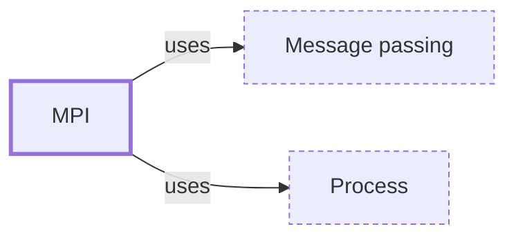

# MPI

**Category:** [Parallelism](../README.md) · **Status:** stub

**One line:** The Message Passing Interface: separate processes, often on separate machines, exchanging messages — the standard for distributed-memory parallel programs.

Also called: Message Passing Interface.

## How it connects

- **Is built on:** [Message passing](../../communication/message_passing/README.md), [Process](../../units_of_execution/process/README.md)

## Where to read more

- **In the books:** [*Mastering C++ Multithreading*](../../../10_Resources/books_cpp/README.md#posch_mastering_cpp_multithreading), Maya Posch — ch. 9, 'Multithreading with Distributed Computing' → 'Installing Open MPI'
- **In the books:** [*Parallel Computing for Bioinformatics and Computational Biology*](../../../10_Resources/books_other/README.md#zomaya_parallel_computing_bioinformatics), Albert Y. Zomaya (editor) — ch. 2, 'Parallel Monte Carlo Simulation of HIV Molecular Evolution in Response to Immune Surveillance' → 'Parallelization with MPI'
- **Reference:** [MPI Forum ↗](https://www.mpi-forum.org/)

<!-- Generated above this line by tools/build_concepts.py from TOML data — edit the data, not the page. Hand-written notes go below it and are kept. -->
