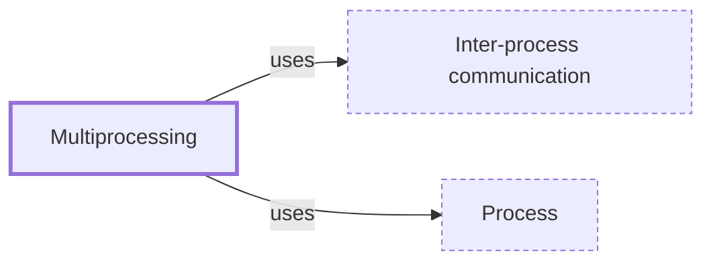

# Multiprocessing

**Category:** [Parallelism](../README.md) · **Status:** stub · **Lessons:** chapter 08, Processes *(planned)*

**One line:** Using several processes instead of several threads — for isolation, or to get parallelism in a runtime whose threads share one global lock.

Also called: process pool, ProcessPoolExecutor.

## How it connects

- **Is built on:** [Inter-process communication](../../communication/ipc/README.md), [Process](../../units_of_execution/process/README.md)
- **See also:** [Global interpreter lock](../gil/README.md), [Process](../../units_of_execution/process/README.md)

## In each language

| | |
|---|---|
| Python | [`multiprocessing` ↗](https://docs.python.org/3/library/multiprocessing.html) and [`ProcessPoolExecutor` ↗](https://docs.python.org/3/library/concurrent.futures.html#processpoolexecutor); in 3.14 the default start method on POSIX changed from `fork` to `forkserver`, while macOS and Windows use `spawn` |

## Where to read more

- **In the books:** [*Parallel Loops in Python*](../../../10_Resources/books_python/README.md#brownlee_parallel_loops_in_python), Jason Brownlee — ch. 5, 'Parallel Loop with the Process Class'
- **In the books:** [*Python Parallel Programming Cookbook*](../../../10_Resources/books_python/README.md#zaccone_python_parallel_programming_cookbook), Giancarlo Zaccone — ch. 3, 'Process-based Parallelism'
- **In the books:** [*Parallel Programming with Python*](../../../10_Resources/books_python/README.md#palach_parallel_programming_with_python), Jan Palach — ch. 5, 'Using Multiprocessing and ProcessPoolExecutor'
- **In the books:** [*Learn Concurrent Programming with Go*](../../../10_Resources/books_go/README.md#cutajar_learn_concurrent_programming_with_go), James Cutajar — ch. 2, 'Dealing with threads' → 'Multiprocessing in operating systems'
- **In the books:** [*Multi-Threaded Programming in C++*](../../../10_Resources/books_cpp/README.md#walmsley_multithreaded_programming_in_cpp), Mark Walmsley — ch. 5, 'Semaphores' → 'The POOL Class'
- **In the books:** [*Python Concurrency with asyncio*](../../../10_Resources/books_python/README.md#fowler_python_concurrency_with_asyncio), Matthew Fowler — ch. 1, 'Getting to know asyncio' → 'Understanding processes, threads, multithreading, and multiprocessing'
- **Notes:** [multiprocessing python ↗](https://docs.google.com/document/d/1cOE8bkU-PY_V_0tDGixPK0OO13PRWoAZzbLeJ-IiA58/edit?tab=t.0)
- **Notes:** [multi-processing - general - multiprocessing ↗](https://docs.google.com/document/d/14T579Iokz3DEBIQZ_jRHwSMlo48xH8eey43kN2bMgQU/edit?tab=t.0)
- **Reference:** [Wikipedia: Multiprocessing ↗](https://en.wikipedia.org/wiki/Multiprocessing)

<!-- Generated above this line by tools/build_concepts.py from TOML data — edit the data, not the page. Hand-written notes go below it and are kept. -->
