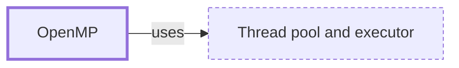

# OpenMP

**Category:** [Parallelism](../README.md) · **Status:** stub

**One line:** Compiler directives and a runtime that parallelize loops and sections of C, C++ and Fortran programs over shared memory.

Also called: OMP.

## How it connects

- **Is built on:** [Thread pool and executor](../../units_of_execution/thread_pool/README.md)

## In each language

| | |
|---|---|
| C | Compiler directives defined by the [OpenMP specifications ↗](https://www.openmp.org/specifications/); the GNU implementation is [libgomp ↗](https://gcc.gnu.org/onlinedocs/libgomp/) |
| C++ | The same directives as C; C++17 [execution policies ↗](https://en.cppreference.com/w/cpp/algorithm/execution_policy_tag_t) parallelize standard algorithms without them |

## Where to read more

- **In the books:** [*Parallel Programming with Intel Parallel Studio XE*](../../../10_Resources/books_cpp/README.md#blair_chappell_intel_parallel_studio_xe), Stephen Blair-Chappell, Andrew Stokes — ch. 3, 'Parallel Studio XE for the Impatient' → 'Example 2: Working with OpenMP'
- **In the books:** [*Advanced Python Programming*](../../../10_Resources/books_python/README.md#nguyen_advanced_python_programming), Quan Nguyen — ch. 8, 'Parallel Processing' → 'Parallel Cython with OpenMP'
- **Reference:** [OpenMP ↗](https://www.openmp.org/)

<!-- Generated above this line by tools/build_concepts.py from TOML data — edit the data, not the page. Hand-written notes go below it and are kept. -->
