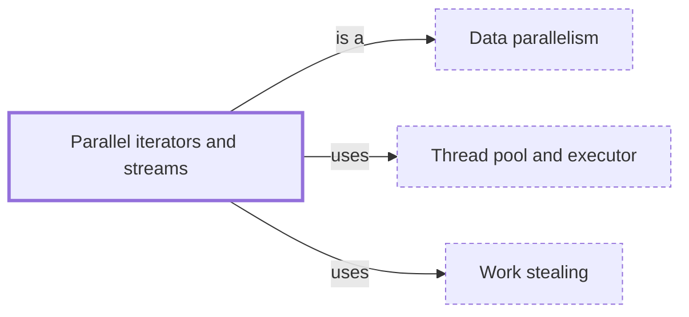

# Parallel iterators and streams

**Category:** [Parallelism](../README.md) · **Status:** stub · **Lessons:** chapter 07, Parallelism *(planned)*

**One line:** A library that spreads an iterator's work over a thread pool with one method call — Rayon's `par_iter`, Java's `parallelStream`.

Also called: rayon, parallel streams, PLINQ.

## How it connects

- **Is a kind of:** [Data parallelism](../data_parallelism/README.md)
- **Is built on:** [Thread pool and executor](../../units_of_execution/thread_pool/README.md), [Work stealing](../../scheduling/work_stealing/README.md)

## In each language

| | |
|---|---|
| Rust | Rayon's [`par_iter` ↗](https://docs.rs/rayon/latest/rayon/) gives parallel versions of iterator methods such as `map`, `filter` and `fold` |
| C++ | Standard algorithms take an [execution policy ↗](https://en.cppreference.com/w/cpp/algorithm/execution_policy_tag_t) rather than a parallel iterator |
| Java | [`Collection.parallelStream` ↗](https://docs.oracle.com/en/java/javase/25/docs/api/java.base/java/util/Collection.html#parallelStream%28%29), or `parallel()` on a stream |
| Python | [`Executor.map` ↗](https://docs.python.org/3/library/concurrent.futures.html#concurrent.futures.Executor.map) on a thread or process pool |
| C# | [PLINQ ↗](https://learn.microsoft.com/en-us/dotnet/standard/parallel-programming/introduction-to-plinq): `AsParallel()` on a LINQ query |
| Erlang and Elixir | [`Task.async_stream` ↗](https://hexdocs.pm/elixir/Task.html#async_stream/3) runs a function on each element in its own task, by default as many at once as there are schedulers online |

## Where to read more

- **In the books:** [*Hands-On Concurrency with Rust*](../../../10_Resources/books_rust/README.md#troutwine_hands_on_concurrency_with_rust), Brian L. Troutwine — ch. 8, 'High-Level Parallelism – Threadpools, Parallel Iterators and Processes'
- **In the books:** [*Concurrency in .NET*](../../../10_Resources/books_csharp_dotnet/README.md#terrell_concurrency_in_dotnet), Riccardo Terrell — ch. 5, 'PLINQ and MapReduce: data parallelism, part 2'
- **In the books:** [*Parallel Loops in Python*](../../../10_Resources/books_python/README.md#brownlee_parallel_loops_in_python), Jason Brownlee — ch. 2, 'Parallel Loop with the Thread Class'
- **In the books:** [*Concurrency in C# Cookbook*](../../../10_Resources/books_csharp_dotnet/README.md#cleary_concurrency_in_csharp_cookbook), Stephen Cleary — ch. 4, 'Parallel Basics' → 'Parallel LINQ'
- **In the books:** [*Parallel Programming and Concurrency with C# 10 and .NET 6*](../../../10_Resources/books_csharp_dotnet/README.md#ashcraft_parallel_programming_concurrency_csharp10), Alvin Ashcraft — ch. 6, 'Parallel Programming Concepts' → 'Parallel loops in .NET'
- **In the books:** [*Modern Java in Action*](../../../10_Resources/books_java/README.md#urma_modern_java_in_action), Raoul-Gabriel Urma, Mario Fusco, Alan Mycroft — ch. 7, 'Parallel data processing and performance'
- **In the books:** [*C# 10 in a Nutshell*](../../../10_Resources/books_csharp_dotnet/README.md#albahari_csharp_in_a_nutshell), Joseph Albahari — ch. 22, 'Parallel Programming' → 'PLINQ'

<!-- Generated above this line by tools/build_concepts.py from TOML data — edit the data, not the page. Hand-written notes go below it and are kept. -->
