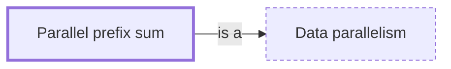

# Parallel prefix sum

**Category:** [Parallelism](../README.md) · **Status:** stub

**One line:** Computing every running total of a sequence in a number of rounds that grows with the logarithm of its length — a building block of many data-parallel algorithms.

Also called: prefix scan, scan.

## How it connects

- **Is a kind of:** [Data parallelism](../data_parallelism/README.md)

## In each language

| | |
|---|---|
| C++ | [`std::inclusive_scan` ↗](https://en.cppreference.com/w/cpp/algorithm/inclusive_scan) and `std::exclusive_scan` (C++17) accept an execution policy |
| Java | [`Arrays.parallelPrefix` ↗](https://docs.oracle.com/en/java/javase/25/docs/api/java.base/java/util/Arrays.html) |

## Where to read more

- **In the books:** [*The Art of Concurrency*](../../../10_Resources/books_general/README.md#breshears_art_of_concurrency), Clay Breshears — ch. 6, 'Parallel Sum and Prefix Scan'
- **Reference:** [Wikipedia: Prefix sum — parallel algorithms ↗](https://en.wikipedia.org/wiki/Prefix_sum#Parallel_algorithms)

<!-- Generated above this line by tools/build_concepts.py from TOML data — edit the data, not the page. Hand-written notes go below it and are kept. -->
