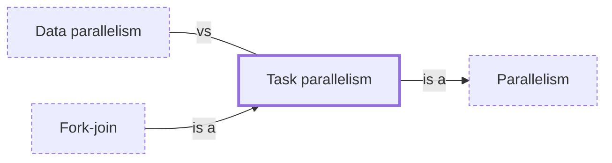

# Task parallelism

**Category:** [Parallelism](../README.md) · **Status:** stub · **Lessons:** [chapter 07, Parallelism](../../../07_Parallelism/README.md)

**One line:** Different tasks, possibly doing different things, running at the same time on different cores.

## How it connects

- **Is a kind of:** [Parallelism](../../foundations/parallelism/README.md)
- **Kinds:** [Fork-join](../fork_join/README.md)
- **Often confused with:** [Data parallelism](../data_parallelism/README.md)

## In each language

| | |
|---|---|
| Rust | Rayon's [`join` ↗](https://docs.rs/rayon/latest/rayon/fn.join.html) runs two closures, potentially in parallel |
| Go | `go` statements, with a [`sync.WaitGroup` ↗](https://pkg.go.dev/sync#WaitGroup) to wait for them |
| C++ | [`std::async` ↗](https://en.cppreference.com/w/cpp/thread/async) with `std::launch::async` |
| Java | [`ForkJoinTask` ↗](https://docs.oracle.com/en/java/javase/25/docs/api/java.base/java/util/concurrent/ForkJoinTask.html) `fork` and `join`; [`StructuredTaskScope` ↗](https://docs.oracle.com/en/java/javase/25/docs/api/java.base/java/util/concurrent/StructuredTaskScope.html) is still a preview API in JDK 25 |
| Python | [`Executor.submit` ↗](https://docs.python.org/3/library/concurrent.futures.html#concurrent.futures.Executor.submit) |
| C# | [`Parallel.Invoke` ↗](https://learn.microsoft.com/en-us/dotnet/api/system.threading.tasks.parallel.invoke) and [task parallelism ↗](https://learn.microsoft.com/en-us/dotnet/standard/parallel-programming/task-based-asynchronous-programming) |
| Swift | [`async let` and task groups ↗](https://docs.swift.org/swift-book/documentation/the-swift-programming-language/concurrency/) |

## Where to read more

- **In this library:** [How do three stages run at once on one stream of values?](../../../05_Message_Passing/a_pipeline_of_stages/README.md)
- **In this library:** [Same work on different data, or different work at once?](../../../07_Parallelism/data_parallel_or_task_parallel/README.md)
- **In this library:** [How does a recursive job split itself across cores?](../../../07_Parallelism/fork_join/README.md)
- **In the books:** [*Concurrent Programming on Windows*](../../../10_Resources/books_csharp_dotnet/README.md#duffy_concurrent_programming_on_windows), Joe Duffy — ch. 13, 'Data and Task Parallelism'
- **In the books:** [*Pro Asynchronous Programming with .NET*](../../../10_Resources/books_csharp_dotnet/README.md#blewett_clymer_pro_asynchronous_programming_dotnet), Richard Blewett, Andrew Clymer — ch. 10, 'TPL Dataflow'
- **In the books:** [*Pro TBB*](../../../10_Resources/books_cpp/README.md#voss_pro_tbb), Michael Voss, Rafael Asenjo, James Reinders — ch. 2, 'Generic Parallel Algorithms' → 'Functional / Task Parallelism'
- **In the books:** [*Programming Concurrency on the JVM*](../../../10_Resources/books_java/README.md#subramaniam_programming_concurrency_on_the_jvm), Venkat Subramaniam — ch. 4, 'Scalability and Thread Safety' → 'Java 7 Fork-Join API'
- **In the books:** [*Parallel Programming and Concurrency with C# 10 and .NET 6*](../../../10_Resources/books_csharp_dotnet/README.md#ashcraft_parallel_programming_concurrency_csharp10), Alvin Ashcraft — ch. 6, 'Parallel Programming Concepts' → 'Getting started with the TPL'
- **In the books:** [*Concurrency in .NET*](../../../10_Resources/books_csharp_dotnet/README.md#terrell_concurrency_in_dotnet), Riccardo Terrell — ch. 7, 'Task-based functional parallelism' → 'The .NET Task Parallel Library'
- **Reference:** [Wikipedia: Task parallelism ↗](https://en.wikipedia.org/wiki/Task_parallelism)

<!-- Generated above this line by tools/build_concepts.py from TOML data — edit the data, not the page. Hand-written notes go below it and are kept. -->
