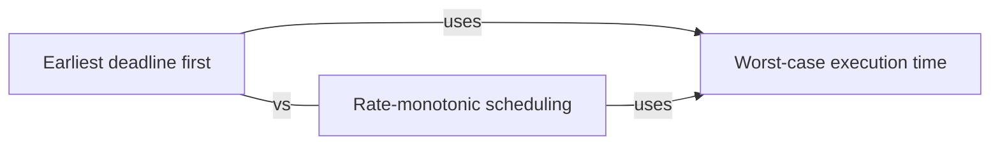

# Real-time systems

When a late answer is a wrong answer: deadlines, worst-case timing, and the scheduling policies that can prove every deadline is met.

[All categories](../README.md) · [How they connect](../schema/README.md)

- [Real-time system](real_time_system/README.md) — A system whose correctness depends on when results arrive as well as on what they are: a hard real-time system must never miss a deadline, a soft one should rarely.
- [Worst-case execution time](wcet/README.md) — The longest a piece of code can take on given hardware; real-time schedules are built from this bound, never from typical timings.
- [Rate-monotonic scheduling](rate_monotonic_scheduling/README.md) — Fixed priorities by period: the task that runs most often gets the highest priority, which is optimal among fixed-priority policies for periodic tasks.
- [Earliest deadline first](earliest_deadline_first/README.md) — Dynamic priorities: whichever ready task has the nearest deadline runs next.

## Inside this category

<!-- Generated above this line by tools/build_concepts.py from TOML data — edit the data, not the page. Hand-written notes go below it and are kept. -->
