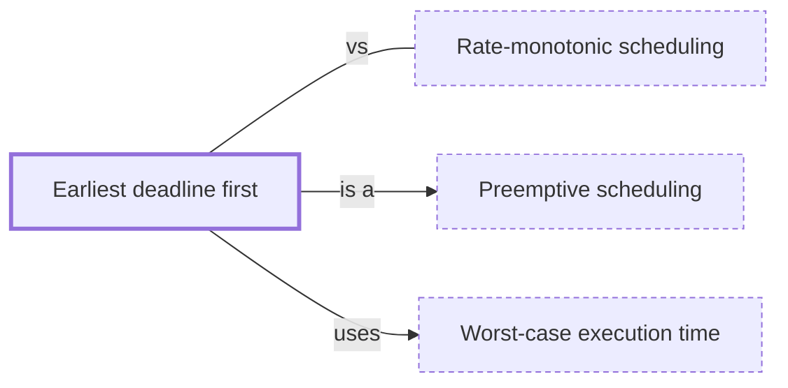

# Earliest deadline first

**Category:** [Real-time systems](../README.md) · **Status:** stub

**One line:** Dynamic priorities: whichever ready task has the nearest deadline runs next.

Also called: EDF, deadline scheduling.

## How it connects

- **Is a kind of:** [Preemptive scheduling](../../scheduling/preemptive_scheduling/README.md)
- **Is built on:** [Worst-case execution time](../wcet/README.md)
- **Often confused with:** [Rate-monotonic scheduling](../rate_monotonic_scheduling/README.md)

## In each language

| | |
|---|---|
| The operating system | Linux's [`SCHED_DEADLINE` ↗](https://man7.org/linux/man-pages/man7/sched.7.html), global EDF combined with a constant bandwidth server |
| Elsewhere | Ada's [Earliest Deadline First dispatching ↗](http://www.ada-auth.org/standards/22rm/html/RM-D-2-6.html) policy and its `Dispatching.EDF` package |

## Where to read more

- **Notes:** [Earliest Deadline First (EDF) ↗](https://docs.google.com/document/d/1Uvz4Cz3L1OSg1Ccla41i5hYqiCNKGV5cX4eLKEx3r1Y/edit?tab=t.0)
- **Reference:** [Wikipedia: Earliest deadline first scheduling ↗](https://en.wikipedia.org/wiki/Earliest_deadline_first_scheduling)

<!-- Generated above this line by tools/build_concepts.py from TOML data — edit the data, not the page. Hand-written notes go below it and are kept. -->
