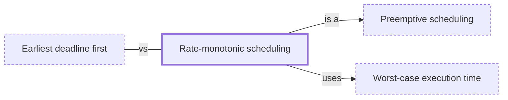

# Rate-monotonic scheduling

**Category:** [Real-time systems](../README.md) · **Status:** stub

**One line:** Fixed priorities by period: the task that runs most often gets the highest priority, which is optimal among fixed-priority policies for periodic tasks.

Also called: RMS.

## How it connects

- **Is a kind of:** [Preemptive scheduling](../../scheduling/preemptive_scheduling/README.md)
- **Is built on:** [Worst-case execution time](../wcet/README.md)
- **Often confused with:** [Earliest deadline first](../earliest_deadline_first/README.md)

## In each language

| | |
|---|---|
| The operating system | Assign [`SCHED_FIFO` ↗](https://man7.org/linux/man-pages/man7/sched.7.html) priorities by period; the kernel then always runs the highest-priority ready thread |
| Elsewhere | Ada's [`FIFO_Within_Priorities` ↗](http://www.ada-auth.org/standards/22rm/html/RM-D-2-3.html) dispatching policy |

## Where to read more

- **Notes:** [Rate Monotonic Scheduling (RMS) ↗](https://docs.google.com/document/d/1QSYQtP0ek0yjilYnEYaB-6Y30DXoHEJ8mBQHTK3rUA0/edit?tab=t.0)
- **Reference:** [Wikipedia: Rate-monotonic scheduling ↗](https://en.wikipedia.org/wiki/Rate-monotonic_scheduling)

<!-- Generated above this line by tools/build_concepts.py from TOML data — edit the data, not the page. Hand-written notes go below it and are kept. -->
