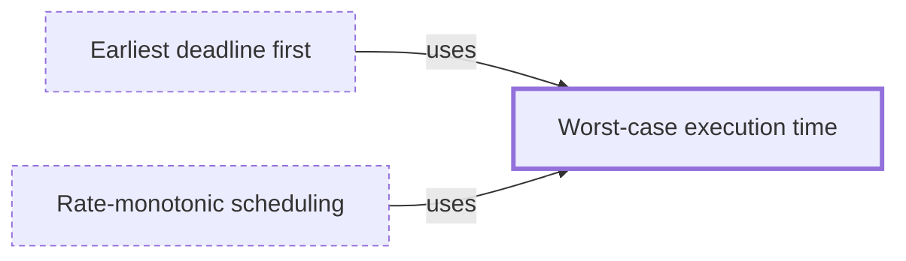

# Worst-case execution time

**Category:** [Real-time systems](../README.md) · **Status:** stub

**One line:** The longest a piece of code can take on given hardware; real-time schedules are built from this bound, never from typical timings.

Also called: WCET.

## How it connects

- **Is used by:** [Earliest deadline first](../earliest_deadline_first/README.md), [Rate-monotonic scheduling](../rate_monotonic_scheduling/README.md)
- **See also:** [Real-time system](../real_time_system/README.md)

## Where to read more

- **Notes:** [Worst Case Execution Time (WCET) ↗](https://docs.google.com/document/d/16EDUR3TaGOAsCS87e_PFdIvamgoZyUB9AMvC1NtSZJE/edit?tab=t.0)
- **Reference:** [Wikipedia: Worst-case execution time ↗](https://en.wikipedia.org/wiki/Worst-case_execution_time)

<!-- Generated above this line by tools/build_concepts.py from TOML data — edit the data, not the page. Hand-written notes go below it and are kept. -->
