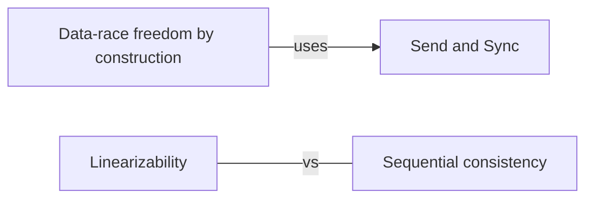

# Safety in languages

How languages and libraries promise that code is safe to share — thread safety, reentrancy, ownership, immutability — and the formal conditions that say what correct means.

[All categories](../README.md) · [How they connect](../schema/README.md)

- [Thread safety](thread_safety/README.md) — Code or data is thread-safe if it behaves correctly when used from several threads at once, without its callers adding any synchronization.
- [Reentrancy](reentrancy/README.md) — A function is reentrant if it can be entered again — by another thread, a signal handler, or itself — before an earlier call has finished, usually because it keeps its state in structures the caller owns instead of in statics.
- [Send and Sync](send_and_sync/README.md) — Rust's two marker traits: a `Send` value may move to another thread, a `Sync` value may be shared with one by reference, and the compiler checks both.
- [Data-race freedom by construction](data_race_freedom/README.md) — A language rule that makes data races impossible to write in the first place — Rust's ownership with Send and Sync, or actors that never share memory.
- [Immutability](immutability/README.md) — Data that cannot change after it is built can be shared by any number of threads with no synchronization at all.
- [Interior mutability](interior_mutability/README.md) — Changing data behind a shared reference through a type that enforces the rules itself — `Cell` and `RefCell` within one thread, `Mutex` and atomics across threads.
- [Thread confinement](thread_confinement/README.md) — Keeping a piece of data reachable from one thread only — a GUI's main thread, a goroutine that owns its state — so that it needs no synchronization.
- [Linearizability](linearizability/README.md) — A concurrent object is linearizable if every operation appears to take effect at a single instant between its start and its end, so it can be reasoned about as if it were sequential.
- [Sequential consistency](sequential_consistency/README.md) — Operations appear to happen in some single order that respects each task's own order, though not necessarily real time — weaker than linearizability.

## Inside this category

<!-- Generated above this line by tools/build_concepts.py from TOML data — edit the data, not the page. Hand-written notes go below it and are kept. -->
