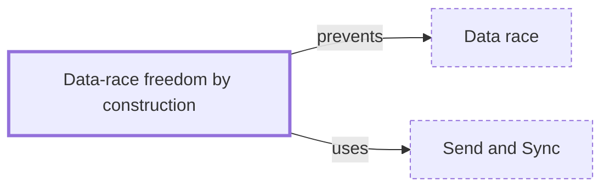

# Data-race freedom by construction

**Category:** [Safety in languages](../README.md) · **Status:** stub · **Lessons:** chapter 02, Shared state *(planned)*

**One line:** A language rule that makes data races impossible to write in the first place — Rust's ownership with Send and Sync, or actors that never share memory.

## How it connects

- **Is built on:** [Send and Sync](../send_and_sync/README.md)
- **Helps prevent:** [Data race](../../hazards/data_race/README.md)

## In each language

| | |
|---|---|
| Rust | [The Rustonomicon ↗](https://doc.rust-lang.org/nomicon/races.html): safe Rust guarantees an absence of data races, though not of race conditions |
| Go | A convention, not a rule: [Effective Go ↗](https://go.dev/doc/effective_go#sharing) says share memory by communicating, so only one goroutine has access to a value at a time |
| JavaScript | [Web workers ↗](https://developer.mozilla.org/en-US/docs/Web/API/Web_Workers_API) exchange messages whose data is copied rather than shared |
| Swift | The [Swift 6 language mode ↗](https://www.swift.org/migration/documentation/swift-6-concurrency-migration-guide/dataracesafety/) prevents data races at compile time |
| Erlang and Elixir | [All data in messages between processes is copied ↗](https://www.erlang.org/doc/system/eff_guide_processes.html), except refc binaries and literals |

## Where to read more

- **In the books:** [*Rust Atomics and Locks*](../../../10_Resources/books_rust/README.md#bos_rust_atomics_and_locks), Mara Bos — ch. 1, 'Basics of Rust Concurrency' → 'Borrowing and Data Races'
- **In the books:** [*The Rust Programming Language*](../../../10_Resources/books_rust/README.md#klabnik_nichols_rust_programming_language), Steve Klabnik, Carol Nichols — ch. 16, 'Fearless Concurrency'
- **In the books:** [*Rust for Rustaceans*](../../../10_Resources/books_rust/README.md#gjengset_rust_for_rustaceans), Jon Gjengset — ch. 10, 'Concurrency (and Parallelism)' → 'Sane Concurrency'
- **Notes:** [data race freedom (DRF) ↗](https://docs.google.com/document/d/1IhgEtE6x4eeA-a0M4PdTGgW8ekLEoTPANFqNtbZDqPU/edit?tab=t.0)

<!-- Generated above this line by tools/build_concepts.py from TOML data — edit the data, not the page. Hand-written notes go below it and are kept. -->
