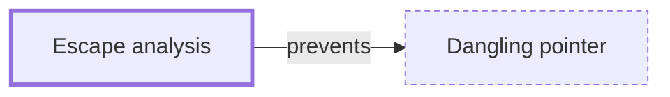

# Escape analysis

**Category:** [Safety in languages](../README.md) · **Status:** stub · **Lessons:** [chapter 01, Threads](../../../01_Threads/README.md)

**One line:** The compiler deciding whether a local's address can outlive its frame, and moving the local to the heap when it can — which is how a language with a garbage collector lets a thread capture a local safely.

Also called: escapes to heap, moved to heap.

## How it connects

- **Helps prevent:** [Dangling pointer](../../hazards/dangling_pointer/README.md)
- **See also:** [Object lifetime](../object_lifetime/README.md)

## In each language

| | |
|---|---|
| Rust | None is needed for safety: a reference that would outlive its referent is a compile error instead, so the placement is the programmer's choice |
| Go | [`go build -gcflags=-m` ↗](https://pkg.go.dev/cmd/compile) reports each decision, including `moved to heap`; the [FAQ ↗](https://go.dev/doc/faq#stack_or_heap) states the rule |
| Java | HotSpot may allocate a non-escaping object on the stack or split it into fields; [JEP 8221340 ↗](https://bugs.openjdk.org/browse/JDK-8221340) tracks the analysis |

## Where to read more

- **In this library:** [Can a thread borrow a local variable?](../../../01_Threads/lending_a_local_to_a_thread/README.md)
- **Reference:** [Wikipedia: Escape analysis ↗](https://en.wikipedia.org/wiki/Escape_analysis)

<!-- Generated above this line by tools/build_concepts.py from TOML data — edit the data, not the page. Hand-written notes go below it and are kept. -->
