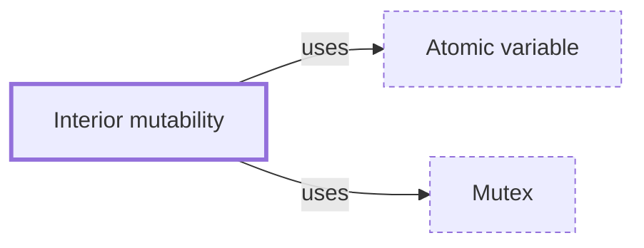

# Interior mutability

**Category:** [Safety in languages](../README.md) · **Status:** stub

**One line:** Changing data behind a shared reference through a type that enforces the rules itself — `Cell` and `RefCell` within one thread, `Mutex` and atomics across threads.

## How it connects

- **Is built on:** [Atomic variable](../../lock_free/atomic_variable/README.md), [Mutex](../../synchronization/mutex/README.md)

## In each language

| | |
|---|---|
| Rust | [`std::cell` ↗](https://doc.rust-lang.org/std/cell/index.html): `Cell`, `RefCell` and `OnceCell` are single-threaded and not `Sync`; across threads use `Mutex`, `RwLock` or atomics |
| C++ | The [`mutable` ↗](https://en.cppreference.com/w/cpp/language/cv) specifier lets a member change inside a `const` object — typically a mutex, as in the page's rule that mutable and mutex go together |

## Where to read more

- **In a sibling library:** [Rust: Interior mutability ↗](https://masiarek.github.io/rust-learning-library/09_Advanced/interior_mutability/index.html)
- **In the books:** [*Programming Concurrency on the JVM*](../../../10_Resources/books_java/README.md#subramaniam_programming_concurrency_on_the_jvm), Venkat Subramaniam — ch. 5, 'Taming Shared Mutability'
- **In the books:** [*Rust Atomics and Locks*](../../../10_Resources/books_rust/README.md#bos_rust_atomics_and_locks), Mara Bos — ch. 1, 'Basics of Rust Concurrency' → 'Interior Mutability'
- **In the books:** [*Haskell Cookbook*](../../../10_Resources/books_haskell/README.md#sajanikar_haskell_cookbook), Yogesh Sajanikar — ch. 12, 'Concurrent and Distributed Programming in Haskell' → 'Working with IORef'
- **Notes:** [interior mutability - rust ↗](https://docs.google.com/document/d/1ECvShX0c8HmryPbay3G_MI_Qq6sfXEW2OQ_K4RMb2lM/edit?tab=t.0)
- **Reference:** [The Rust Reference: Interior mutability ↗](https://doc.rust-lang.org/reference/interior-mutability.html)

<!-- Generated above this line by tools/build_concepts.py from TOML data — edit the data, not the page. Hand-written notes go below it and are kept. -->
