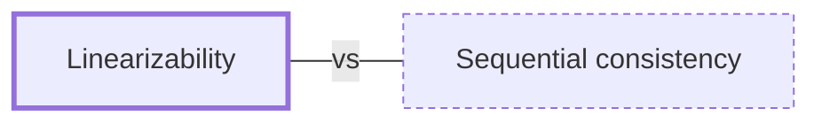

# Linearizability

**Category:** [Safety in languages](../README.md) · **Status:** stub

**One line:** A concurrent object is linearizable if every operation appears to take effect at a single instant between its start and its end, so it can be reasoned about as if it were sequential.

Also called: atomic consistency, strong consistency.

## How it connects

- **Often confused with:** [Sequential consistency](../sequential_consistency/README.md)
- **See also:** [Consistency models](../../distributed/consistency_models/README.md)

## In each language

| | |
|---|---|
| Kotlin | [Lincheck ↗](https://github.com/JetBrains/lincheck) runs random concurrent scenarios by stress testing or bounded model checking and checks that the results are linearizable |

## Where to read more

- **In the books:** [*Hands-On Concurrency with Rust*](../../../10_Resources/books_rust/README.md#troutwine_hands_on_concurrency_with_rust), Brian L. Troutwine — ch. 6, 'Atomics – the Primitives of Synchronization' → 'Linearizability'
- **In the books:** [*The Art of Multiprocessor Programming*](../../../10_Resources/books_general/README.md#herlihy_shavit_art_of_multiprocessor_programming), Maurice Herlihy, Nir Shavit — ch. 3, 'Concurrent Objects' → 'Linearizability'
- **In the books:** [*Designing Data-Intensive Applications*](../../../10_Resources/books_general/README.md#kleppmann_designing_data_intensive_applications), Martin Kleppmann — ch. 9, 'Consistency and Consensus' → 'Linearizability'
- **Reference:** [Wikipedia: Linearizability ↗](https://en.wikipedia.org/wiki/Linearizability)

<!-- Generated above this line by tools/build_concepts.py from TOML data — edit the data, not the page. Hand-written notes go below it and are kept. -->
