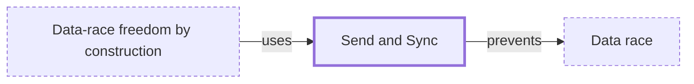

# Send and Sync

**Category:** [Safety in languages](../README.md) · **Status:** stub · **Lessons:** chapter 02, Shared state *(planned)*

**One line:** Rust's two marker traits: a `Send` value may move to another thread, a `Sync` value may be shared with one by reference, and the compiler checks both.

Also called: Sendable.

## How it connects

- **Is used by:** [Data-race freedom by construction](../data_race_freedom/README.md)
- **Helps prevent:** [Data race](../../hazards/data_race/README.md)

## In each language

| | |
|---|---|
| Rust | [`Send` ↗](https://doc.rust-lang.org/std/marker/trait.Send.html) and [`Sync` ↗](https://doc.rust-lang.org/std/marker/trait.Sync.html) are `unsafe` auto traits; `Rc` is not `Send` because its reference count is not atomic, while `Arc` is |
| Swift | [`Sendable` ↗](https://developer.apple.com/documentation/swift/sendable) plays the same part: a type whose values can cross concurrent contexts without risk of data races |

## Where to read more

- **In a sibling library:** [Rust: Send and Sync ↗](https://masiarek.github.io/rust-learning-library/09_Advanced/send_and_sync/index.html)
- **In a sibling library:** [Rust: Sharing across threads: Arc ↗](https://masiarek.github.io/rust-learning-library/18_Ownership/sharing_across_threads/index.html)
- **In the books:** [*Hands-On Concurrency with Rust*](../../../10_Resources/books_rust/README.md#troutwine_hands_on_concurrency_with_rust), Brian L. Troutwine — ch. 4, 'Sync and Send – the Foundation of Rust Concurrency'
- **In the books:** [*Rust Atomics and Locks*](../../../10_Resources/books_rust/README.md#bos_rust_atomics_and_locks), Mara Bos — ch. 1, 'Basics of Rust Concurrency' → 'Thread Safety: Send and Sync'
- **In the books:** [*The Rust Programming Language*](../../../10_Resources/books_rust/README.md#klabnik_nichols_rust_programming_language), Steve Klabnik, Carol Nichols — ch. 16, 'Fearless Concurrency' → 'Extensible Concurrency with the Sync and Send Traits'
- **Reference:** [The Rustonomicon: Send and Sync ↗](https://doc.rust-lang.org/nomicon/send-and-sync.html)

<!-- Generated above this line by tools/build_concepts.py from TOML data — edit the data, not the page. Hand-written notes go below it and are kept. -->
