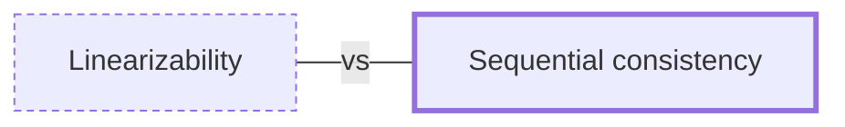

# Sequential consistency

**Category:** [Safety in languages](../README.md) · **Status:** stub

**One line:** Operations appear to happen in some single order that respects each task's own order, though not necessarily real time — weaker than linearizability.

Also called: SeqCst.

## How it connects

- **Often confused with:** [Linearizability](../linearizability/README.md)
- **See also:** [Consistency models](../../distributed/consistency_models/README.md)

## In each language

| | |
|---|---|
| Rust | [`Ordering::SeqCst` ↗](https://doc.rust-lang.org/std/sync/atomic/enum.Ordering.html#variant.SeqCst) additionally preserves a total order of such operations across all threads |
| C | The generic [`atomic_compare_exchange` ↗](https://en.cppreference.com/w/c/atomic/atomic_compare_exchange) functions use `memory_order_seq_cst` by default |
| C++ | [`std::memory_order_seq_cst` ↗](https://en.cppreference.com/w/cpp/atomic/memory_order): the default for all atomic operations, sequentially consistent ordering |

## Where to read more

- **In this library:** [Can one thread see another's writes out of order?](../../../02_Shared_State/reordering_and_the_memory_model/README.md)
- **In the books:** [*Rust Atomics and Locks*](../../../10_Resources/books_rust/README.md#bos_rust_atomics_and_locks), Mara Bos — ch. 3, 'Memory Ordering' → 'Sequentially Consistent Ordering'
- **In the books:** [*The Art of Multiprocessor Programming*](../../../10_Resources/books_general/README.md#herlihy_shavit_art_of_multiprocessor_programming), Maurice Herlihy, Nir Shavit — ch. 3, 'Concurrent Objects' → 'Sequential Consistency'
- **Notes:** [sequential consistency ↗](https://docs.google.com/document/d/1QQTW1NbrHYrrjaSAvPRkIFAJyq_VPOSrB0eS4duX4pc/edit?tab=t.0)
- **Reference:** [Wikipedia: Sequential consistency ↗](https://en.wikipedia.org/wiki/Sequential_consistency)

<!-- Generated above this line by tools/build_concepts.py from TOML data — edit the data, not the page. Hand-written notes go below it and are kept. -->
