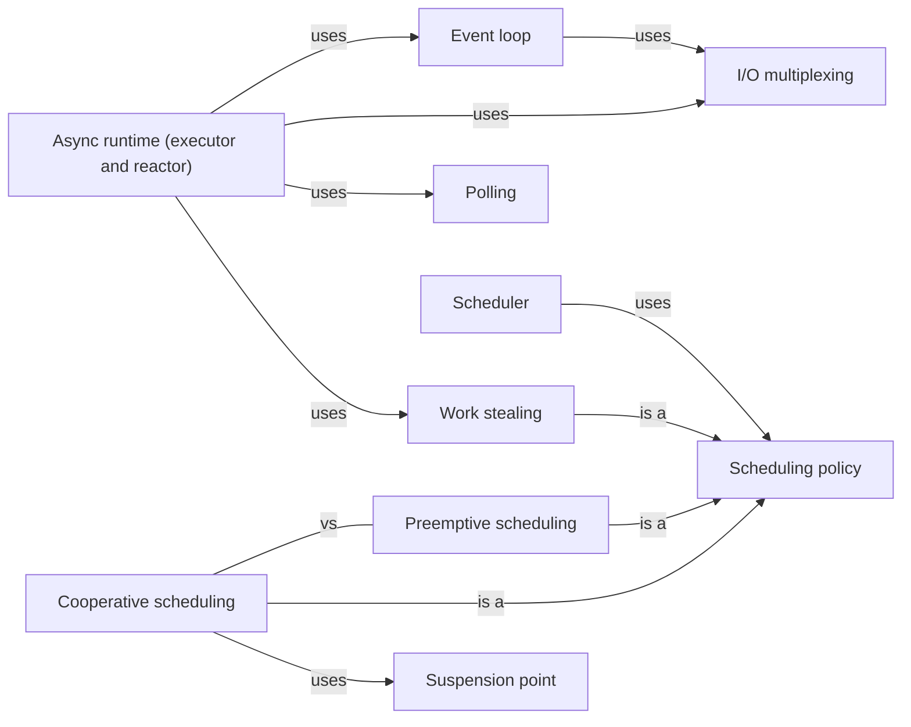

# Scheduling

Who decides what runs next, when, and on which core — the operating system's scheduler, or a runtime's event loop and executor.

[All categories](../README.md) · [How they connect](../schema/README.md)

- [Scheduler](scheduler/README.md) — The part of an operating system or runtime that decides which ready thread or task runs next, on which core, and for how long.
- [Event loop](event_loop/README.md) — A loop on one thread that waits for events — a socket ready, a timer due, work finished — and runs the callbacks or resumes the tasks waiting on each.
- [Async runtime (executor and reactor)](async_runtime/README.md) — The library that drives async tasks: an executor that polls the tasks that can make progress, and a reactor that wakes them when the I/O they wait for is ready.
- [I/O multiplexing](io_multiplexing/README.md) — Asking the operating system to watch many sockets or file descriptors at once and report which are ready, so that one thread can serve thousands of connections.
- [Polling](polling/README.md) — Asking repeatedly whether something is ready instead of being told; in Rust, an executor polls a future and the future answers Ready or Pending.
- [Suspension point](suspension_point/README.md) — A place where a coroutine or async function can pause and hand control back — an await, a yield — and where other tasks may run before it resumes.
- [Busy waiting](busy_waiting/README.md) — Waiting for a condition by checking it in a loop, burning CPU the whole time; worth it for a few nanoseconds inside a spinlock, wasteful for anything longer.
- [Scheduling policy](scheduling_policy/README.md) — The rule a scheduler follows to pick what runs next: whether a running task can be interrupted, how priorities are set, and where idle cores find work.
    - [Preemptive scheduling](preemptive_scheduling/README.md) — The scheduler may stop a running thread at any moment, usually on a timer interrupt, and run another — no thread can hog the CPU, and any step can be interrupted.
    - [Cooperative scheduling](cooperative_scheduling/README.md) — A task runs until it gives way — at an await, a yield or a blocking call — so switches happen only at known points, and one task that never gives way stalls all the others.
    - [Work stealing](work_stealing/README.md) — Each worker thread keeps its own queue of tasks, and an idle worker takes tasks from a busy worker's queue, balancing the load without one central queue.

## Inside this category

<!-- Generated above this line by tools/build_concepts.py from TOML data — edit the data, not the page. Hand-written notes go below it and are kept. -->
