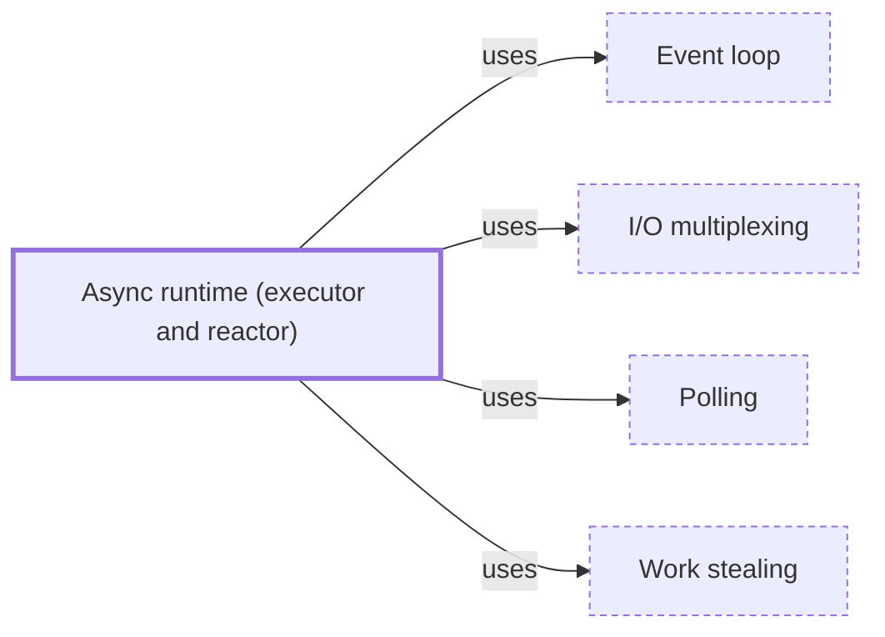

# Async runtime (executor and reactor)

**Category:** [Scheduling](../README.md) · **Status:** stub · **Lessons:** [chapter 06, Async](../../../06_Async/README.md)

**One line:** The library that drives async tasks: an executor that polls the tasks that can make progress, and a reactor that wakes them when the I/O they wait for is ready.

Also called: executor, reactor, tokio, asyncio event loop.

## How it connects

- **Is built on:** [Event loop](../event_loop/README.md), [I/O multiplexing](../io_multiplexing/README.md), [Polling](../polling/README.md), [Work stealing](../work_stealing/README.md)
- **See also:** [Task (async)](../../units_of_execution/async_task/README.md)

## In each language

| | |
|---|---|
| Rust | Not in the standard library: [Tokio ↗](https://docs.rs/tokio/latest/tokio/), whose `#[tokio::main]` starts one, is the common choice |
| Python | [`asyncio.run` ↗](https://docs.python.org/3/library/asyncio-runner.html#asyncio.run) runs a coroutine in an event loop that it manages, and returns the result |
| Kotlin | [`runBlocking` ↗](https://kotlinlang.org/api/kotlinx.coroutines/kotlinx-coroutines-core/kotlinx.coroutines/run-blocking.html) bridges regular blocking code to suspending code, blocking its thread until the coroutine completes |

## Where to read more

- **In this library:** [What does an event loop do all day?](../../../06_Async/what_an_event_loop_does/README.md)
- **In this library:** [Who runs an async task, and on how many threads?](../../../06_Async/who_runs_the_tasks/README.md)
- **In a sibling library:** [Rust: The Tokio runtime ↗](https://masiarek.github.io/rust-learning-library/35_Async/building_minidb/the_tokio_runtime/index.html)
- **In the books:** [*Concurrency in Go*](../../../10_Resources/books_go/README.md#cox_buday_concurrency_in_go), Katherine Cox-Buday — ch. 6, 'Goroutines and the Go Runtime'
- **In the books:** [*Asynchronous Programming in Rust*](../../../10_Resources/books_rust/README.md#samson_asynchronous_programming_in_rust), Carl Fredrik Samson — ch. 6, 'Futures in Rust' → 'A mental model of an async runtime'
- **In the books:** [*Async Rust*](../../../10_Resources/books_rust/README.md#flitton_morton_async_rust), Maxwell Flitton, Caroline Morton — ch. 3, 'Building Our Own Async Queues' → 'Configuring Our Runtime'
- **In the books:** [*Rust Programming By Example*](../../../10_Resources/books_rust/README.md#gomez_boucher_rust_programming_by_example), Antoni Boucher, Guillaume Gomez — ch. 9, 'Implementing an Asynchronous FTP Server' → 'Using Tokio'
- **In the books:** [*Ultimate Rust for Systems Programming*](../../../10_Resources/books_rust/README.md#harmouch_ultimate_rust_for_systems_programming), Mahmoud Harmouch — ch. 14, 'Asynchronous Programming' → 'Utilizing the tokio Library'
- **In the books:** [*Programming Rust*](../../../10_Resources/books_rust/README.md#blandy_programming_rust), Jim Blandy, Jason Orendorff, Leonora F. S. Tindall — ch. 20, 'Asynchronous Programming' → 'Primitive Futures and Executors: When Is a Future Worth Polling Again?'
- **Notes:** [async runtimes - rust - executor ↗](https://docs.google.com/document/u/0/d/1r7DE4Fatd-0QI-I0c4_HL2ACvJMpBqH5H-okshAJPiY/edit)
- **Notes:** [runtime - executor - async ↗](https://docs.google.com/document/u/0/d/1qlUZaKlBvhpcAXz1C4kS6yelY1NnOKHz9sNw2ASmPDE/edit)
- **Notes:** [tokio - main ↗](https://docs.google.com/document/d/1ppXXUpBzA6HXaoLaf09BmfrOHGtnCxRAofZw7MrQtKk/edit?tab=t.0)

<!-- Generated above this line by tools/build_concepts.py from TOML data — edit the data, not the page. Hand-written notes go below it and are kept. -->
