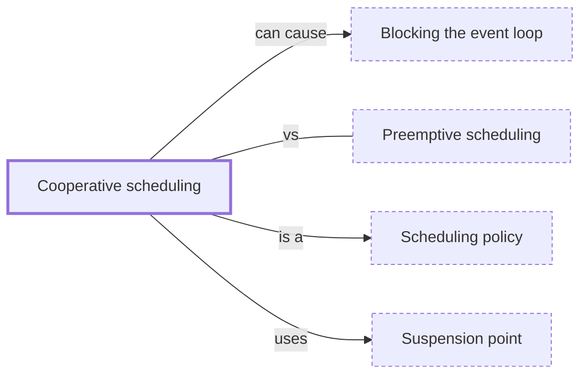

# Cooperative scheduling

**Category:** [Scheduling](../README.md) · **Status:** stub · **Lessons:** chapter 06, Async *(planned)*

**One line:** A task runs until it gives way — at an await, a yield or a blocking call — so switches happen only at known points, and one task that never gives way stalls all the others.

Also called: cooperative multitasking, non-preemptive scheduling.

## How it connects

- **Is a kind of:** [Scheduling policy](../scheduling_policy/README.md)
- **Is built on:** [Suspension point](../suspension_point/README.md)
- **Can lead to:** [Blocking the event loop](../../async/blocking_the_event_loop/README.md)
- **Often confused with:** [Preemptive scheduling](../preemptive_scheduling/README.md)
- **See also:** [Multitasking](../../foundations/multitasking/README.md)

## In each language

| | |
|---|---|
| Rust | [`tokio::task::yield_now` ↗](https://docs.rs/tokio/latest/tokio/task/fn.yield_now.html) yields execution back to the runtime, which schedules the other pending tasks |
| Go | Before [Go 1.14 ↗](https://go.dev/doc/go1.14#runtime), a loop without function calls could hold up the scheduler; [`runtime.Gosched` ↗](https://pkg.go.dev/runtime#Gosched) still yields on request |
| Python | [`await asyncio.sleep(0)` ↗](https://docs.python.org/3/library/asyncio-task.html#asyncio.sleep) lets other tasks run |
| C# | [`await Task.Yield()` ↗](https://learn.microsoft.com/en-us/dotnet/api/system.threading.tasks.task.yield) |
| JavaScript | Code [runs to completion ↗](https://developer.mozilla.org/en-US/docs/Web/JavaScript/Reference/Execution_model); other code runs only after an `await` or a return to the event loop |
| Kotlin | A coroutine keeps its thread until it suspends; [`yield()` ↗](https://kotlinlang.org/api/kotlinx.coroutines/kotlinx-coroutines-core/kotlinx.coroutines/yield.html) suspends only to let other coroutines run |
| Swift | [`Task.yield()` ↗](https://developer.apple.com/documentation/swift/task/yield%28%29) suspends the current task so that other tasks can run |

## Where to read more

- **In the books:** [*Kotlin Coroutines by Tutorials*](../../../10_Resources/books_other/README.md#babic_srivastava_kotlin_coroutines_by_tutorials), Filip Babić, Nishant Srivastava — ch. 10, 'Building Sequences & Iterators with Yield'
- **In the books:** [*Pro TBB*](../../../10_Resources/books_cpp/README.md#voss_pro_tbb), Michael Voss, Rafael Asenjo, James Reinders — ch. 14, 'Using Task Priorities' → 'Support for Non-Preemptive Priorities in the TBB Task Class'
- **In the books:** [*JavaScript Concurrency*](../../../10_Resources/books_javascript/README.md#boduch_javascript_concurrency), Adam Boduch — ch. 4, 'Lazy Evaluation with Generators' → 'Creating generators and yielding values'
- **In the books:** [*Grokking Concurrency*](../../../10_Resources/books_general/README.md#bobrov_grokking_concurrency), Kirill Bobrov — ch. 12, 'Asynchronous communication' → 'Cooperative multitasking'
- **In the books:** [*High Performance JavaScript*](../../../10_Resources/books_javascript/README.md#zakas_high_performance_javascript), Nicholas C. Zakas — ch. 6, 'Responsive Interfaces' → 'Yielding with Timers'
- **Notes:** [cooperative scheduling - general ↗](https://docs.google.com/document/d/1G8Rb6Qf3fPkDzNri1u6E3XWA4Krv2IaZw1Waz7OFqEs/edit?tab=t.0)
- **Reference:** [Wikipedia: Cooperative multitasking ↗](https://en.wikipedia.org/wiki/Cooperative_multitasking)

<!-- Generated above this line by tools/build_concepts.py from TOML data — edit the data, not the page. Hand-written notes go below it and are kept. -->
