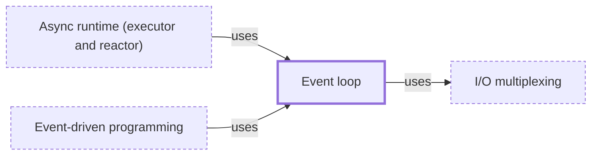

# Event loop

**Category:** [Scheduling](../README.md) · **Status:** stub · **Lessons:** chapter 06, Async *(planned)*

**One line:** A loop on one thread that waits for events — a socket ready, a timer due, work finished — and runs the callbacks or resumes the tasks waiting on each.

Also called: run loop, message loop.

## How it connects

- **Is built on:** [I/O multiplexing](../io_multiplexing/README.md)
- **Is used by:** [Async runtime (executor and reactor)](../async_runtime/README.md), [Event-driven programming](../../async/event_driven_programming/README.md)
- **See also:** [Blocking the event loop](../../async/blocking_the_event_loop/README.md), [Callback](../../async/callback/README.md), [Concurrency models](../../foundations/concurrency_models/README.md), [Timers and tickers](../../async/timers/README.md), [UI thread](../../units_of_execution/ui_thread/README.md)

## In each language

| | |
|---|---|
| Rust | None in the standard library; an async runtime such as [Tokio ↗](https://docs.rs/tokio/latest/tokio/runtime/index.html) provides it |
| C | Written by hand around [`poll` ↗](https://pubs.opengroup.org/onlinepubs/9799919799/functions/poll.html), or taken from an event library |
| Python | The [`asyncio` event loop ↗](https://docs.python.org/3/library/asyncio-eventloop.html); applications normally start it with `asyncio.run` and rarely touch the loop object |
| JavaScript | Always there, provided by the host; [microtasks ↗](https://developer.mozilla.org/en-US/docs/Web/API/HTML_DOM_API/Microtask_guide) such as promise callbacks run before control returns to the event loop |
| Swift | [`RunLoop` ↗](https://developer.apple.com/documentation/foundation/runloop) in Foundation |
| Erlang and Elixir | A [`GenServer` ↗](https://hexdocs.pm/elixir/GenServer.html) is a process whose receive loop the behaviour writes for you |

## Where to read more

- **In the books:** [*Asynchronous Programming in Rust*](../../../10_Resources/books_rust/README.md#samson_asynchronous_programming_in_rust), Carl Fredrik Samson — ch. 3, 'Understanding OS-Backed Event Queues, System Calls, and Cross-Platform Abstractions'
- **In the books:** [*asyncio Recipes*](../../../10_Resources/books_python/README.md#tahrioui_asyncio_recipes), Mohamed Mustapha Tahrioui — ch. 2, 'Working with Event Loops'
- **In the books:** [*JavaScript Concurrency*](../../../10_Resources/books_javascript/README.md#boduch_javascript_concurrency), Adam Boduch — ch. 8, 'Evented IO with NodeJS'
- **In the books:** [*Grokking Concurrency*](../../../10_Resources/books_general/README.md#bobrov_grokking_concurrency), Kirill Bobrov — ch. 11, 'Event-based concurrency' → 'Event loop'
- **In the books:** [*Python Concurrency with asyncio*](../../../10_Resources/books_python/README.md#fowler_python_concurrency_with_asyncio), Matthew Fowler — ch. 1, 'Getting to know asyncio' → 'How an event loop works'
- **In the books:** [*Using Asyncio in Python*](../../../10_Resources/books_python/README.md#hattingh_using_asyncio_in_python), Caleb Hattingh — ch. 3, 'Asyncio Walk-Through' → 'Event Loop'
- **Notes:** [Event loop - async - general ↗](https://docs.google.com/document/d/1yuX9X55V0ARMjFmBB4z1Lp4v0ikOTDIa0DmvCAivuuo/edit?tab=t.0)
- **Reference:** [Wikipedia: Event loop ↗](https://en.wikipedia.org/wiki/Event_loop)

<!-- Generated above this line by tools/build_concepts.py from TOML data — edit the data, not the page. Hand-written notes go below it and are kept. -->
