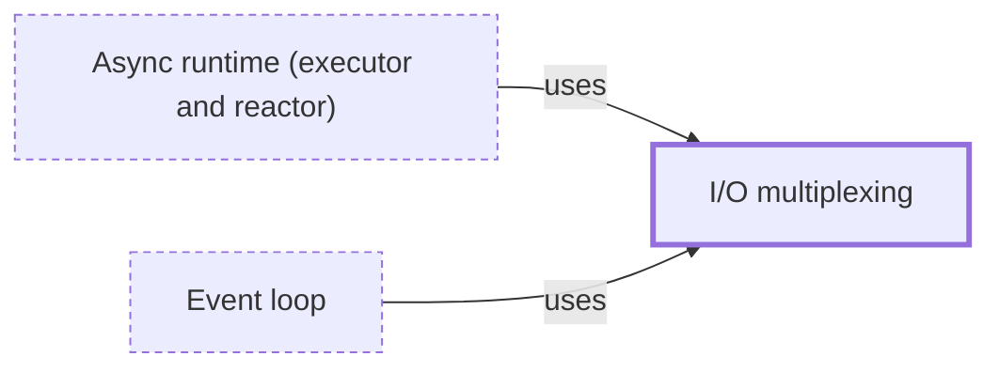

# I/O multiplexing

**Category:** [Scheduling](../README.md) · **Status:** stub · **Lessons:** [chapter 06, Async](../../../06_Async/README.md)

**One line:** Asking the operating system to watch many sockets or file descriptors at once and report which are ready, so that one thread can serve thousands of connections.

Also called: epoll, kqueue, IOCP, select(2), poll(2).

## How it connects

- **Is used by:** [Async runtime (executor and reactor)](../async_runtime/README.md), [Event loop](../event_loop/README.md)
- **See also:** [Blocking and non-blocking calls](../../foundations/blocking_and_nonblocking/README.md)

## In each language

| | |
|---|---|
| Rust | Not in the standard library; the [`mio` ↗](https://docs.rs/mio/latest/mio/struct.Poll.html) crate's `Poll` is backed by epoll, kqueue or IOCP, depending on the OS |
| C | POSIX [`poll` ↗](https://pubs.opengroup.org/onlinepubs/9799919799/functions/poll.html) and [`select` ↗](https://pubs.opengroup.org/onlinepubs/9799919799/functions/select.html) |
| Java | [`Selector` ↗](https://docs.oracle.com/en/java/javase/25/docs/api/java.base/java/nio/channels/Selector.html) over non-blocking channels |
| Python | [`selectors` ↗](https://docs.python.org/3/library/selectors.html), whose `DefaultSelector` picks the most efficient mechanism on the platform |
| The operating system | [`epoll(7)` ↗](https://man7.org/linux/man-pages/man7/epoll.7.html) on Linux, [`poll(2)` ↗](https://man7.org/linux/man-pages/man2/poll.2.html) everywhere; Windows [I/O completion ports ↗](https://learn.microsoft.com/en-us/windows/win32/fileio/i-o-completion-ports) queue a packet when an I/O operation completes |

## Where to read more

- **In this library:** [How does one thread wait on several channels at once?](../../../05_Message_Passing/waiting_on_several_channels/README.md)
- **In this library:** [What does an event loop do all day?](../../../06_Async/what_an_event_loop_does/README.md)
- **In this library:** [How does one thread watch a thousand sockets?](../../../06_Async/io_multiplexing_under_the_loop/README.md)
- **In the books:** [*Asynchronous Programming in Rust*](../../../10_Resources/books_rust/README.md#samson_asynchronous_programming_in_rust), Carl Fredrik Samson — ch. 3, 'Understanding OS-Backed Event Queues, System Calls, and Cross-Platform Abstractions'
- **In the books:** [*Python Concurrency with asyncio*](../../../10_Resources/books_python/README.md#fowler_python_concurrency_with_asyncio), Matthew Fowler — ch. 3, 'A first asyncio application' → 'Using the selectors module to build a socket event loop'
- **In the books:** [*Grokking Concurrency*](../../../10_Resources/books_general/README.md#bobrov_grokking_concurrency), Kirill Bobrov — ch. 11, 'Event-based concurrency' → 'I/O multiplexing'
- **In the books:** [*The Linux Programming Interface*](../../../10_Resources/books_c/README.md#kerrisk_linux_programming_interface), Michael Kerrisk — ch. 63, 'Alternative I/O Models'
- **In the books:** [*The Go Programming Language*](../../../10_Resources/books_go/README.md#donovan_kernighan_go_programming_language), Alan A. A. Donovan, Brian W. Kernighan — ch. 8, 'Goroutines and Channels' → 'Multiplexing with select'
- **In the books:** [*Advanced Programming in the UNIX Environment*](../../../10_Resources/books_c/README.md#stevens_rago_apue), W. Richard Stevens, Stephen A. Rago — ch. 14, 'Advanced I/O' → 'I/O Multiplexing'
- **Notes:** [Rust's Journey to Async/Await - Evented I/O non-blocking APIs - nginx ↗](https://docs.google.com/document/d/1UP0c6brYqFlGiHsO6dSzuxa-SKsHGc24w0apNb4Fqcc/edit?tab=t.0)
- **Reference:** [Wikipedia: epoll ↗](https://en.wikipedia.org/wiki/Epoll)

<!-- Generated above this line by tools/build_concepts.py from TOML data — edit the data, not the page. Hand-written notes go below it and are kept. -->
