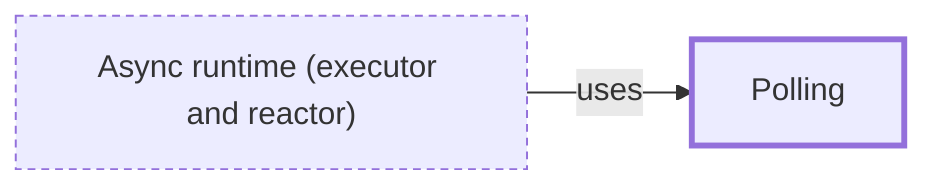

# Polling

**Category:** [Scheduling](../README.md) · **Status:** stub

**One line:** Asking repeatedly whether something is ready instead of being told; in Rust, an executor polls a future and the future answers Ready or Pending.

Also called: poll.

## How it connects

- **Is used by:** [Async runtime (executor and reactor)](../async_runtime/README.md)
- **See also:** [Blocking and non-blocking calls](../../foundations/blocking_and_nonblocking/README.md), [Busy waiting](../busy_waiting/README.md), [Future and promise](../../async/future_and_promise/README.md)

## In each language

| | |
|---|---|
| Rust | [`Future::poll` ↗](https://doc.rust-lang.org/std/future/trait.Future.html#tymethod.poll) returns [`Poll::Ready` ↗](https://doc.rust-lang.org/std/task/enum.Poll.html) or `Poll::Pending`, and a [`Waker` ↗](https://doc.rust-lang.org/std/task/struct.Waker.html) says when to poll again |
| Go | A [`select` with a `default` case ↗](https://go.dev/ref/spec#Select_statements) checks channels without blocking |
| C++ | [`std::future::wait_for` ↗](https://en.cppreference.com/w/cpp/thread/future/wait_for) with a zero timeout asks whether a result is ready |
| Java | [`Future.isDone` ↗](https://docs.oracle.com/en/java/javase/25/docs/api/java.base/java/util/concurrent/Future.html#isDone%28%29), and `poll` on a [`BlockingQueue` ↗](https://docs.oracle.com/en/java/javase/25/docs/api/java.base/java/util/concurrent/BlockingQueue.html) |
| Python | [`Popen.poll` ↗](https://docs.python.org/3/library/subprocess.html#subprocess.Popen.poll) checks whether a child process has ended |
| The operating system | [`poll(2)` ↗](https://man7.org/linux/man-pages/man2/poll.2.html), despite its name, waits for a file descriptor to become ready |

## Where to read more

- **In the books:** [*Asynchronous Programming in Rust*](../../../10_Resources/books_rust/README.md#samson_asynchronous_programming_in_rust), Carl Fredrik Samson — ch. 4, 'Create Your Own Event Queue' → 'The Poll module'
- **In the books:** [*Concurrency in C# Cookbook*](../../../10_Resources/books_csharp_dotnet/README.md#cleary_concurrency_in_csharp_cookbook), Stephen Cleary — ch. 10, 'Cancellation' → 'Responding to Cancellation Requests by Polling'
- **In the books:** [*Kotlin Coroutines by Tutorials*](../../../10_Resources/books_other/README.md#babic_srivastava_kotlin_coroutines_by_tutorials), Filip Babić, Nishant Srivastava — ch. 11, 'Channels' → 'Comparing receive and poll'
- **In the books:** [*Advanced Programming in the UNIX Environment*](../../../10_Resources/books_c/README.md#stevens_rago_apue), W. Richard Stevens, Stephen A. Rago — ch. 14, 'Advanced I/O' → 'poll Function'
- **In the books:** [*Python Cookbook*](../../../10_Resources/books_python/README.md#beazley_jones_python_cookbook), David Beazley, Brian K. Jones — ch. 12, 'Concurrency' → 'Polling Multiple Thread Queues'
- **In the books:** [*Programming Rust*](../../../10_Resources/books_rust/README.md#blandy_programming_rust), Jim Blandy, Jason Orendorff, Leonora F. S. Tindall — ch. 20, 'Asynchronous Programming' → 'Primitive Futures and Executors: When Is a Future Worth Polling Again?'
- **Notes:** [poll - polling - general ↗](https://docs.google.com/document/d/1otsU4JjxA2eQrj-G1kuoWJS6QyMIYXYMBnzSuCKY6zs/edit?tab=t.0)
- **Notes:** [poll - rust ↗](https://docs.google.com/document/u/0/d/1Osp8gq7XwMEiMGlEZ8fSFbpedjz-7ZapsXQXgZhSblc/edit)
- **Reference:** [Wikipedia: Polling (computer science) ↗](https://en.wikipedia.org/wiki/Polling_(computer_science))

<!-- Generated above this line by tools/build_concepts.py from TOML data — edit the data, not the page. Hand-written notes go below it and are kept. -->
