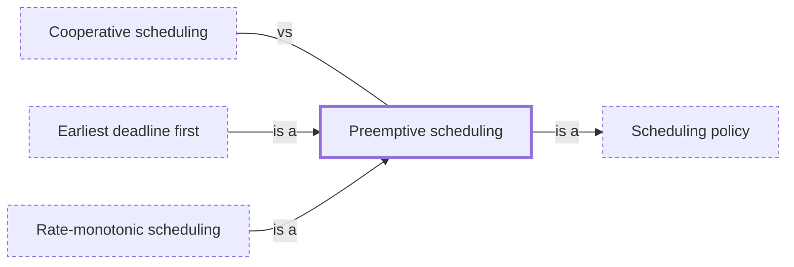

# Preemptive scheduling

**Category:** [Scheduling](../README.md) · **Status:** stub

**One line:** The scheduler may stop a running thread at any moment, usually on a timer interrupt, and run another — no thread can hog the CPU, and any step can be interrupted.

Also called: preemption, preemptive multitasking.

## How it connects

- **Is a kind of:** [Scheduling policy](../scheduling_policy/README.md)
- **Kinds:** [Earliest deadline first](../../real_time/earliest_deadline_first/README.md), [Rate-monotonic scheduling](../../real_time/rate_monotonic_scheduling/README.md)
- **Often confused with:** [Cooperative scheduling](../cooperative_scheduling/README.md)
- **See also:** [Context switch](../../units_of_execution/context_switch/README.md), [Goroutine](../../units_of_execution/goroutine/README.md), [Interleaving](../../foundations/interleaving/README.md), [Multitasking](../../foundations/multitasking/README.md)

## In each language

| | |
|---|---|
| Go | Goroutines have been [asynchronously preemptible since Go 1.14 ↗](https://go.dev/doc/go1.14#runtime); before that, a loop without function calls could hold up the scheduler |
| Python | Threads get timeslices set by the [switch interval ↗](https://docs.python.org/3/library/sys.html#sys.setswitchinterval), and the operating system picks which runs next: the interpreter has no scheduler of its own |
| JavaScript | Never: a function [runs to completion ↗](https://developer.mozilla.org/en-US/docs/Web/JavaScript/Reference/Execution_model) before other code on the same thread runs |
| Haskell | GHC [preempts a thread ↗](https://hackage.haskell.org/package/base/docs/Control-Concurrent.html) only when it allocates memory, so a tight loop that never allocates can lock out other threads |
| The operating system | [`sched(7)` ↗](https://man7.org/linux/man-pages/man7/sched.7.html): a higher-priority thread preempts a lower one; `SCHED_RR` also takes turns by time slice |

## Where to read more

- **In this library:** [What does a sleep promise, and what does a yield?](../../../01_Threads/sleep_and_yield/README.md)
- **In this library:** [How does a low-priority thread block a high-priority one?](../../../03_When_Locks_Go_Wrong/priority_inversion/README.md)
- **In the books:** [*Pro TBB*](../../../10_Resources/books_cpp/README.md#voss_pro_tbb), Michael Voss, Rafael Asenjo, James Reinders — ch. 14, 'Using Task Priorities' → 'Support for Non-Preemptive Priorities in the TBB Task Class'
- **Reference:** [Wikipedia: Preemption (computing) ↗](https://en.wikipedia.org/wiki/Preemption_(computing))

<!-- Generated above this line by tools/build_concepts.py from TOML data — edit the data, not the page. Hand-written notes go below it and are kept. -->
