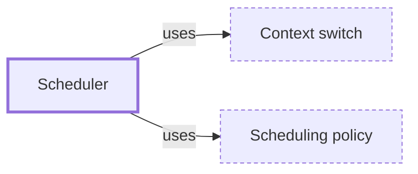

# Scheduler

**Category:** [Scheduling](../README.md) · **Status:** stub

**One line:** The part of an operating system or runtime that decides which ready thread or task runs next, on which core, and for how long.

Also called: thread scheduler, process scheduler.

## How it connects

- **Is built on:** [Context switch](../../units_of_execution/context_switch/README.md), [Scheduling policy](../scheduling_policy/README.md)
- **See also:** [Context switch](../../units_of_execution/context_switch/README.md), [Green threads and M:N scheduling](../../units_of_execution/green_thread/README.md), [Thread](../../units_of_execution/thread/README.md)

## In each language

| | |
|---|---|
| Rust | Threads are scheduled by the OS; async tasks by the chosen runtime, such as [Tokio's ↗](https://docs.rs/tokio/latest/tokio/runtime/index.html) |
| Go | The runtime schedules goroutines onto threads, running Go code on at most [`GOMAXPROCS` ↗](https://pkg.go.dev/runtime#GOMAXPROCS) CPUs at once |
| Java | Platform threads by the OS; [virtual threads ↗](https://docs.oracle.com/en/java/javase/25/docs/api/java.base/java/lang/Thread.html#virtual-threads) by a scheduler in the JDK, using as many platform threads as there are processors by default |
| C# | [`TaskScheduler` ↗](https://learn.microsoft.com/en-us/dotnet/api/system.threading.tasks.taskscheduler) decides where tasks run |
| Kotlin | A [`CoroutineDispatcher` ↗](https://kotlinlang.org/api/kotlinx.coroutines/kotlinx-coroutines-core/kotlinx.coroutines/-coroutine-dispatcher/), such as `Dispatchers.Default` or `Dispatchers.IO`, runs coroutines on its pool of threads |
| Erlang and Elixir | [Scheduler threads ↗](https://www.erlang.org/doc/apps/erts/erl_cmd.html) (`+S`), by default one per logical processor |
| Haskell | [`setNumCapabilities` ↗](https://hackage.haskell.org/package/base/docs/GHC-Conc.html#v:setNumCapabilities) sets how many Haskell threads can run truly simultaneously |
| The operating system | [`sched(7)` ↗](https://man7.org/linux/man-pages/man7/sched.7.html): Linux's policies `SCHED_OTHER`, `SCHED_FIFO`, `SCHED_RR` and `SCHED_DEADLINE` |

## Where to read more

- **In the books:** [*Concurrency in C# Cookbook*](../../../10_Resources/books_csharp_dotnet/README.md#cleary_concurrency_in_csharp_cookbook), Stephen Cleary — ch. 13, 'Scheduling'
- **In the books:** [*Combine: Asynchronous Programming with Swift*](../../../10_Resources/books_swift/README.md#kodeco_combine_asynchronous_programming_swift), Shai Mishali, Florent Pillet, Marin Todorov, Scott Gardner — ch. 17, 'Schedulers'
- **In the books:** [*Programming with POSIX Threads*](../../../10_Resources/books_c/README.md#butenhof_programming_with_posix_threads), David R. Butenhof — ch. 5, 'Advanced Threaded Programming' → 'Realtime scheduling'
- **In the books:** [*Pro TBB*](../../../10_Resources/books_cpp/README.md#voss_pro_tbb), Michael Voss, Rafael Asenjo, James Reinders — ch. 11, 'Controlling the Number of Threads Used for Execution' → 'A Brief Recap of the TBB Scheduler Architecture'
- **In the books:** [*Learning Concurrent Programming in Scala*](../../../10_Resources/books_scala_jvm_functional/README.md#prokopec_learning_concurrent_programming_in_scala), Aleksandar Prokopec — ch. 6, 'Concurrent Programming with Reactive Extensions' → 'Rx schedulers'
- **In the books:** [*Parallel and Concurrent Programming in Haskell*](../../../10_Resources/books_haskell/README.md#marlow_parallel_and_concurrent_programming_in_haskell), Simon Marlow — ch. 4, 'Dataflow Parallelism: The Par Monad' → 'Using Different Schedulers'
- **Reference:** [Wikipedia: Scheduling (computing) ↗](https://en.wikipedia.org/wiki/Scheduling_(computing))

<!-- Generated above this line by tools/build_concepts.py from TOML data — edit the data, not the page. Hand-written notes go below it and are kept. -->
