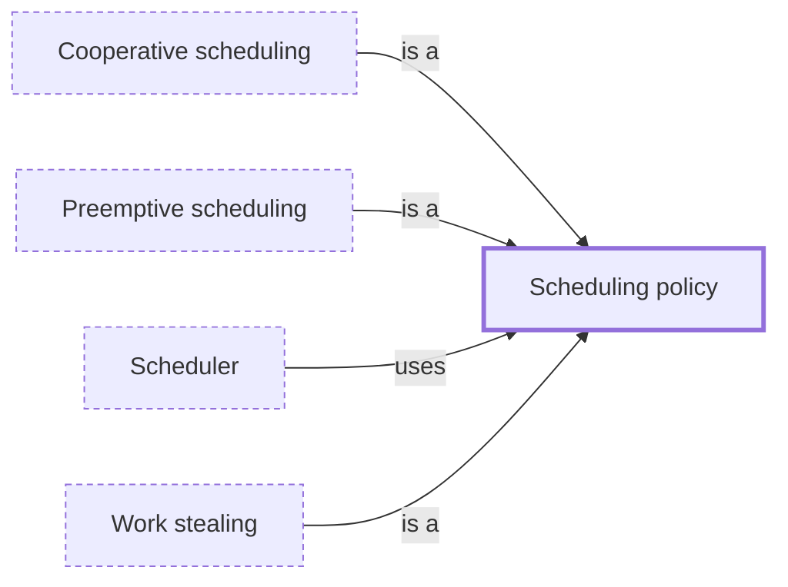

# Scheduling policy

**Category:** [Scheduling](../README.md) · **Status:** stub

**One line:** The rule a scheduler follows to pick what runs next: whether a running task can be interrupted, how priorities are set, and where idle cores find work.

Also called: scheduling algorithm.

## How it connects

- **Kinds:** [Cooperative scheduling](../cooperative_scheduling/README.md), [Preemptive scheduling](../preemptive_scheduling/README.md), [Work stealing](../work_stealing/README.md)
- **Is used by:** [Scheduler](../scheduler/README.md)

## In each language

| | |
|---|---|
| The operating system | Linux's [scheduling policies ↗](https://man7.org/linux/man-pages/man7/sched.7.html): `SCHED_OTHER` for ordinary threads, and the real-time `SCHED_FIFO` and `SCHED_RR` |

## Where to read more

- **Reference:** [Wikipedia: Scheduling (computing) — scheduling disciplines ↗](https://en.wikipedia.org/wiki/Scheduling_(computing)#Scheduling_disciplines)

<!-- Generated above this line by tools/build_concepts.py from TOML data — edit the data, not the page. Hand-written notes go below it and are kept. -->
