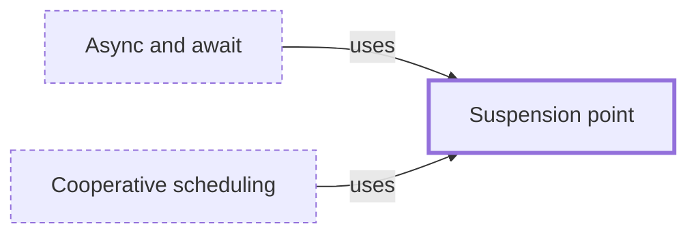

# Suspension point

**Category:** [Scheduling](../README.md) · **Status:** stub · **Lessons:** [chapter 06, Async](../../../06_Async/README.md)

**One line:** A place where a coroutine or async function can pause and hand control back — an await, a yield — and where other tasks may run before it resumes.

Also called: await point, yield point.

## How it connects

- **Is used by:** [Async and await](../../async/async_await/README.md), [Cooperative scheduling](../cooperative_scheduling/README.md)
- **See also:** [Async and await](../../async/async_await/README.md), [Coroutine](../../units_of_execution/coroutine/README.md)

## In each language

| | |
|---|---|
| Rust | Each [`.await` ↗](https://doc.rust-lang.org/reference/expressions/await-expr.html) |
| Go | No marked points: goroutines have been [asynchronously preemptible ↗](https://go.dev/doc/go1.14#runtime) since Go 1.14 |
| C++ | [`co_await` and `co_yield` ↗](https://en.cppreference.com/w/cpp/language/coroutines) |
| Python | [`await` ↗](https://docs.python.org/3/reference/expressions.html#await-expression), and the implicit awaits in `async for` and `async with` |
| C# | [`await` ↗](https://learn.microsoft.com/en-us/dotnet/csharp/language-reference/operators/await) |
| JavaScript | [`await` ↗](https://developer.mozilla.org/en-US/docs/Web/JavaScript/Reference/Operators/await), and `yield` in a generator |
| Kotlin | A call to a [suspending function ↗](https://kotlinlang.org/docs/coroutines-overview.html), which pauses and resumes without blocking a thread |
| Swift | [`await` ↗](https://docs.swift.org/swift-book/documentation/the-swift-programming-language/concurrency/) marks each possible suspension point |

## Where to read more

- **In this library:** [What happens at an await?](../../../06_Async/async_and_await/README.md)
- **In this library:** [How is a running task told to stop, and does it?](../../../06_Async/cancelling_an_async_task/README.md)
- **In the books:** [*Kotlin Coroutines by Tutorials*](../../../10_Resources/books_other/README.md#babic_srivastava_kotlin_coroutines_by_tutorials), Filip Babić, Nishant Srivastava — ch. 4, 'Suspending Functions'
- **In the books:** [*Programming with C++20*](../../../10_Resources/books_cpp/README.md#fertig_programming_with_cpp20), Andreas Fertig — ch. 2, 'Coroutines: Suspending functions'
- **Notes:** [suspension point - concurrent - async - general ↗](https://docs.google.com/document/d/152N9fY5IrgOSHLjxj08re2_IKtUVU9LpV_FjbpEhh2k/edit?tab=t.0)
- **Notes:** [await - yield control to caller at an await - rust ↗](https://docs.google.com/document/d/1kXQpJjA-j44wqGe7eWidTkjwp3XLgRJyDBup5fzBVho/edit?tab=t.0)

<!-- Generated above this line by tools/build_concepts.py from TOML data — edit the data, not the page. Hand-written notes go below it and are kept. -->
