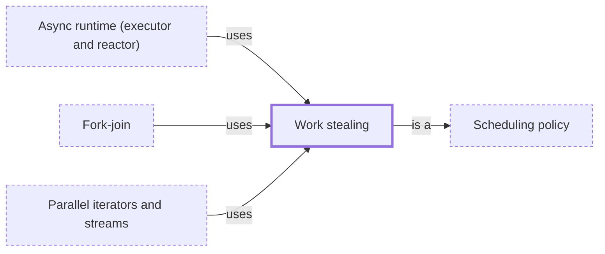

# Work stealing

**Category:** [Scheduling](../README.md) · **Status:** stub

**One line:** Each worker thread keeps its own queue of tasks, and an idle worker takes tasks from a busy worker's queue, balancing the load without one central queue.

Also called: work-stealing scheduler.

## How it connects

- **Is a kind of:** [Scheduling policy](../scheduling_policy/README.md)
- **Is used by:** [Async runtime (executor and reactor)](../async_runtime/README.md), [Fork-join](../../parallelism/fork_join/README.md), [Parallel iterators and streams](../../parallelism/parallel_iterators/README.md)
- **See also:** [Thread pool and executor](../../units_of_execution/thread_pool/README.md)

## In each language

| | |
|---|---|
| Rust | Tokio's [multi-thread scheduler ↗](https://docs.rs/tokio/latest/tokio/runtime/index.html) and Rayon's [`join` ↗](https://docs.rs/rayon/latest/rayon/fn.join.html) both use work stealing |
| Java | [`ForkJoinPool` ↗](https://docs.oracle.com/en/java/javase/25/docs/api/java.base/java/util/concurrent/ForkJoinPool.html), and [`Executors.newWorkStealingPool` ↗](https://docs.oracle.com/en/java/javase/25/docs/api/java.base/java/util/concurrent/Executors.html#newWorkStealingPool%28%29) |
| C# | The default [`TaskScheduler` ↗](https://learn.microsoft.com/en-us/dotnet/api/system.threading.tasks.taskscheduler) gives thread-pool threads local work queues, and an idle thread steals from another's |

## Where to read more

- **In the books:** [*Concurrency in Go*](../../../10_Resources/books_go/README.md#cox_buday_concurrency_in_go), Katherine Cox-Buday — ch. 6, 'Goroutines and the Go Runtime' → 'Work Stealing'
- **In the books:** [*Async Rust*](../../../10_Resources/books_rust/README.md#flitton_morton_async_rust), Maxwell Flitton, Caroline Morton — ch. 3, 'Building Our Own Async Queues' → 'Task Stealing'
- **In the books:** [*The Art of Multiprocessor Programming*](../../../10_Resources/books_general/README.md#herlihy_shavit_art_of_multiprocessor_programming), Maurice Herlihy, Nir Shavit — ch. 16, 'Futures, Scheduling, and Work Distribution' → 'Work-Stealing Dequeues'
- **Notes:** [work-stealing based task scheduler ↗](https://docs.google.com/document/d/1vTgNx3VxgbuMS7mj24BpO9SEdSIA33PW7GZgq0TIh7U/edit?tab=t.0)
- **Reference:** [Wikipedia: Work stealing ↗](https://en.wikipedia.org/wiki/Work_stealing)

<!-- Generated above this line by tools/build_concepts.py from TOML data — edit the data, not the page. Hand-written notes go below it and are kept. -->
