# The schema

**How the concepts connect.** The [ontology](../README.md) says what each concept *is a kind of*. This page draws everything else: what a concept is built on, what it helps prevent, what it can lead to, what it is an alternative to, and what it is often confused with.

Every connection is written once, in the data behind these pages (`11_Concepts/<category>/concepts.toml`), and appears on both concepts' pages — so a link from *mutex* to *deadlock* cannot exist without the link back.

**Reading a diagram.** An arrow points from the concept a relation is written from: *mutex* —can cause→ *deadlock*. A line without an arrowhead reads the same both ways (*deadlock* — vs — *livelock*). A dashed box is a concept from another category, drawn because something in this one connects to it. *See also* links appear on the pages and in the table at the end, but not in the diagrams, which they would clutter.

<!-- concepts:schema -->

## The relations

| Relation | Read it as | On the other page |
|---|---|---|
| `is_a` | A — *is a kind of* — B | B — *kinds* — A |
| `uses` | A — *is built on* — B | B — *is used by* — A |
| `prevents` | A — *helps prevent* — B | B — *is prevented by* — A |
| `causes` | A — *can lead to* — B | B — *can be caused by* — A |
| `alternative` | A — *an alternative to* — B | the same, both ways |
| `contrasts` | A — *often confused with* — B | the same, both ways |
| `related` | A — *see also* — B | the same, both ways |

## Between categories

Each arrow counts the connections from concepts in one category to concepts in another.

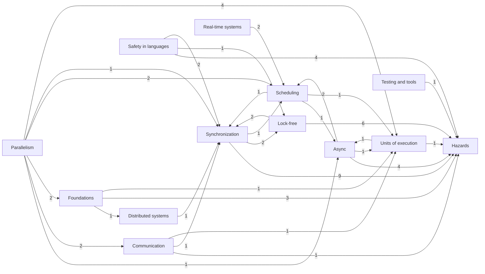

## Foundations

Dashed boxes belong to other categories.

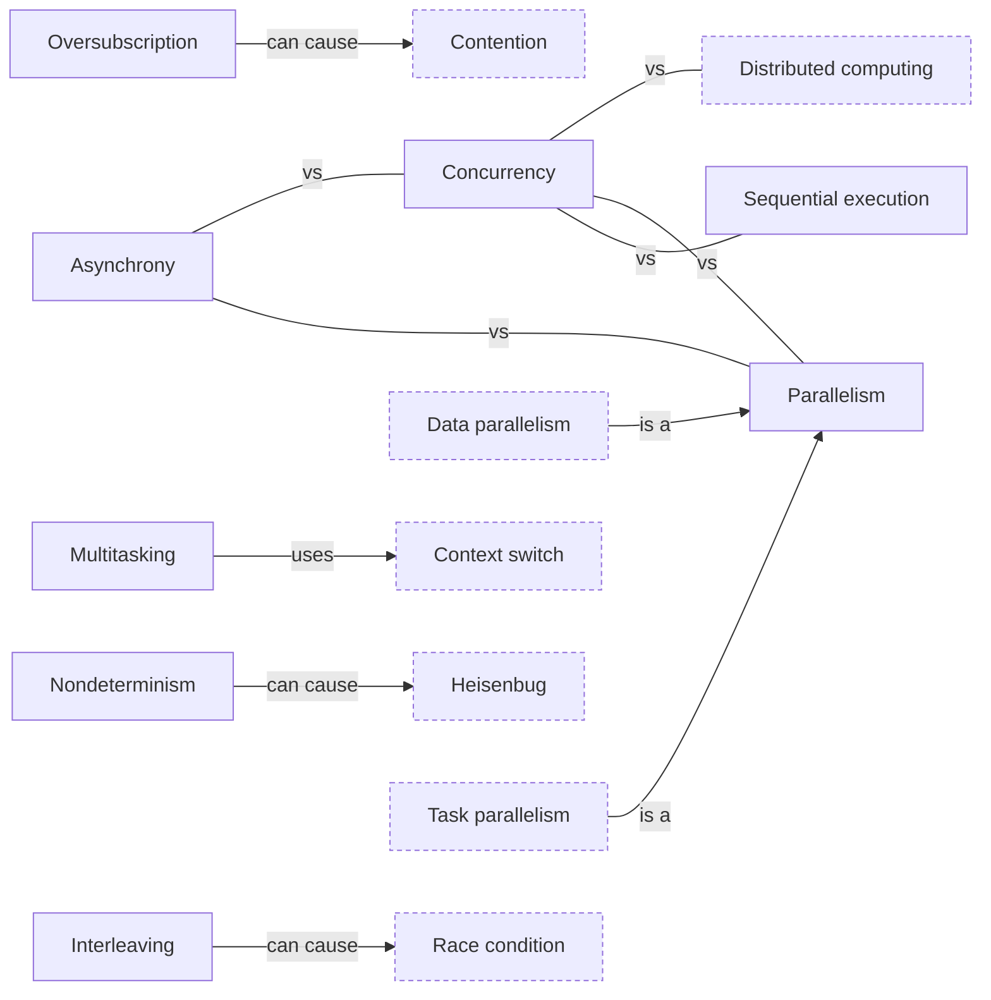

## Units of execution

Dashed boxes belong to other categories.

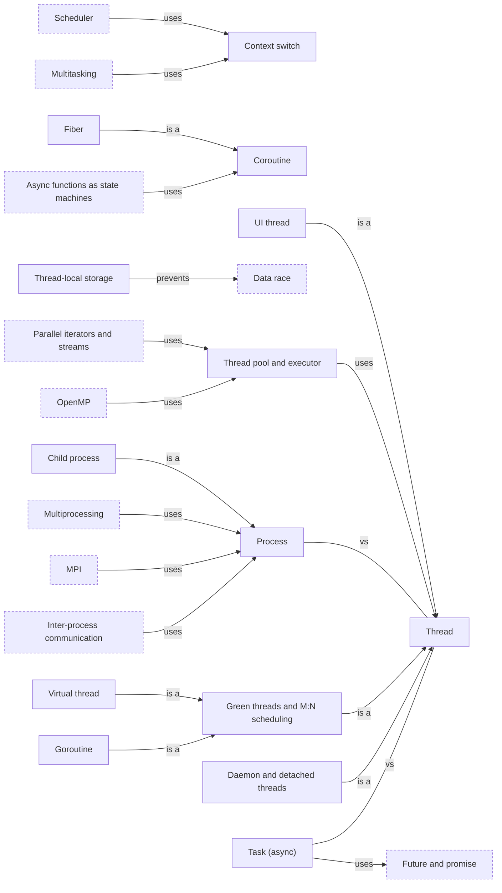

## Scheduling

Dashed boxes belong to other categories.

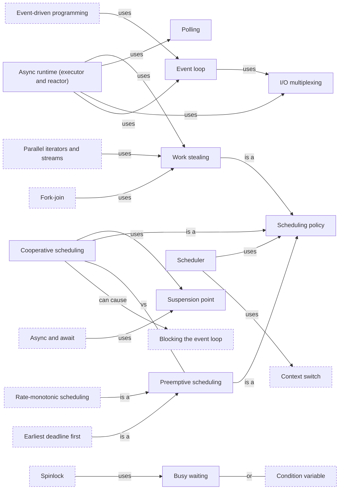

## Hazards

Dashed boxes belong to other categories.

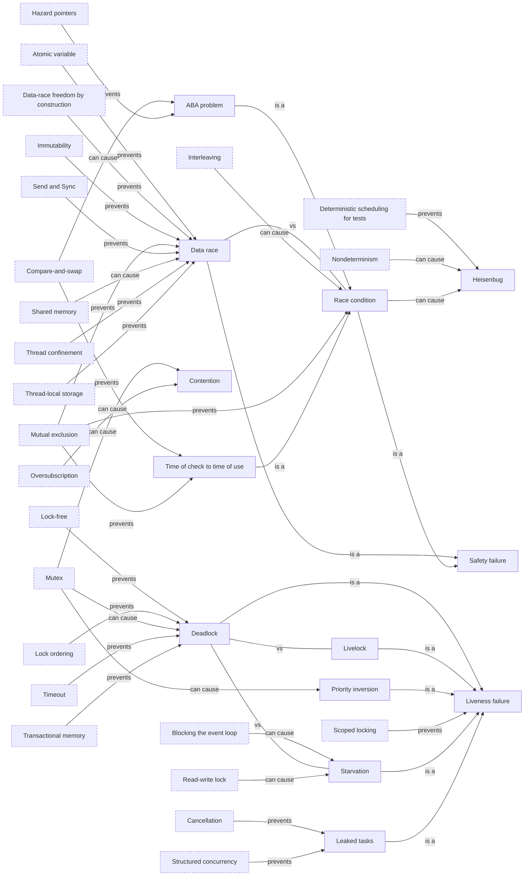

## Synchronization

Dashed boxes belong to other categories.

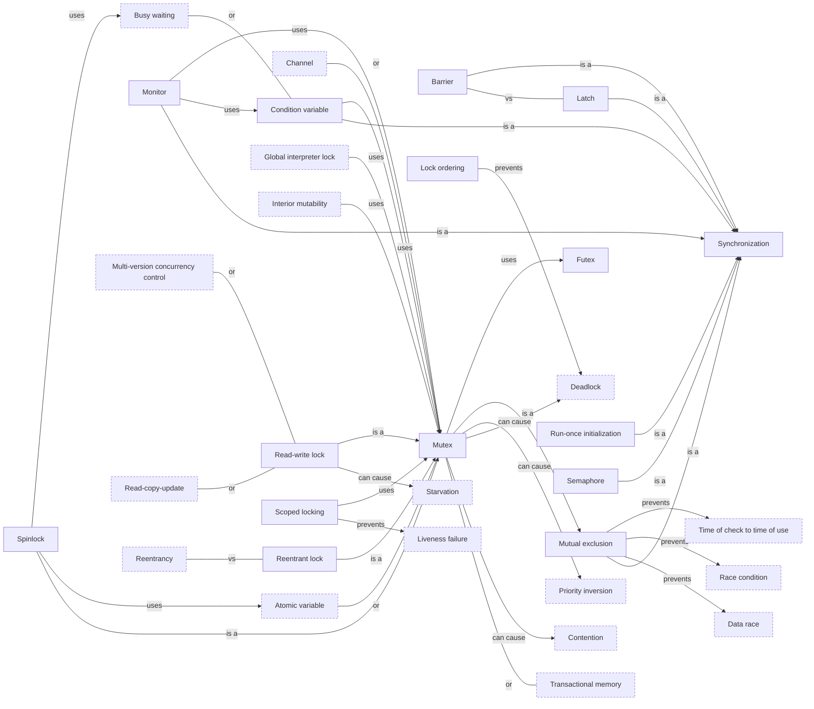

## Lock-free

Dashed boxes belong to other categories.

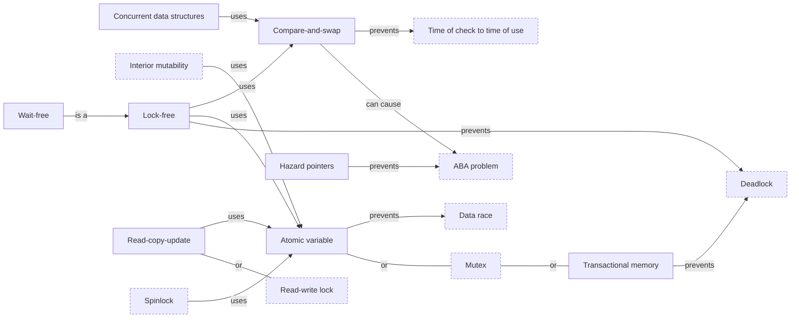

## Communication

Dashed boxes belong to other categories.

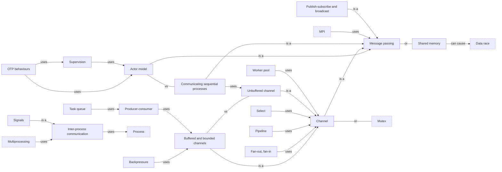

## Async

Dashed boxes belong to other categories.

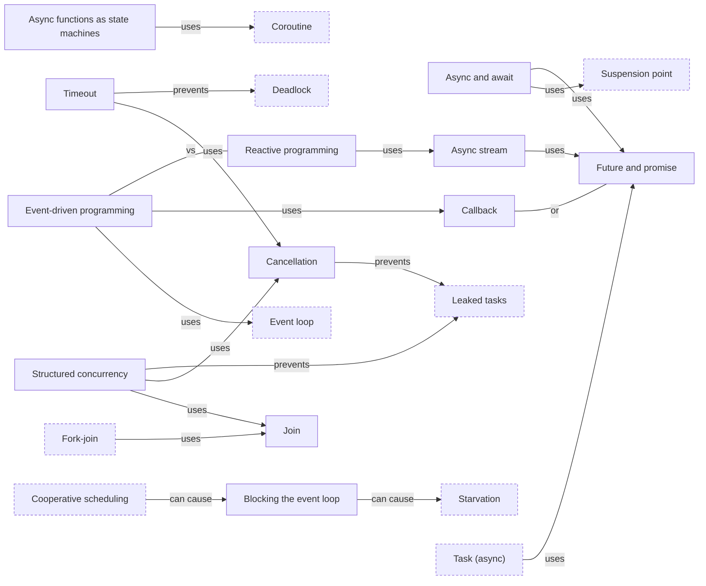

## Parallelism

Dashed boxes belong to other categories.

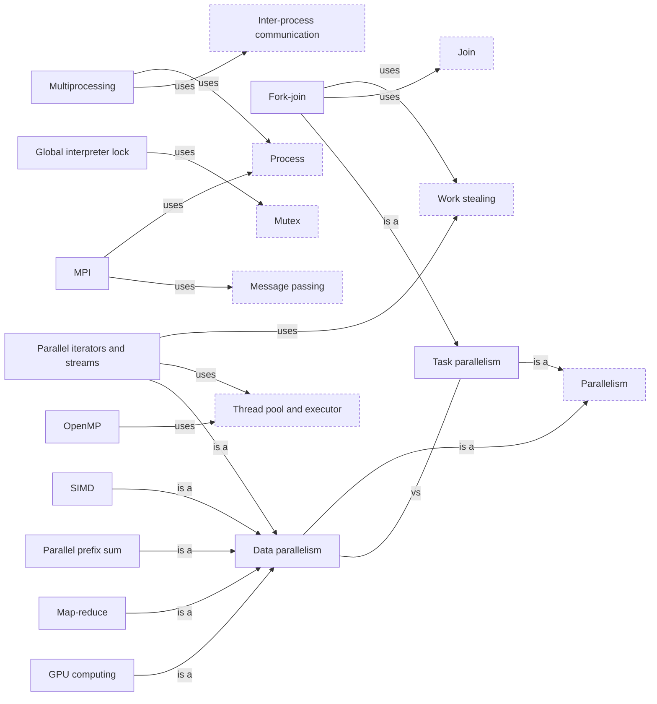

## Safety in languages

Dashed boxes belong to other categories.

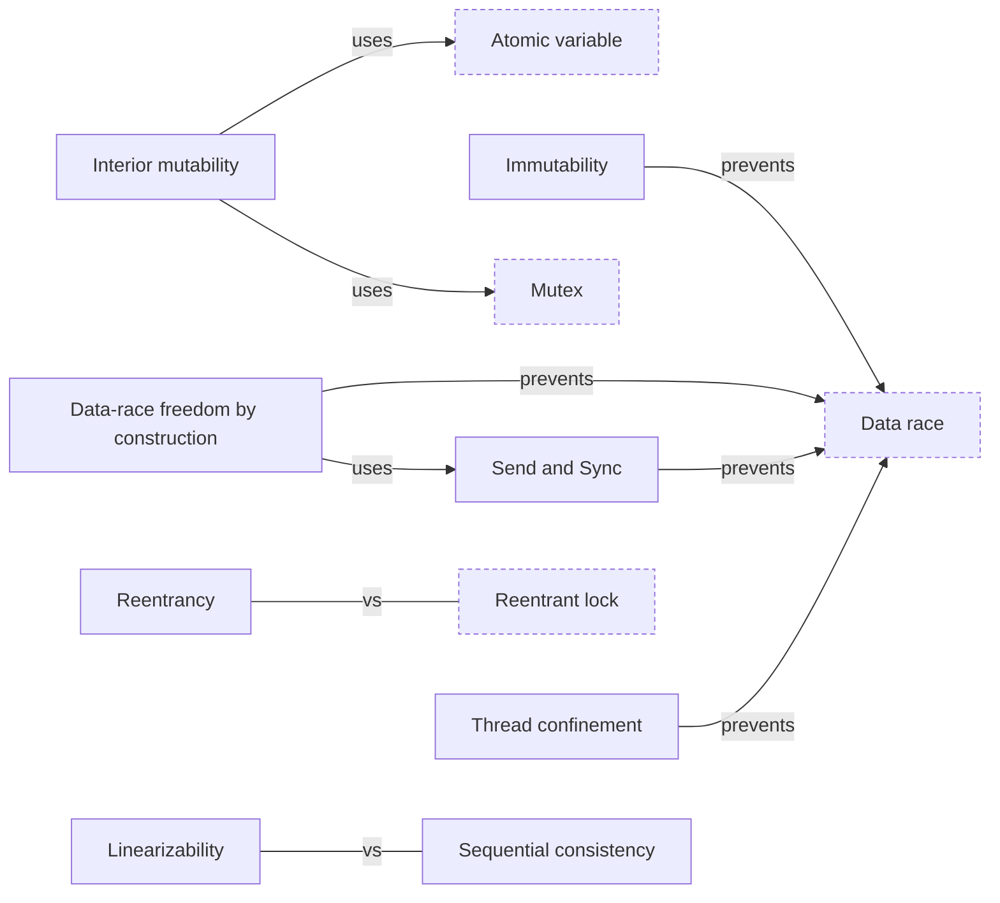

## Distributed systems

Dashed boxes belong to other categories.

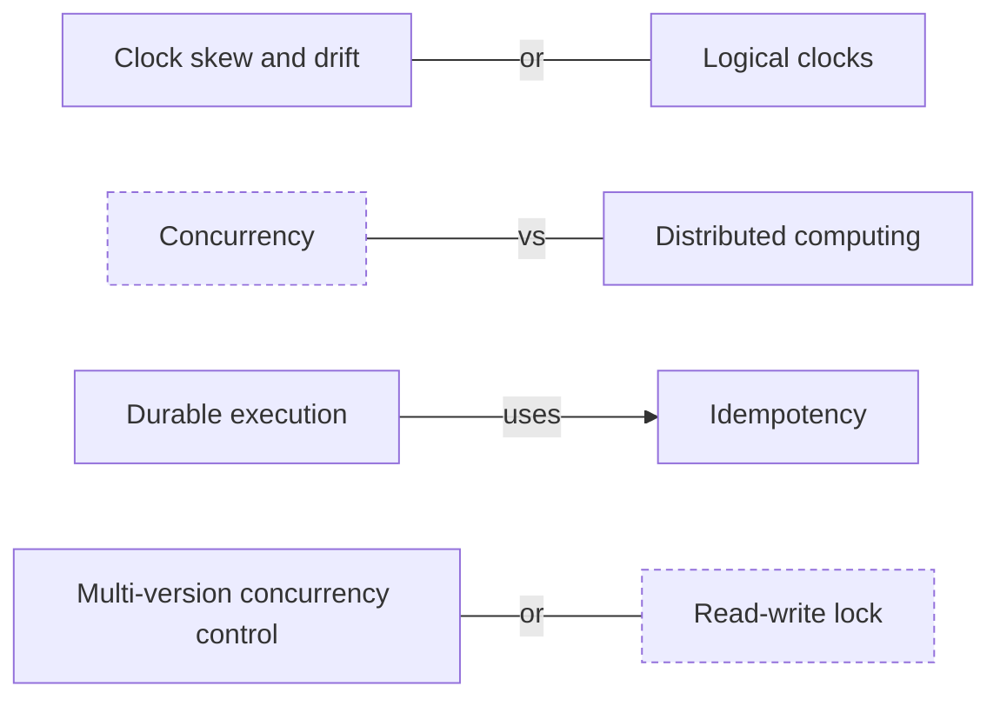

## Real-time systems

Dashed boxes belong to other categories.

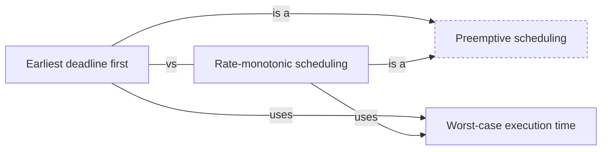

## Testing and tools

Dashed boxes belong to other categories.

## Every connection

| Concept | Relation | Concept |
|---|---|---|
| [ABA problem](../hazards/aba_problem/README.md) | is a kind of | [Race condition](../hazards/race_condition/README.md) |
| [Actor model](../communication/actor_model/README.md) | often confused with | [Communicating sequential processes](../communication/csp/README.md) |
| [Actor model](../communication/actor_model/README.md) | is a kind of | [Message passing](../communication/message_passing/README.md) |
| [Actor model](../communication/actor_model/README.md) | see also | [Concurrency models](../foundations/concurrency_models/README.md) |
| [Async and await](../async/async_await/README.md) | see also | [Async functions as state machines](../async/async_state_machine/README.md) |
| [Async and await](../async/async_await/README.md) | see also | [Asynchrony](../foundations/asynchrony/README.md) |
| [Async and await](../async/async_await/README.md) | see also | [Coroutine](../units_of_execution/coroutine/README.md) |
| [Async and await](../async/async_await/README.md) | see also | [Durable execution](../distributed/durable_execution/README.md) |
| [Async and await](../async/async_await/README.md) | see also | [Function coloring](../async/function_coloring/README.md) |
| [Async and await](../async/async_await/README.md) | see also | [Future and promise](../async/future_and_promise/README.md) |
| [Async and await](../async/async_await/README.md) | see also | [Suspension point](../scheduling/suspension_point/README.md) |
| [Async and await](../async/async_await/README.md) | is built on | [Future and promise](../async/future_and_promise/README.md) |
| [Async and await](../async/async_await/README.md) | is built on | [Suspension point](../scheduling/suspension_point/README.md) |
| [Async runtime (executor and reactor)](../scheduling/async_runtime/README.md) | see also | [Task (async)](../units_of_execution/async_task/README.md) |
| [Async runtime (executor and reactor)](../scheduling/async_runtime/README.md) | is built on | [Event loop](../scheduling/event_loop/README.md) |
| [Async runtime (executor and reactor)](../scheduling/async_runtime/README.md) | is built on | [I/O multiplexing](../scheduling/io_multiplexing/README.md) |
| [Async runtime (executor and reactor)](../scheduling/async_runtime/README.md) | is built on | [Polling](../scheduling/polling/README.md) |
| [Async runtime (executor and reactor)](../scheduling/async_runtime/README.md) | is built on | [Work stealing](../scheduling/work_stealing/README.md) |
| [Async functions as state machines](../async/async_state_machine/README.md) | see also | [Pinning](../async/pinning/README.md) |
| [Async functions as state machines](../async/async_state_machine/README.md) | is built on | [Coroutine](../units_of_execution/coroutine/README.md) |
| [Async stream](../async/async_stream/README.md) | is built on | [Future and promise](../async/future_and_promise/README.md) |
| [Task (async)](../units_of_execution/async_task/README.md) | often confused with | [Thread](../units_of_execution/thread/README.md) |
| [Task (async)](../units_of_execution/async_task/README.md) | see also | [Thread-local storage](../units_of_execution/thread_local_storage/README.md) |
| [Task (async)](../units_of_execution/async_task/README.md) | is built on | [Future and promise](../async/future_and_promise/README.md) |
| [Asynchrony](../foundations/asynchrony/README.md) | often confused with | [Concurrency](../foundations/concurrency/README.md) |
| [Asynchrony](../foundations/asynchrony/README.md) | often confused with | [Parallelism](../foundations/parallelism/README.md) |
| [Asynchrony](../foundations/asynchrony/README.md) | see also | [Blocking and non-blocking calls](../foundations/blocking_and_nonblocking/README.md) |
| [Asynchrony](../foundations/asynchrony/README.md) | see also | [Callback](../async/callback/README.md) |
| [Asynchrony](../foundations/asynchrony/README.md) | see also | [Future and promise](../async/future_and_promise/README.md) |
| [Atomic variable](../lock_free/atomic_variable/README.md) | an alternative to | [Mutex](../synchronization/mutex/README.md) |
| [Atomic variable](../lock_free/atomic_variable/README.md) | helps prevent | [Data race](../hazards/data_race/README.md) |
| [Atomic variable](../lock_free/atomic_variable/README.md) | see also | [Compare-and-swap](../lock_free/compare_and_swap/README.md) |
| [Atomic variable](../lock_free/atomic_variable/README.md) | see also | [Concurrency primitives](../foundations/concurrency_primitives/README.md) |
| [Backpressure](../communication/backpressure/README.md) | is built on | [Buffered and bounded channels](../communication/bounded_channel/README.md) |
| [Barrier](../synchronization/barrier/README.md) | often confused with | [Latch](../synchronization/latch/README.md) |
| [Barrier](../synchronization/barrier/README.md) | is a kind of | [Synchronization](../synchronization/synchronization/README.md) |
| [Blocking and non-blocking calls](../foundations/blocking_and_nonblocking/README.md) | see also | [I/O-bound and CPU-bound work](../foundations/io_bound_and_cpu_bound/README.md) |
| [Blocking and non-blocking calls](../foundations/blocking_and_nonblocking/README.md) | see also | [I/O multiplexing](../scheduling/io_multiplexing/README.md) |
| [Blocking and non-blocking calls](../foundations/blocking_and_nonblocking/README.md) | see also | [Polling](../scheduling/polling/README.md) |
| [Blocking the event loop](../async/blocking_the_event_loop/README.md) | can lead to | [Starvation](../hazards/starvation/README.md) |
| [Blocking the event loop](../async/blocking_the_event_loop/README.md) | see also | [Event loop](../scheduling/event_loop/README.md) |
| [Blocking the event loop](../async/blocking_the_event_loop/README.md) | see also | [Function coloring](../async/function_coloring/README.md) |
| [Blocking the event loop](../async/blocking_the_event_loop/README.md) | see also | [UI thread](../units_of_execution/ui_thread/README.md) |
| [Buffered and bounded channels](../communication/bounded_channel/README.md) | often confused with | [Unbuffered channel](../communication/unbuffered_channel/README.md) |
| [Buffered and bounded channels](../communication/bounded_channel/README.md) | is a kind of | [Channel](../communication/channel/README.md) |
| [Buffered and bounded channels](../communication/bounded_channel/README.md) | see also | [Semaphore](../synchronization/semaphore/README.md) |
| [Busy waiting](../scheduling/busy_waiting/README.md) | an alternative to | [Condition variable](../synchronization/condition_variable/README.md) |
| [Busy waiting](../scheduling/busy_waiting/README.md) | see also | [Polling](../scheduling/polling/README.md) |
| [Busy waiting](../scheduling/busy_waiting/README.md) | see also | [Spinlock](../synchronization/spinlock/README.md) |
| [Cache coherence](../parallelism/cache_coherence/README.md) | see also | [False sharing](../hazards/false_sharing/README.md) |
| [Cache coherence](../parallelism/cache_coherence/README.md) | see also | [NUMA](../parallelism/numa/README.md) |
| [Callback](../async/callback/README.md) | an alternative to | [Future and promise](../async/future_and_promise/README.md) |
| [Callback](../async/callback/README.md) | see also | [Event loop](../scheduling/event_loop/README.md) |
| [Cancellation](../async/cancellation/README.md) | helps prevent | [Leaked tasks](../hazards/task_leak/README.md) |
| [Cancellation](../async/cancellation/README.md) | see also | [Select](../communication/select/README.md) |
| [Cancellation](../async/cancellation/README.md) | see also | [Timeout](../async/timeout/README.md) |
| [Channel](../communication/channel/README.md) | an alternative to | [Mutex](../synchronization/mutex/README.md) |
| [Channel](../communication/channel/README.md) | is a kind of | [Message passing](../communication/message_passing/README.md) |
| [Channel](../communication/channel/README.md) | see also | [Concurrency primitives](../foundations/concurrency_primitives/README.md) |
| [Channel](../communication/channel/README.md) | see also | [Goroutine](../units_of_execution/goroutine/README.md) |
| [Classic synchronization problems](../synchronization/classic_synchronization_problems/README.md) | see also | [Deadlock](../hazards/deadlock/README.md) |
| [Classic synchronization problems](../synchronization/classic_synchronization_problems/README.md) | see also | [Producer-consumer](../communication/producer_consumer/README.md) |
| [Classic synchronization problems](../synchronization/classic_synchronization_problems/README.md) | see also | [Read-write lock](../synchronization/read_write_lock/README.md) |
| [Classic synchronization problems](../synchronization/classic_synchronization_problems/README.md) | see also | [Semaphore](../synchronization/semaphore/README.md) |
| [Classic synchronization problems](../synchronization/classic_synchronization_problems/README.md) | see also | [Starvation](../hazards/starvation/README.md) |
| [Clock skew and drift](../distributed/clock_skew/README.md) | an alternative to | [Logical clocks](../distributed/logical_clocks/README.md) |
| [Compare-and-swap](../lock_free/compare_and_swap/README.md) | can lead to | [ABA problem](../hazards/aba_problem/README.md) |
| [Compare-and-swap](../lock_free/compare_and_swap/README.md) | helps prevent | [Time of check to time of use](../hazards/toctou/README.md) |
| [Concurrency](../foundations/concurrency/README.md) | often confused with | [Distributed computing](../distributed/distributed_computing/README.md) |
| [Concurrency](../foundations/concurrency/README.md) | often confused with | [Parallelism](../foundations/parallelism/README.md) |
| [Concurrency](../foundations/concurrency/README.md) | often confused with | [Sequential execution](../foundations/sequential_execution/README.md) |
| [Concurrency](../foundations/concurrency/README.md) | see also | [Concurrency models](../foundations/concurrency_models/README.md) |
| [Concurrency](../foundations/concurrency/README.md) | see also | [Interleaving](../foundations/interleaving/README.md) |
| [Concurrency](../foundations/concurrency/README.md) | see also | [Multitasking](../foundations/multitasking/README.md) |
| [Debugging concurrent programs](../testing_and_tools/concurrency_debugging/README.md) | see also | [Deadlock](../hazards/deadlock/README.md) |
| [Concurrency models](../foundations/concurrency_models/README.md) | see also | [Communicating sequential processes](../communication/csp/README.md) |
| [Concurrency models](../foundations/concurrency_models/README.md) | see also | [Data parallelism](../parallelism/data_parallelism/README.md) |
| [Concurrency models](../foundations/concurrency_models/README.md) | see also | [Event loop](../scheduling/event_loop/README.md) |
| [Concurrency models](../foundations/concurrency_models/README.md) | see also | [Transactional memory](../lock_free/transactional_memory/README.md) |
| [Concurrency primitives](../foundations/concurrency_primitives/README.md) | see also | [Condition variable](../synchronization/condition_variable/README.md) |
| [Concurrency primitives](../foundations/concurrency_primitives/README.md) | see also | [Future and promise](../async/future_and_promise/README.md) |
| [Concurrency primitives](../foundations/concurrency_primitives/README.md) | see also | [Mutex](../synchronization/mutex/README.md) |
| [Concurrency primitives](../foundations/concurrency_primitives/README.md) | see also | [Semaphore](../synchronization/semaphore/README.md) |
| [Concurrency primitives](../foundations/concurrency_primitives/README.md) | see also | [Thread](../units_of_execution/thread/README.md) |
| [Concurrency primitives](../foundations/concurrency_primitives/README.md) | see also | [Thread pool and executor](../units_of_execution/thread_pool/README.md) |
| [Concurrent data structures](../lock_free/concurrent_data_structures/README.md) | see also | [Hazard pointers](../lock_free/hazard_pointers/README.md) |
| [Concurrent data structures](../lock_free/concurrent_data_structures/README.md) | see also | [Lock-free](../lock_free/lock_free/README.md) |
| [Concurrent data structures](../lock_free/concurrent_data_structures/README.md) | see also | [Thread safety](../safety_in_languages/thread_safety/README.md) |
| [Concurrent data structures](../lock_free/concurrent_data_structures/README.md) | is built on | [Compare-and-swap](../lock_free/compare_and_swap/README.md) |
| [Condition variable](../synchronization/condition_variable/README.md) | is a kind of | [Synchronization](../synchronization/synchronization/README.md) |
| [Condition variable](../synchronization/condition_variable/README.md) | is built on | [Mutex](../synchronization/mutex/README.md) |
| [Consensus](../distributed/consensus/README.md) | see also | [Partial failure](../distributed/partial_failure/README.md) |
| [Consistency models](../distributed/consistency_models/README.md) | see also | [Linearizability](../safety_in_languages/linearizability/README.md) |
| [Consistency models](../distributed/consistency_models/README.md) | see also | [Multi-version concurrency control](../distributed/mvcc/README.md) |
| [Consistency models](../distributed/consistency_models/README.md) | see also | [Sequential consistency](../safety_in_languages/sequential_consistency/README.md) |
| [Contention](../hazards/contention/README.md) | see also | [False sharing](../hazards/false_sharing/README.md) |
| [Contention](../hazards/contention/README.md) | see also | [Profiling concurrent programs](../testing_and_tools/profiling_concurrency/README.md) |
| [Contention](../hazards/contention/README.md) | see also | [Starvation](../hazards/starvation/README.md) |
| [Context switch](../units_of_execution/context_switch/README.md) | see also | [Oversubscription](../foundations/oversubscription/README.md) |
| [Context switch](../units_of_execution/context_switch/README.md) | see also | [Preemptive scheduling](../scheduling/preemptive_scheduling/README.md) |
| [Context switch](../units_of_execution/context_switch/README.md) | see also | [Process](../units_of_execution/process/README.md) |
| [Context switch](../units_of_execution/context_switch/README.md) | see also | [Scheduler](../scheduling/scheduler/README.md) |
| [Cooperative scheduling](../scheduling/cooperative_scheduling/README.md) | can lead to | [Blocking the event loop](../async/blocking_the_event_loop/README.md) |
| [Cooperative scheduling](../scheduling/cooperative_scheduling/README.md) | often confused with | [Preemptive scheduling](../scheduling/preemptive_scheduling/README.md) |
| [Cooperative scheduling](../scheduling/cooperative_scheduling/README.md) | is a kind of | [Scheduling policy](../scheduling/scheduling_policy/README.md) |
| [Cooperative scheduling](../scheduling/cooperative_scheduling/README.md) | see also | [Multitasking](../foundations/multitasking/README.md) |
| [Cooperative scheduling](../scheduling/cooperative_scheduling/README.md) | is built on | [Suspension point](../scheduling/suspension_point/README.md) |
| [Coroutine](../units_of_execution/coroutine/README.md) | see also | [Green threads and M:N scheduling](../units_of_execution/green_thread/README.md) |
| [Coroutine](../units_of_execution/coroutine/README.md) | see also | [Suspension point](../scheduling/suspension_point/README.md) |
| [Critical section](../synchronization/critical_section/README.md) | see also | [Mutual exclusion](../synchronization/mutual_exclusion/README.md) |
| [Communicating sequential processes](../communication/csp/README.md) | is a kind of | [Message passing](../communication/message_passing/README.md) |
| [Communicating sequential processes](../communication/csp/README.md) | see also | [Goroutine](../units_of_execution/goroutine/README.md) |
| [Communicating sequential processes](../communication/csp/README.md) | is built on | [Unbuffered channel](../communication/unbuffered_channel/README.md) |
| [Daemon and detached threads](../units_of_execution/daemon_thread/README.md) | is a kind of | [Thread](../units_of_execution/thread/README.md) |
| [Daemon and detached threads](../units_of_execution/daemon_thread/README.md) | see also | [Goroutine](../units_of_execution/goroutine/README.md) |
| [Daemon and detached threads](../units_of_execution/daemon_thread/README.md) | see also | [Join](../async/join/README.md) |
| [Daemon and detached threads](../units_of_execution/daemon_thread/README.md) | see also | [Virtual thread](../units_of_execution/virtual_thread/README.md) |
| [Data parallelism](../parallelism/data_parallelism/README.md) | often confused with | [Task parallelism](../parallelism/task_parallelism/README.md) |
| [Data parallelism](../parallelism/data_parallelism/README.md) | is a kind of | [Parallelism](../foundations/parallelism/README.md) |
| [Data parallelism](../parallelism/data_parallelism/README.md) | see also | [Parallel algorithms](../parallelism/parallel_algorithms/README.md) |
| [Data race](../hazards/data_race/README.md) | often confused with | [Race condition](../hazards/race_condition/README.md) |
| [Data race](../hazards/data_race/README.md) | is a kind of | [Safety failure](../hazards/safety_failure/README.md) |
| [Data race](../hazards/data_race/README.md) | see also | [Happens-before](../lock_free/happens_before/README.md) |
| [Data race](../hazards/data_race/README.md) | see also | [Race detector](../testing_and_tools/race_detector/README.md) |
| [Data race](../hazards/data_race/README.md) | see also | [Weak memory models and reordering](../hazards/weak_memory_model/README.md) |
| [Data-race freedom by construction](../safety_in_languages/data_race_freedom/README.md) | helps prevent | [Data race](../hazards/data_race/README.md) |
| [Data-race freedom by construction](../safety_in_languages/data_race_freedom/README.md) | is built on | [Send and Sync](../safety_in_languages/send_and_sync/README.md) |
| [Dataflow programming](../communication/dataflow/README.md) | see also | [Pipeline](../communication/pipeline/README.md) |
| [Dataflow programming](../communication/dataflow/README.md) | see also | [Reactive programming](../async/reactive_programming/README.md) |
| [Deadlock](../hazards/deadlock/README.md) | often confused with | [Livelock](../hazards/livelock/README.md) |
| [Deadlock](../hazards/deadlock/README.md) | often confused with | [Starvation](../hazards/starvation/README.md) |
| [Deadlock](../hazards/deadlock/README.md) | is a kind of | [Liveness failure](../hazards/liveness_failure/README.md) |
| [Deterministic scheduling for tests](../testing_and_tools/deterministic_testing/README.md) | helps prevent | [Heisenbug](../hazards/heisenbug/README.md) |
| [Deterministic scheduling for tests](../testing_and_tools/deterministic_testing/README.md) | see also | [Heisenbug](../hazards/heisenbug/README.md) |
| [Deterministic scheduling for tests](../testing_and_tools/deterministic_testing/README.md) | see also | [Model checking](../testing_and_tools/model_checking/README.md) |
| [Distributed computing](../distributed/distributed_computing/README.md) | see also | [Partial failure](../distributed/partial_failure/README.md) |
| [Distributed computing](../distributed/distributed_computing/README.md) | see also | [Remote procedure call](../distributed/rpc/README.md) |
| [Durable execution](../distributed/durable_execution/README.md) | see also | [Partial failure](../distributed/partial_failure/README.md) |
| [Durable execution](../distributed/durable_execution/README.md) | is built on | [Idempotency](../distributed/idempotency/README.md) |
| [Earliest deadline first](../real_time/earliest_deadline_first/README.md) | often confused with | [Rate-monotonic scheduling](../real_time/rate_monotonic_scheduling/README.md) |
| [Earliest deadline first](../real_time/earliest_deadline_first/README.md) | is a kind of | [Preemptive scheduling](../scheduling/preemptive_scheduling/README.md) |
| [Earliest deadline first](../real_time/earliest_deadline_first/README.md) | is built on | [Worst-case execution time](../real_time/wcet/README.md) |
| [Event-driven programming](../async/event_driven_programming/README.md) | often confused with | [Reactive programming](../async/reactive_programming/README.md) |
| [Event-driven programming](../async/event_driven_programming/README.md) | is built on | [Callback](../async/callback/README.md) |
| [Event-driven programming](../async/event_driven_programming/README.md) | is built on | [Event loop](../scheduling/event_loop/README.md) |
| [Event loop](../scheduling/event_loop/README.md) | see also | [Timers and tickers](../async/timers/README.md) |
| [Event loop](../scheduling/event_loop/README.md) | see also | [UI thread](../units_of_execution/ui_thread/README.md) |
| [Event loop](../scheduling/event_loop/README.md) | is built on | [I/O multiplexing](../scheduling/io_multiplexing/README.md) |
| [False sharing](../hazards/false_sharing/README.md) | see also | [NUMA](../parallelism/numa/README.md) |
| [False sharing](../hazards/false_sharing/README.md) | see also | [Profiling concurrent programs](../testing_and_tools/profiling_concurrency/README.md) |
| [Fan-out, fan-in](../communication/fan_out_fan_in/README.md) | see also | [Pipeline](../communication/pipeline/README.md) |
| [Fan-out, fan-in](../communication/fan_out_fan_in/README.md) | see also | [Worker pool](../communication/worker_pool/README.md) |
| [Fan-out, fan-in](../communication/fan_out_fan_in/README.md) | is built on | [Channel](../communication/channel/README.md) |
| [Fiber](../units_of_execution/fiber/README.md) | is a kind of | [Coroutine](../units_of_execution/coroutine/README.md) |
| [Fiber](../units_of_execution/fiber/README.md) | see also | [Green threads and M:N scheduling](../units_of_execution/green_thread/README.md) |
| [Fork-join](../parallelism/fork_join/README.md) | is a kind of | [Task parallelism](../parallelism/task_parallelism/README.md) |
| [Fork-join](../parallelism/fork_join/README.md) | see also | [Map-reduce](../parallelism/map_reduce/README.md) |
| [Fork-join](../parallelism/fork_join/README.md) | see also | [Parallel algorithms](../parallelism/parallel_algorithms/README.md) |
| [Fork-join](../parallelism/fork_join/README.md) | is built on | [Join](../async/join/README.md) |
| [Fork-join](../parallelism/fork_join/README.md) | is built on | [Work stealing](../scheduling/work_stealing/README.md) |
| [Future and promise](../async/future_and_promise/README.md) | see also | [Join](../async/join/README.md) |
| [Future and promise](../async/future_and_promise/README.md) | see also | [Polling](../scheduling/polling/README.md) |
| [Global interpreter lock](../parallelism/gil/README.md) | see also | [I/O-bound and CPU-bound work](../foundations/io_bound_and_cpu_bound/README.md) |
| [Global interpreter lock](../parallelism/gil/README.md) | see also | [Multiprocessing](../parallelism/multiprocessing/README.md) |
| [Global interpreter lock](../parallelism/gil/README.md) | is built on | [Mutex](../synchronization/mutex/README.md) |
| [Goroutine](../units_of_execution/goroutine/README.md) | is a kind of | [Green threads and M:N scheduling](../units_of_execution/green_thread/README.md) |
| [Goroutine](../units_of_execution/goroutine/README.md) | see also | [Preemptive scheduling](../scheduling/preemptive_scheduling/README.md) |
| [GPU computing](../parallelism/gpu_computing/README.md) | is a kind of | [Data parallelism](../parallelism/data_parallelism/README.md) |
| [Granularity](../foundations/granularity/README.md) | see also | [Oversubscription](../foundations/oversubscription/README.md) |
| [Granularity](../foundations/granularity/README.md) | see also | [Speedup and Amdahl's law](../foundations/speedup_and_amdahls_law/README.md) |
| [Green threads and M:N scheduling](../units_of_execution/green_thread/README.md) | is a kind of | [Thread](../units_of_execution/thread/README.md) |
| [Green threads and M:N scheduling](../units_of_execution/green_thread/README.md) | see also | [Scheduler](../scheduling/scheduler/README.md) |
| [Happens-before](../lock_free/happens_before/README.md) | see also | [Weak memory models and reordering](../hazards/weak_memory_model/README.md) |
| [Hazard pointers](../lock_free/hazard_pointers/README.md) | helps prevent | [ABA problem](../hazards/aba_problem/README.md) |
| [Hazard pointers](../lock_free/hazard_pointers/README.md) | see also | [Lock-free](../lock_free/lock_free/README.md) |
| [Hazard pointers](../lock_free/hazard_pointers/README.md) | see also | [Read-copy-update](../lock_free/rcu/README.md) |
| [Heisenbug](../hazards/heisenbug/README.md) | see also | [Race detector](../testing_and_tools/race_detector/README.md) |
| [Idempotency](../distributed/idempotency/README.md) | see also | [Partial failure](../distributed/partial_failure/README.md) |
| [Immutability](../safety_in_languages/immutability/README.md) | helps prevent | [Data race](../hazards/data_race/README.md) |
| [Interior mutability](../safety_in_languages/interior_mutability/README.md) | is built on | [Atomic variable](../lock_free/atomic_variable/README.md) |
| [Interior mutability](../safety_in_languages/interior_mutability/README.md) | is built on | [Mutex](../synchronization/mutex/README.md) |
| [Interleaving](../foundations/interleaving/README.md) | can lead to | [Race condition](../hazards/race_condition/README.md) |
| [Interleaving](../foundations/interleaving/README.md) | see also | [Nondeterminism](../foundations/nondeterminism/README.md) |
| [Interleaving](../foundations/interleaving/README.md) | see also | [Preemptive scheduling](../scheduling/preemptive_scheduling/README.md) |
| [I/O-bound and CPU-bound work](../foundations/io_bound_and_cpu_bound/README.md) | see also | [Parallelism](../foundations/parallelism/README.md) |
| [Inter-process communication](../communication/ipc/README.md) | see also | [Message passing](../communication/message_passing/README.md) |
| [Inter-process communication](../communication/ipc/README.md) | see also | [Process](../units_of_execution/process/README.md) |
| [Inter-process communication](../communication/ipc/README.md) | see also | [Child process](../units_of_execution/subprocess/README.md) |
| [Inter-process communication](../communication/ipc/README.md) | is built on | [Process](../units_of_execution/process/README.md) |
| [Latch](../synchronization/latch/README.md) | is a kind of | [Synchronization](../synchronization/synchronization/README.md) |
| [Latch](../synchronization/latch/README.md) | see also | [Semaphore](../synchronization/semaphore/README.md) |
| [Linearizability](../safety_in_languages/linearizability/README.md) | often confused with | [Sequential consistency](../safety_in_languages/sequential_consistency/README.md) |
| [Livelock](../hazards/livelock/README.md) | is a kind of | [Liveness failure](../hazards/liveness_failure/README.md) |
| [Liveness failure](../hazards/liveness_failure/README.md) | see also | [Safety and liveness](../hazards/safety_and_liveness/README.md) |
| [Lock-free](../lock_free/lock_free/README.md) | helps prevent | [Deadlock](../hazards/deadlock/README.md) |
| [Lock-free](../lock_free/lock_free/README.md) | is built on | [Atomic variable](../lock_free/atomic_variable/README.md) |
| [Lock-free](../lock_free/lock_free/README.md) | is built on | [Compare-and-swap](../lock_free/compare_and_swap/README.md) |
| [Lock ordering](../synchronization/lock_ordering/README.md) | helps prevent | [Deadlock](../hazards/deadlock/README.md) |
| [Lock poisoning](../synchronization/lock_poisoning/README.md) | see also | [Mutex](../synchronization/mutex/README.md) |
| [Lock poisoning](../synchronization/lock_poisoning/README.md) | see also | [Scoped locking](../synchronization/scoped_lock/README.md) |
| [Map-reduce](../parallelism/map_reduce/README.md) | is a kind of | [Data parallelism](../parallelism/data_parallelism/README.md) |
| [Message passing](../communication/message_passing/README.md) | an alternative to | [Shared memory](../communication/shared_memory/README.md) |
| [Message passing](../communication/message_passing/README.md) | see also | [Thread confinement](../safety_in_languages/thread_confinement/README.md) |
| [Monitor](../synchronization/monitor/README.md) | is a kind of | [Synchronization](../synchronization/synchronization/README.md) |
| [Monitor](../synchronization/monitor/README.md) | is built on | [Condition variable](../synchronization/condition_variable/README.md) |
| [Monitor](../synchronization/monitor/README.md) | is built on | [Mutex](../synchronization/mutex/README.md) |
| [MPI](../parallelism/mpi/README.md) | is built on | [Message passing](../communication/message_passing/README.md) |
| [MPI](../parallelism/mpi/README.md) | is built on | [Process](../units_of_execution/process/README.md) |
| [Multiprocessing](../parallelism/multiprocessing/README.md) | see also | [Process](../units_of_execution/process/README.md) |
| [Multiprocessing](../parallelism/multiprocessing/README.md) | is built on | [Inter-process communication](../communication/ipc/README.md) |
| [Multiprocessing](../parallelism/multiprocessing/README.md) | is built on | [Process](../units_of_execution/process/README.md) |
| [Multitasking](../foundations/multitasking/README.md) | see also | [Preemptive scheduling](../scheduling/preemptive_scheduling/README.md) |
| [Multitasking](../foundations/multitasking/README.md) | is built on | [Context switch](../units_of_execution/context_switch/README.md) |
| [Mutex](../synchronization/mutex/README.md) | an alternative to | [Transactional memory](../lock_free/transactional_memory/README.md) |
| [Mutex](../synchronization/mutex/README.md) | can lead to | [Contention](../hazards/contention/README.md) |
| [Mutex](../synchronization/mutex/README.md) | can lead to | [Deadlock](../hazards/deadlock/README.md) |
| [Mutex](../synchronization/mutex/README.md) | can lead to | [Priority inversion](../hazards/priority_inversion/README.md) |
| [Mutex](../synchronization/mutex/README.md) | is a kind of | [Mutual exclusion](../synchronization/mutual_exclusion/README.md) |
| [Mutex](../synchronization/mutex/README.md) | is built on | [Futex](../synchronization/futex/README.md) |
| [Mutual exclusion](../synchronization/mutual_exclusion/README.md) | is a kind of | [Synchronization](../synchronization/synchronization/README.md) |
| [Mutual exclusion](../synchronization/mutual_exclusion/README.md) | helps prevent | [Data race](../hazards/data_race/README.md) |
| [Mutual exclusion](../synchronization/mutual_exclusion/README.md) | helps prevent | [Race condition](../hazards/race_condition/README.md) |
| [Mutual exclusion](../synchronization/mutual_exclusion/README.md) | helps prevent | [Time of check to time of use](../hazards/toctou/README.md) |
| [Mutual exclusion](../synchronization/mutual_exclusion/README.md) | see also | [Shared memory](../communication/shared_memory/README.md) |
| [Multi-version concurrency control](../distributed/mvcc/README.md) | an alternative to | [Read-write lock](../synchronization/read_write_lock/README.md) |
| [Multi-version concurrency control](../distributed/mvcc/README.md) | see also | [Transactional memory](../lock_free/transactional_memory/README.md) |
| [Nondeterminism](../foundations/nondeterminism/README.md) | can lead to | [Heisenbug](../hazards/heisenbug/README.md) |
| [Nondeterminism](../foundations/nondeterminism/README.md) | see also | [Stress testing](../testing_and_tools/stress_testing/README.md) |
| [Run-once initialization](../synchronization/once_initialization/README.md) | is a kind of | [Synchronization](../synchronization/synchronization/README.md) |
| [OpenMP](../parallelism/openmp/README.md) | is built on | [Thread pool and executor](../units_of_execution/thread_pool/README.md) |
| [OTP behaviours](../communication/otp_behaviours/README.md) | is built on | [Actor model](../communication/actor_model/README.md) |
| [OTP behaviours](../communication/otp_behaviours/README.md) | is built on | [Supervision](../communication/supervision/README.md) |
| [Oversubscription](../foundations/oversubscription/README.md) | can lead to | [Contention](../hazards/contention/README.md) |
| [Oversubscription](../foundations/oversubscription/README.md) | see also | [Thread pool and executor](../units_of_execution/thread_pool/README.md) |
| [Parallel algorithms](../parallelism/parallel_algorithms/README.md) | see also | [Speedup and Amdahl's law](../foundations/speedup_and_amdahls_law/README.md) |
| [Parallel iterators and streams](../parallelism/parallel_iterators/README.md) | is a kind of | [Data parallelism](../parallelism/data_parallelism/README.md) |
| [Parallel iterators and streams](../parallelism/parallel_iterators/README.md) | is built on | [Thread pool and executor](../units_of_execution/thread_pool/README.md) |
| [Parallel iterators and streams](../parallelism/parallel_iterators/README.md) | is built on | [Work stealing](../scheduling/work_stealing/README.md) |
| [Parallel prefix sum](../parallelism/parallel_prefix_sum/README.md) | is a kind of | [Data parallelism](../parallelism/data_parallelism/README.md) |
| [Parallelism](../foundations/parallelism/README.md) | see also | [Speedup and Amdahl's law](../foundations/speedup_and_amdahls_law/README.md) |
| [Partial failure](../distributed/partial_failure/README.md) | see also | [Remote procedure call](../distributed/rpc/README.md) |
| [Partial failure](../distributed/partial_failure/README.md) | see also | [Timeout](../async/timeout/README.md) |
| [Pipeline](../communication/pipeline/README.md) | is built on | [Channel](../communication/channel/README.md) |
| [Preemptive scheduling](../scheduling/preemptive_scheduling/README.md) | is a kind of | [Scheduling policy](../scheduling/scheduling_policy/README.md) |
| [Priority inversion](../hazards/priority_inversion/README.md) | is a kind of | [Liveness failure](../hazards/liveness_failure/README.md) |
| [Priority inversion](../hazards/priority_inversion/README.md) | see also | [Real-time system](../real_time/real_time_system/README.md) |
| [Process](../units_of_execution/process/README.md) | often confused with | [Thread](../units_of_execution/thread/README.md) |
| [Producer-consumer](../communication/producer_consumer/README.md) | see also | [Worker pool](../communication/worker_pool/README.md) |
| [Producer-consumer](../communication/producer_consumer/README.md) | is built on | [Buffered and bounded channels](../communication/bounded_channel/README.md) |
| [Profiling concurrent programs](../testing_and_tools/profiling_concurrency/README.md) | see also | [Speedup and Amdahl's law](../foundations/speedup_and_amdahls_law/README.md) |
| [Publish-subscribe and broadcast](../communication/publish_subscribe/README.md) | is a kind of | [Message passing](../communication/message_passing/README.md) |
| [Publish-subscribe and broadcast](../communication/publish_subscribe/README.md) | see also | [Reactive programming](../async/reactive_programming/README.md) |
| [Publish-subscribe and broadcast](../communication/publish_subscribe/README.md) | see also | [Task queue](../communication/task_queue/README.md) |
| [Race condition](../hazards/race_condition/README.md) | can lead to | [Heisenbug](../hazards/heisenbug/README.md) |
| [Race condition](../hazards/race_condition/README.md) | is a kind of | [Safety failure](../hazards/safety_failure/README.md) |
| [Rate-monotonic scheduling](../real_time/rate_monotonic_scheduling/README.md) | is a kind of | [Preemptive scheduling](../scheduling/preemptive_scheduling/README.md) |
| [Rate-monotonic scheduling](../real_time/rate_monotonic_scheduling/README.md) | is built on | [Worst-case execution time](../real_time/wcet/README.md) |
| [Read-copy-update](../lock_free/rcu/README.md) | an alternative to | [Read-write lock](../synchronization/read_write_lock/README.md) |
| [Read-copy-update](../lock_free/rcu/README.md) | is built on | [Atomic variable](../lock_free/atomic_variable/README.md) |
| [Reactive programming](../async/reactive_programming/README.md) | is built on | [Async stream](../async/async_stream/README.md) |
| [Read-write lock](../synchronization/read_write_lock/README.md) | can lead to | [Starvation](../hazards/starvation/README.md) |
| [Read-write lock](../synchronization/read_write_lock/README.md) | is a kind of | [Mutex](../synchronization/mutex/README.md) |
| [Real-time system](../real_time/real_time_system/README.md) | see also | [Worst-case execution time](../real_time/wcet/README.md) |
| [Reentrancy](../safety_in_languages/reentrancy/README.md) | often confused with | [Reentrant lock](../synchronization/reentrant_lock/README.md) |
| [Reentrancy](../safety_in_languages/reentrancy/README.md) | see also | [Thread safety](../safety_in_languages/thread_safety/README.md) |
| [Reentrant lock](../synchronization/reentrant_lock/README.md) | is a kind of | [Mutex](../synchronization/mutex/README.md) |
| [Safety and liveness](../hazards/safety_and_liveness/README.md) | see also | [Safety failure](../hazards/safety_failure/README.md) |
| [Scheduler](../scheduling/scheduler/README.md) | see also | [Thread](../units_of_execution/thread/README.md) |
| [Scheduler](../scheduling/scheduler/README.md) | is built on | [Context switch](../units_of_execution/context_switch/README.md) |
| [Scheduler](../scheduling/scheduler/README.md) | is built on | [Scheduling policy](../scheduling/scheduling_policy/README.md) |
| [Scoped locking](../synchronization/scoped_lock/README.md) | helps prevent | [Liveness failure](../hazards/liveness_failure/README.md) |
| [Scoped locking](../synchronization/scoped_lock/README.md) | is built on | [Mutex](../synchronization/mutex/README.md) |
| [Select](../communication/select/README.md) | see also | [Timeout](../async/timeout/README.md) |
| [Select](../communication/select/README.md) | is built on | [Channel](../communication/channel/README.md) |
| [Semaphore](../synchronization/semaphore/README.md) | is a kind of | [Synchronization](../synchronization/synchronization/README.md) |
| [Send and Sync](../safety_in_languages/send_and_sync/README.md) | helps prevent | [Data race](../hazards/data_race/README.md) |
| [Shared memory](../communication/shared_memory/README.md) | can lead to | [Data race](../hazards/data_race/README.md) |
| [Signals](../communication/signals/README.md) | is a kind of | [Inter-process communication](../communication/ipc/README.md) |
| [SIMD](../parallelism/simd/README.md) | is a kind of | [Data parallelism](../parallelism/data_parallelism/README.md) |
| [Spinlock](../synchronization/spinlock/README.md) | is a kind of | [Mutex](../synchronization/mutex/README.md) |
| [Spinlock](../synchronization/spinlock/README.md) | is built on | [Atomic variable](../lock_free/atomic_variable/README.md) |
| [Spinlock](../synchronization/spinlock/README.md) | is built on | [Busy waiting](../scheduling/busy_waiting/README.md) |
| [Starvation](../hazards/starvation/README.md) | is a kind of | [Liveness failure](../hazards/liveness_failure/README.md) |
| [Structured concurrency](../async/structured_concurrency/README.md) | helps prevent | [Leaked tasks](../hazards/task_leak/README.md) |
| [Structured concurrency](../async/structured_concurrency/README.md) | see also | [Supervision](../communication/supervision/README.md) |
| [Structured concurrency](../async/structured_concurrency/README.md) | is built on | [Cancellation](../async/cancellation/README.md) |
| [Structured concurrency](../async/structured_concurrency/README.md) | is built on | [Join](../async/join/README.md) |
| [Child process](../units_of_execution/subprocess/README.md) | is a kind of | [Process](../units_of_execution/process/README.md) |
| [Supervision](../communication/supervision/README.md) | is built on | [Actor model](../communication/actor_model/README.md) |
| [Leaked tasks](../hazards/task_leak/README.md) | is a kind of | [Liveness failure](../hazards/liveness_failure/README.md) |
| [Task parallelism](../parallelism/task_parallelism/README.md) | is a kind of | [Parallelism](../foundations/parallelism/README.md) |
| [Task queue](../communication/task_queue/README.md) | see also | [Worker pool](../communication/worker_pool/README.md) |
| [Task queue](../communication/task_queue/README.md) | is built on | [Producer-consumer](../communication/producer_consumer/README.md) |
| [Thread confinement](../safety_in_languages/thread_confinement/README.md) | helps prevent | [Data race](../hazards/data_race/README.md) |
| [Thread confinement](../safety_in_languages/thread_confinement/README.md) | see also | [Thread-local storage](../units_of_execution/thread_local_storage/README.md) |
| [Thread confinement](../safety_in_languages/thread_confinement/README.md) | see also | [UI thread](../units_of_execution/ui_thread/README.md) |
| [Thread-local storage](../units_of_execution/thread_local_storage/README.md) | helps prevent | [Data race](../hazards/data_race/README.md) |
| [Thread pool and executor](../units_of_execution/thread_pool/README.md) | see also | [Work stealing](../scheduling/work_stealing/README.md) |
| [Thread pool and executor](../units_of_execution/thread_pool/README.md) | see also | [Worker pool](../communication/worker_pool/README.md) |
| [Thread pool and executor](../units_of_execution/thread_pool/README.md) | is built on | [Thread](../units_of_execution/thread/README.md) |
| [Timeout](../async/timeout/README.md) | helps prevent | [Deadlock](../hazards/deadlock/README.md) |
| [Timeout](../async/timeout/README.md) | see also | [Timers and tickers](../async/timers/README.md) |
| [Timeout](../async/timeout/README.md) | is built on | [Cancellation](../async/cancellation/README.md) |
| [Time of check to time of use](../hazards/toctou/README.md) | is a kind of | [Race condition](../hazards/race_condition/README.md) |
| [Transactional memory](../lock_free/transactional_memory/README.md) | helps prevent | [Deadlock](../hazards/deadlock/README.md) |
| [UI thread](../units_of_execution/ui_thread/README.md) | is a kind of | [Thread](../units_of_execution/thread/README.md) |
| [Unbuffered channel](../communication/unbuffered_channel/README.md) | is a kind of | [Channel](../communication/channel/README.md) |
| [Virtual thread](../units_of_execution/virtual_thread/README.md) | is a kind of | [Green threads and M:N scheduling](../units_of_execution/green_thread/README.md) |
| [Wait-free](../lock_free/wait_free/README.md) | is a kind of | [Lock-free](../lock_free/lock_free/README.md) |
| [Work stealing](../scheduling/work_stealing/README.md) | is a kind of | [Scheduling policy](../scheduling/scheduling_policy/README.md) |
| [Worker pool](../communication/worker_pool/README.md) | is built on | [Channel](../communication/channel/README.md) |

<!-- /concepts:schema -->
