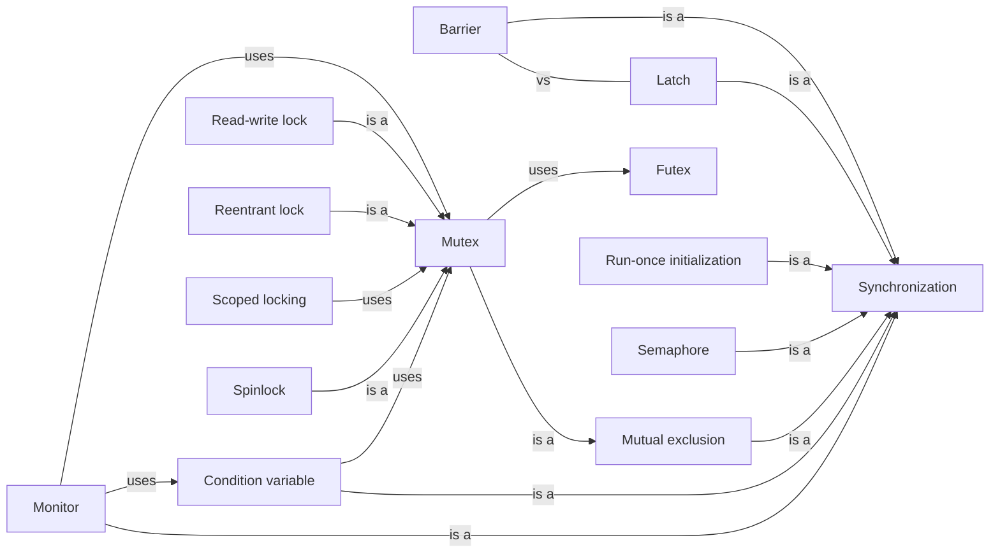

# Synchronization

The primitives that make tasks take turns or wait for each other: locks, condition variables, semaphores, latches and barriers.

[All categories](../README.md) · [How they connect](../schema/README.md)

- [Synchronization](synchronization/README.md) — Coordinating concurrent tasks so that their interactions happen safely — only one at a time, or one waiting until another is ready.
    - [Mutual exclusion](mutual_exclusion/README.md) — The guarantee that at most one task is inside a critical section at any moment.
        - [Mutex](mutex/README.md) — A lock that one task holds at a time; any other task that tries to take it waits until it is released.
            - [Spinlock](spinlock/README.md) — A lock that waits by looping and retrying instead of sleeping, which pays off only when it is held for very short times.
            - [Read-write lock](read_write_lock/README.md) — A lock that lets many readers in at once but lets a writer in only alone.
            - [Reentrant lock](reentrant_lock/README.md) — A lock that the thread already holding it may take again without deadlocking itself; it is released only when every acquisition has been undone.
    - [Condition variable](condition_variable/README.md) — Lets a thread that holds a lock sleep until another thread signals that what it waits for may now be true; wake-ups can be spurious, so the condition is checked again in a loop.
    - [Monitor](monitor/README.md) — An object whose methods all run under one built-in lock, with condition variables for waiting inside it — Java's `synchronized` with `wait` and `notify`.
    - [Semaphore](semaphore/README.md) — A counter of permits: taking one waits while none are left, and returning one lets a waiter in — a lock that up to n tasks may hold at once.
    - [Latch](latch/README.md) — A one-shot gate: tasks wait on it until a set number of other tasks have each signalled, then every waiter proceeds and the gate stays open.
    - [Barrier](barrier/README.md) — A meeting point for a fixed number of tasks: each waits there until all of them have arrived, then all continue together.
    - [Run-once initialization](once_initialization/README.md) — Running an initializer exactly once however many threads ask for it at the same moment, and handing all of them the same result.
- [Critical section](critical_section/README.md) — A stretch of code that touches shared state and must not be run by two tasks at once.
- [Lock poisoning](lock_poisoning/README.md) — Marking a lock as suspect when a thread panics while holding it, so that the next thread to take it learns the data may be half-updated.
- [Scoped locking](scoped_lock/README.md) — Tying a lock's release to leaving a scope — a guard object, `defer`, `with`, `synchronized` — so that no path out of the code can forget to unlock.
- [Lock ordering](lock_ordering/README.md) — Always taking locks in one agreed order, so that no cycle of tasks waiting on each other — and so no deadlock — can form.
- [Futex](futex/README.md) — A Linux kernel facility for building locks: the uncontended case is a single atomic operation in user space, and only a thread that has to wait enters the kernel.
- [Classic synchronization problems](classic_synchronization_problems/README.md) — Small puzzles that each stand for a family of real bugs: the dining philosophers (deadlock and starvation), readers and writers, producer and consumer, the sleeping barber.

## Inside this category

<!-- Generated above this line by tools/build_concepts.py from TOML data — edit the data, not the page. Hand-written notes go below it and are kept. -->
