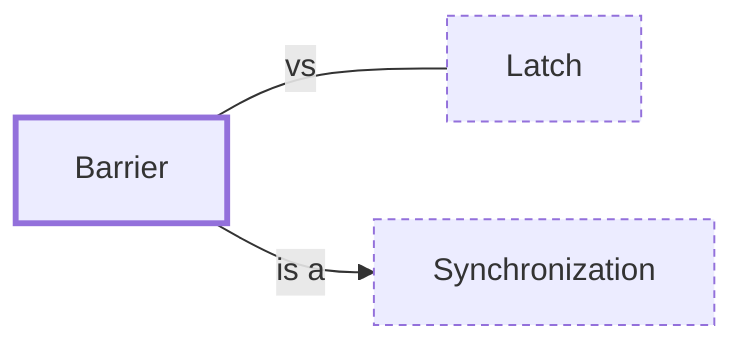

# Barrier

**Category:** [Synchronization](../README.md) · **Status:** stub · **Lessons:** [chapter 04, Waiting for each other](../../../04_Waiting_For_Each_Other/README.md)

**One line:** A meeting point for a fixed number of tasks: each waits there until all of them have arrived, then all continue together.

Also called: CyclicBarrier, std::sync::Barrier, rendezvous.

## How it connects

- **Is a kind of:** [Synchronization](../synchronization/README.md)
- **Often confused with:** [Latch](../latch/README.md)

## In each language

| | |
|---|---|
| Rust | [`std::sync::Barrier` ↗](https://doc.rust-lang.org/std/sync/struct.Barrier.html) enables multiple threads to synchronize the beginning of some computation |
| Go | None in `sync`; closing a channel releases every goroutine waiting to receive from it, because [after `close` ↗](https://go.dev/ref/spec#Close) receives no longer block |
| Java | [`CyclicBarrier` ↗](https://docs.oracle.com/en/java/javase/25/docs/api/java.base/java/util/concurrent/CyclicBarrier.html) can be reset and reused; if one waiter is interrupted or times out, the others leave with `BrokenBarrierException` |
| Python | [`threading.Barrier` ↗](https://docs.python.org/3/library/threading.html#barrier-objects): a timeout or `abort` breaks it, and waiters get `BrokenBarrierError` |
| C# | [`Barrier` ↗](https://learn.microsoft.com/en-us/dotnet/api/system.threading.barrier) is reused through several phases of an algorithm |
| The operating system | POSIX [`pthread_barrier_wait` ↗](https://pubs.opengroup.org/onlinepubs/9799919799/functions/pthread_barrier_wait.html) returns `PTHREAD_BARRIER_SERIAL_THREAD` to one arbitrary thread and zero to the others |

## Where to read more

- **In this library:** [Is total += n safe on two threads?](../../../02_Shared_State/the_lost_update/README.md)
- **In this library:** [How do N threads wait for each other?](../../../04_Waiting_For_Each_Other/a_barrier_and_a_latch/README.md)
- **In a sibling library:** [Go: A buffered channel as a semaphore ↗](https://masiarek.github.io/go-learning-library/06_Patterns/a_buffered_channel_as_a_semaphore/index.html)
- **In the books:** [*Learn Concurrent Programming with Go*](../../../10_Resources/books_go/README.md#cutajar_learn_concurrent_programming_with_go), James Cutajar — ch. 6, 'Synchronizing with waitgroups and barriers'
- **In the books:** [*Hands-On Concurrency with Rust*](../../../10_Resources/books_rust/README.md#troutwine_hands_on_concurrency_with_rust), Brian L. Troutwine — ch. 5, 'Locks – Mutex, Condvar, Barriers and RWLock'
- **In the books:** [*The Art of Multiprocessor Programming*](../../../10_Resources/books_general/README.md#herlihy_shavit_art_of_multiprocessor_programming), Maurice Herlihy, Nir Shavit — ch. 17, 'Barriers'
- **In the books:** [*Concurrency with Modern C++*](../../../10_Resources/books_cpp/README.md#grimm_concurrency_with_modern_cpp), Rainer Grimm — ch. 6, 'The Future: C++20/23' → 'Latches and Barriers'
- **In the books:** [*Pro Asynchronous Programming with .NET*](../../../10_Resources/books_csharp_dotnet/README.md#blewett_clymer_pro_asynchronous_programming_dotnet), Richard Blewett, Andrew Clymer — ch. 4, 'Basic Thread Safety' → 'Barrier: Rendezvous-Based Synchronization'
- **In the books:** [*Data Parallel C++*](../../../10_Resources/books_cpp/README.md#reinders_data_parallel_cpp), James Reinders, Ben Ashbaugh, James Brodman, Michael Kinsner, John Pennycook, Xinmin Tian — ch. 9, 'Communication and Synchronization' → 'Using Work-Group Barriers and Local Memory'
- **Notes:** [std::barrier - C++ ↗](https://docs.google.com/document/u/0/d/1rZl9ENxfdmr-e77AKoAvwtFNt1Wfg5xd8glex-lWeXM/edit)
- **Notes:** [Synchronisation Patterns - C++ ↗](https://docs.google.com/document/u/0/d/1HNxows1jQ3CjB-e8hWScZUU9bp1fUuaU0PnGnOBN6Dk/edit)

<!-- Generated above this line by tools/build_concepts.py from TOML data — edit the data, not the page. Hand-written notes go below it and are kept. -->
