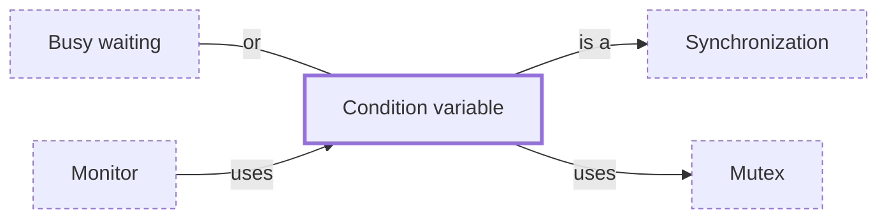

# Condition variable

**Category:** [Synchronization](../README.md) · **Status:** stub · **Lessons:** chapter 04, Waiting for each other *(planned)*

**One line:** Lets a thread that holds a lock sleep until another thread signals that what it waits for may now be true; wake-ups can be spurious, so the condition is checked again in a loop.

Also called: condvar, spurious wakeup, guarded block, wait and notify.

## How it connects

- **Is a kind of:** [Synchronization](../synchronization/README.md)
- **Is built on:** [Mutex](../mutex/README.md)
- **Is used by:** [Monitor](../monitor/README.md)
- **An alternative to:** [Busy waiting](../../scheduling/busy_waiting/README.md)
- **See also:** [Concurrency primitives](../../foundations/concurrency_primitives/README.md)

## In each language

| | |
|---|---|
| Rust | [`Condvar` ↗](https://doc.rust-lang.org/std/sync/struct.Condvar.html): `wait` is susceptible to spurious wakeups, and `wait_while` checks the predicate for you |
| Go | [`sync.Cond` ↗](https://pkg.go.dev/sync#Cond), whose docs say most simple uses are better off with channels: `Broadcast` is like closing one, `Signal` like sending on one |
| C | [`cnd_wait` ↗](https://en.cppreference.com/w/c/thread/cnd_wait) returns when signalled or on a spurious wake-up |
| C++ | [`std::condition_variable::wait` ↗](https://en.cppreference.com/w/cpp/thread/condition_variable/wait) may wake spuriously; the overload taking a predicate loops for you |
| Java | A [`Condition` ↗](https://docs.oracle.com/en/java/javase/25/docs/api/java.base/java/util/concurrent/locks/Condition.html) from a `Lock`, or [`Object.wait` ↗](https://docs.oracle.com/en/java/javase/25/docs/api/java.base/java/lang/Object.html) inside `synchronized`; both permit spurious wakeups |
| Python | [`threading.Condition` ↗](https://docs.python.org/3/library/threading.html#condition-objects); `wait_for` automates the condition check |
| C# | [`Monitor.Wait` ↗](https://learn.microsoft.com/en-us/dotnet/api/system.threading.monitor) with `Pulse` and `PulseAll`, called by the thread that owns the lock |
| JavaScript | [`Atomics.wait` ↗](https://developer.mozilla.org/en-US/docs/Web/JavaScript/Reference/Global_Objects/Atomics/wait) and `Atomics.notify` on shared memory; `wait` cannot be used on the main thread |
| The operating system | POSIX [`pthread_cond_wait` ↗](https://pubs.opengroup.org/onlinepubs/9799919799/functions/pthread_cond_wait.html): spurious wakeups may occur |

## Where to read more

- **In the books:** [*Learn Concurrent Programming with Go*](../../../10_Resources/books_go/README.md#cutajar_learn_concurrent_programming_with_go), James Cutajar — ch. 5, 'Condition variables and semaphores'
- **In the books:** [*Hands-On Concurrency with Rust*](../../../10_Resources/books_rust/README.md#troutwine_hands_on_concurrency_with_rust), Brian L. Troutwine — ch. 5, 'Locks – Mutex, Condvar, Barriers and RWLock'
- **In the books:** [*Pthreads Programming*](../../../10_Resources/books_c/README.md#nichols_pthreads_programming), Bradford Nichols, Dick Buttlar, Jacqueline Proulx Farrell — ch. 3, 'Synchronizing Pthreads' → 'Condition Variables'
- **In the books:** [*Concurrency with Modern C++*](../../../10_Resources/books_cpp/README.md#grimm_concurrency_with_modern_cpp), Rainer Grimm — ch. 3, 'Multithreading' → 'Condition Variables'
- **In the books:** [*Concurrent Programming on Windows*](../../../10_Resources/books_csharp_dotnet/README.md#duffy_concurrent_programming_on_windows), Joe Duffy — ch. 6, 'Data and Control Synchronization' → 'Condition Variables'
- **In the books:** [*Python Asyncio Jump-Start*](../../../10_Resources/books_python/README.md#brownlee_python_asyncio_jump_start), Jason Brownlee — ch. 5, 'Queues and Synchronization Primitives' → 'How to Coordinate Using a Condition Variable'
- **Reference:** [Wikipedia: Monitor — condition variables ↗](https://en.wikipedia.org/wiki/Monitor_(synchronization)#Condition_variables_2)

<!-- Generated above this line by tools/build_concepts.py from TOML data — edit the data, not the page. Hand-written notes go below it and are kept. -->
