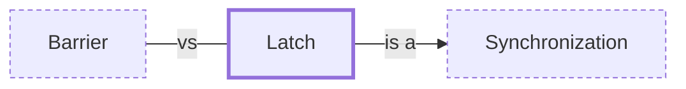

# Latch

**Category:** [Synchronization](../README.md) · **Status:** stub · **Lessons:** [chapter 04, Waiting for each other](../../../04_Waiting_For_Each_Other/README.md)

**One line:** A one-shot gate: tasks wait on it until a set number of other tasks have each signalled, then every waiter proceeds and the gate stays open.

Also called: CountDownLatch, std::latch, CountdownEvent.

## How it connects

- **Is a kind of:** [Synchronization](../synchronization/README.md)
- **Often confused with:** [Barrier](../barrier/README.md)
- **See also:** [Semaphore](../semaphore/README.md)

## In each language

| | |
|---|---|
| Go | [`sync.WaitGroup` ↗](https://pkg.go.dev/sync#WaitGroup), a counting semaphore typically used to wait for a group of goroutines to finish |
| C++ | [`std::latch` ↗](https://en.cppreference.com/w/cpp/thread/latch) (C++20), a downward counter that threads can block on until it reaches zero |
| Java | [`CountDownLatch` ↗](https://docs.oracle.com/en/java/javase/25/docs/api/java.base/java/util/concurrent/CountDownLatch.html): a one-shot phenomenon, the count cannot be reset |
| Python | No counted latch; [`threading.Event` ↗](https://docs.python.org/3/library/threading.html#event-objects) is a flag that `wait` blocks on until it is set |
| C# | [`CountdownEvent` ↗](https://learn.microsoft.com/en-us/dotnet/api/system.threading.countdownevent) is signaled when its count reaches zero |

## Where to read more

- **In this library:** [Is total += n safe on two threads?](../../../02_Shared_State/the_lost_update/README.md)
- **In this library:** [How do N threads wait for each other?](../../../04_Waiting_For_Each_Other/a_barrier_and_a_latch/README.md)
- **In the books:** [*Concurrency with Modern C++*](../../../10_Resources/books_cpp/README.md#grimm_concurrency_with_modern_cpp), Rainer Grimm — ch. 6, 'The Future: C++20/23' → 'Latches and Barriers'
- **In the books:** [*Functional and Concurrent Programming*](../../../10_Resources/books_scala_jvm_functional/README.md#charpentier_functional_and_concurrent_programming), Michel Charpentier — ch. 23, 'Common Synchronizers' → 'Latches and Barriers'
- **Notes:** [Latches - C++ ↗](https://docs.google.com/document/d/1WpU_f2wtATL4GFhpqVgWLe5M2FxI5XXYh9vwtzRDIEY/edit?tab=t.0)

<!-- Generated above this line by tools/build_concepts.py from TOML data — edit the data, not the page. Hand-written notes go below it and are kept. -->
