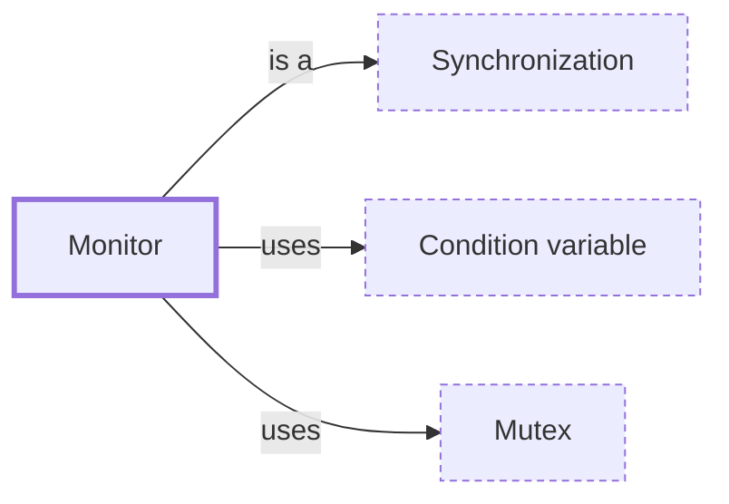

# Monitor

**Category:** [Synchronization](../README.md) · **Status:** stub · **Lessons:** chapter 04, Waiting for each other *(planned)*

**One line:** An object whose methods all run under one built-in lock, with condition variables for waiting inside it — Java's `synchronized` with `wait` and `notify`.

Also called: synchronized, intrinsic lock.

## How it connects

- **Is a kind of:** [Synchronization](../synchronization/README.md)
- **Is built on:** [Condition variable](../condition_variable/README.md), [Mutex](../mutex/README.md)

## In each language

| | |
|---|---|
| Rust | No monitor type: a [`Mutex<T>` ↗](https://doc.rust-lang.org/std/sync/struct.Mutex.html) holds the data and a [`Condvar` ↗](https://doc.rust-lang.org/std/sync/struct.Condvar.html) waits on its guard |
| Go | No monitor: a [`sync.Cond` ↗](https://pkg.go.dev/sync#Cond) carries a `Locker` that must be held when the condition changes and when calling `Wait` |
| Java | Every object has one: [JLS §17.1 ↗](https://docs.oracle.com/javase/specs/jls/se25/html/jls-17.html#jls-17.1) `synchronized` locks it, and [`Object.wait` ↗](https://docs.oracle.com/en/java/javase/25/docs/api/java.base/java/lang/Object.html), `notify` and `notifyAll` wait inside it |
| Python | [`threading.Condition` ↗](https://docs.python.org/3/library/threading.html#condition-objects) bundles a lock with `wait` and `notify` |
| C# | [`Monitor` ↗](https://learn.microsoft.com/en-us/dotnet/api/system.threading.monitor): `Enter` and `Exit`, and `Wait`, `Pulse` and `PulseAll` inside; the `lock` statement uses it |
| Kotlin | [`@Synchronized` ↗](https://kotlinlang.org/api/core/kotlin-stdlib/kotlin.jvm/-synchronized/) marks the generated JVM method as synchronized |

## Where to read more

- **In the books:** [*The Art of Multiprocessor Programming*](../../../10_Resources/books_general/README.md#herlihy_shavit_art_of_multiprocessor_programming), Maurice Herlihy, Nir Shavit — ch. 8, 'Monitors and Blocking Synchronization'
- **In the books:** [*Modern Multithreading*](../../../10_Resources/books_general/README.md#carver_tai_modern_multithreading), Richard H. Carver, Kuo-Chung Tai — ch. 4, 'Monitors'
- **In the books:** [*Concurrency with Modern C++*](../../../10_Resources/books_cpp/README.md#grimm_concurrency_with_modern_cpp), Rainer Grimm — ch. 9, 'Concurrent Architecture' → 'Monitor Object'
- **In the books:** [*Learning Concurrent Programming in Scala*](../../../10_Resources/books_scala_jvm_functional/README.md#prokopec_learning_concurrent_programming_in_scala), Aleksandar Prokopec — ch. 2, 'Concurrency on the JVM and the Java Memory Model' → 'Monitors and synchronization'
- **In the books:** [*Pro Asynchronous Programming with .NET*](../../../10_Resources/books_csharp_dotnet/README.md#blewett_clymer_pro_asynchronous_programming_dotnet), Richard Blewett, Andrew Clymer — ch. 4, 'Basic Thread Safety' → 'Monitor: The Workhorse of .NET Synchronization'
- **In the books:** [*Concurrent Programming: Algorithms, Principles, and Foundations*](../../../10_Resources/books_general/README.md#raynal_concurrent_programming_algorithms), Michel Raynal — ch. 3, 'Lock-Based Concurrent Objects' → 'A Construct for Imperative Languages: the Monitor'
- **Notes:** [synchronized constructs ↗](https://docs.google.com/document/d/1YgMesPh7_i5Hw63tY4pQgmN3cHiLmpMU0Q_3cXG0DAg/edit?tab=t.0)
- **Reference:** [Wikipedia: Monitor (synchronization) ↗](https://en.wikipedia.org/wiki/Monitor_(synchronization))

<!-- Generated above this line by tools/build_concepts.py from TOML data — edit the data, not the page. Hand-written notes go below it and are kept. -->
