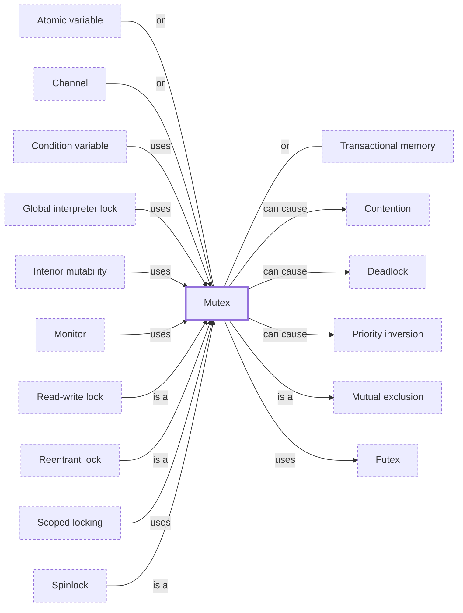

# Mutex

**Category:** [Synchronization](../README.md) · **Status:** stub · **Lessons:** chapter 02, Shared state *(planned)*

**One line:** A lock that one task holds at a time; any other task that tries to take it waits until it is released.

Also called: lock, mutual exclusion lock.

## How it connects

- **Is a kind of:** [Mutual exclusion](../mutual_exclusion/README.md)
- **Kinds:** [Read-write lock](../read_write_lock/README.md), [Reentrant lock](../reentrant_lock/README.md), [Spinlock](../spinlock/README.md)
- **Is built on:** [Futex](../futex/README.md)
- **Is used by:** [Condition variable](../condition_variable/README.md), [Global interpreter lock](../../parallelism/gil/README.md), [Interior mutability](../../safety_in_languages/interior_mutability/README.md), [Monitor](../monitor/README.md), [Scoped locking](../scoped_lock/README.md)
- **Can lead to:** [Contention](../../hazards/contention/README.md), [Deadlock](../../hazards/deadlock/README.md), [Priority inversion](../../hazards/priority_inversion/README.md)
- **An alternative to:** [Atomic variable](../../lock_free/atomic_variable/README.md), [Channel](../../communication/channel/README.md), [Transactional memory](../../lock_free/transactional_memory/README.md)
- **See also:** [Concurrency primitives](../../foundations/concurrency_primitives/README.md), [Lock poisoning](../lock_poisoning/README.md)

## In each language

| | |
|---|---|
| Rust | [`std::sync::Mutex` ↗](https://doc.rust-lang.org/std/sync/struct.Mutex.html) contains the data it guards; the guard unlocks when dropped, and a panic while holding it poisons the lock |
| Go | [`sync.Mutex` ↗](https://pkg.go.dev/sync#Mutex): the zero value is unlocked, it must not be copied after first use, and it is not tied to the goroutine that locked it; `Lock` returns nothing, so there is no poisoning |
| C | [`mtx_t` ↗](https://en.cppreference.com/w/c/thread/mtx_init) from C11 `<threads.h>`: `mtx_plain` or `mtx_timed`, optionally combined with `mtx_recursive` |
| C++ | [`std::mutex` ↗](https://en.cppreference.com/w/cpp/thread/mutex): [locking it again ↗](https://en.cppreference.com/w/cpp/thread/mutex/lock) from the owning thread is undefined behaviour |
| Java | The monitor behind `synchronized`, or [`ReentrantLock` ↗](https://docs.oracle.com/en/java/javase/25/docs/api/java.base/java/util/concurrent/locks/ReentrantLock.html), which behaves like it and adds `tryLock`, timed waits and a fairness option; both are reentrant |
| Python | [`threading.Lock` ↗](https://docs.python.org/3/library/threading.html#lock-objects) is not owned by the thread that locked it; [`RLock` ↗](https://docs.python.org/3/library/threading.html#rlock-objects) is the reentrant one |
| C# | The [`lock` statement ↗](https://learn.microsoft.com/en-us/dotnet/csharp/language-reference/statements/lock) on a [`System.Threading.Lock` ↗](https://learn.microsoft.com/en-us/dotnet/api/system.threading.lock), or on any reference object through `Monitor` |
| Kotlin | [`Mutex` ↗](https://kotlinlang.org/api/kotlinx.coroutines/kotlinx-coroutines-core/kotlinx.coroutines.sync/-mutex/) in kotlinx.coroutines suspends the coroutine instead of blocking a thread, and is non-reentrant |
| Swift | [`Mutex` ↗](https://developer.apple.com/documentation/synchronization/mutex) in the Synchronization module protects shared mutable state via mutual exclusion |
| Haskell | An [`MVar` ↗](https://hackage.haskell.org/package/base/docs/Control-Concurrent-MVar.html) holding `()`: `takeMVar` to lock, `putMVar` to unlock, with FIFO wake-ups |
| The operating system | POSIX [`pthread_mutex_lock` ↗](https://pubs.opengroup.org/onlinepubs/9799919799/functions/pthread_mutex_lock.html) with normal, error-checking, recursive and robust mutexes; on Linux they are built on [futexes ↗](https://man7.org/linux/man-pages/man7/futex.7.html) |

## Where to read more

- **In a sibling library:** [Rust: Sharing across threads: Arc ↗](https://masiarek.github.io/rust-learning-library/18_Ownership/sharing_across_threads/index.html)
- **In a sibling library:** [Go: A mutex guards a counter ↗](https://masiarek.github.io/go-learning-library/04_Sync/a_mutex_guards_a_counter/index.html)
- **In the books:** [*Learn Concurrent Programming with Go*](../../../10_Resources/books_go/README.md#cutajar_learn_concurrent_programming_with_go), James Cutajar — ch. 4, 'Synchronization with mutexes'
- **In the books:** [*Hands-On Concurrency with Rust*](../../../10_Resources/books_rust/README.md#troutwine_hands_on_concurrency_with_rust), Brian L. Troutwine — ch. 5, 'Locks – Mutex, Condvar, Barriers and RWLock'
- **In the books:** [*Multi-Threaded Programming in C++*](../../../10_Resources/books_cpp/README.md#walmsley_multithreaded_programming_in_cpp), Mark Walmsley — ch. 3, 'Mutexes'
- **In the books:** [*Pthreads Programming*](../../../10_Resources/books_c/README.md#nichols_pthreads_programming), Bradford Nichols, Dick Buttlar, Jacqueline Proulx Farrell — ch. 3, 'Synchronizing Pthreads' → 'Mutex Variables'
- **In the books:** [*Python Asyncio Jump-Start*](../../../10_Resources/books_python/README.md#brownlee_python_asyncio_jump_start), Jason Brownlee — ch. 5, 'Queues and Synchronization Primitives' → 'How to Protect Critical Sections with a Mutex Lock'
- **In the books:** [*Multithreaded JavaScript*](../../../10_Resources/books_javascript/README.md#hunter_english_multithreaded_javascript), Thomas Hunter II, Bryan English — ch. 6, 'Multithreaded Patterns' → 'Mutex: A Basic Lock'
- **Notes:** [Locks in general - concurrency ↗](https://docs.google.com/document/d/1NP9uyNLSCaTpUwQa08VvqI3qD226R9-pvtIOAf0XlKg/edit)
- **Notes:** [Mutexes in general - concurrency ↗](https://docs.google.com/document/d/1JGosAZ9FWuQSc90co5JH2ZZmJg21CcJt9kY56tcg0Ek/edit)
- **Notes:** [Mutexes and Spinlocks in general - C++ ↗](https://docs.google.com/document/d/1wwututLXE2Lpx997jfg-DzDgb8L88zyNuYe8GF8OXVE/edit?tab=t.0)
- **Notes:** [parking_lot ↗](https://docs.google.com/document/d/1EiehFfa6Cb-fEeY6WY8mowS6YvWqiPIaWWylFzgZ-BM/edit?tab=t.0)
- **Reference:** [Wikipedia: Lock (computer science) ↗](https://en.wikipedia.org/wiki/Lock_(computer_science))

<!-- Generated above this line by tools/build_concepts.py from TOML data — edit the data, not the page. Hand-written notes go below it and are kept. -->
