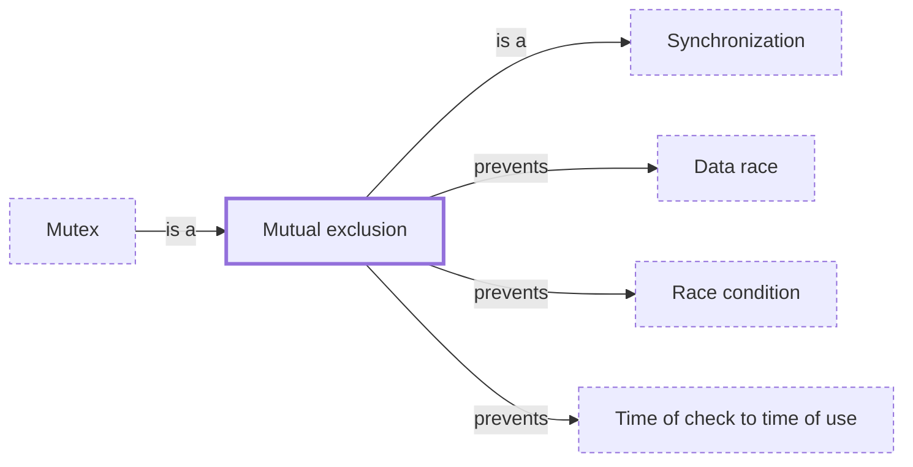

# Mutual exclusion

**Category:** [Synchronization](../README.md) · **Status:** stub · **Lessons:** chapter 02, Shared state *(planned)*

**One line:** The guarantee that at most one task is inside a critical section at any moment.

Also called: exclusive access.

## How it connects

- **Is a kind of:** [Synchronization](../synchronization/README.md)
- **Kinds:** [Mutex](../mutex/README.md)
- **Helps prevent:** [Data race](../../hazards/data_race/README.md), [Race condition](../../hazards/race_condition/README.md), [Time of check to time of use](../../hazards/toctou/README.md)
- **See also:** [Critical section](../critical_section/README.md), [Shared memory](../../communication/shared_memory/README.md)

## In each language

| | |
|---|---|
| Rust | Enforced by types: a [`Mutex<T>` ↗](https://doc.rust-lang.org/std/sync/struct.Mutex.html) owns its data, reachable only through the guard that `lock` returns |
| Go | The [memory model ↗](https://go.dev/ref/mem): programs must serialize access to shared data, with channel operations or the `sync` and `sync/atomic` primitives |
| JavaScript | The [Web Locks API ↗](https://developer.mozilla.org/en-US/docs/Web/API/Web_Locks_API) lets a script in one tab or worker hold a named lock while it works |
| Erlang and Elixir | Little shared memory to exclude: [all data in messages between processes is copied ↗](https://www.erlang.org/doc/system/eff_guide_processes.html), except refc binaries and literals |

## Where to read more

- **In the books:** [*Concurrent Programming: Algorithms, Principles, and Foundations*](../../../10_Resources/books_general/README.md#raynal_concurrent_programming_algorithms), Michel Raynal — ch. 1, 'The Mutual Exclusion Problem'
- **In the books:** [*The Art of Multiprocessor Programming*](../../../10_Resources/books_general/README.md#herlihy_shavit_art_of_multiprocessor_programming), Maurice Herlihy, Nir Shavit — ch. 2, 'Mutual Exclusion'
- **In the books:** [*Distributed Computing*](../../../10_Resources/books_general/README.md#kshemkalyani_singhal_distributed_computing), Ajay D. Kshemkalyani, Mukesh Singhal — ch. 9, 'Distributed Mutual Exclusion Algorithms'
- **In the books:** [*Mastering C++ Multithreading*](../../../10_Resources/books_cpp/README.md#posch_mastering_cpp_multithreading), Maya Posch — ch. 2, 'Multithreading Implementation on the Processor and OS' → 'Mutual exclusion implementations'
- **In the books:** [*Concurrent Programming on Windows*](../../../10_Resources/books_csharp_dotnet/README.md#duffy_concurrent_programming_on_windows), Joe Duffy — ch. 6, 'Data and Control Synchronization' → 'Mutual Exclusion'
- **In the books:** [*Distributed Graph Algorithms for Computer Networks*](../../../10_Resources/books_other/README.md#erciyes_distributed_graph_algorithms), K. Erciyes — ch. 8, 'Self-Stabilization' → 'Dijkstra’s Self-Stabilizing Mutual Exclusion Algorithm'
- **Notes:** [Mutual Exclusion ↗](https://docs.google.com/document/d/13UdhepCAsU6CKWgXDv5PtIK3kGiZC_TxaVVJrQa18FE/edit?tab=t.0)
- **Reference:** [Wikipedia: Mutual exclusion ↗](https://en.wikipedia.org/wiki/Mutual_exclusion)

<!-- Generated above this line by tools/build_concepts.py from TOML data — edit the data, not the page. Hand-written notes go below it and are kept. -->
