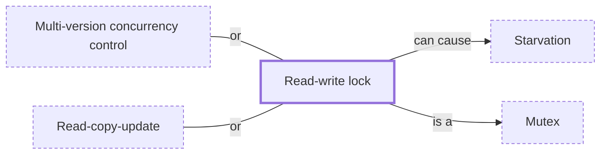

# Read-write lock

**Category:** [Synchronization](../README.md) · **Status:** stub · **Lessons:** chapter 02, Shared state *(planned)*

**One line:** A lock that lets many readers in at once but lets a writer in only alone.

Also called: RwLock, shared-exclusive lock, shared lock, readers-writer lock, RWMutex, shared_mutex.

## How it connects

- **Is a kind of:** [Mutex](../mutex/README.md)
- **Can lead to:** [Starvation](../../hazards/starvation/README.md)
- **An alternative to:** [Multi-version concurrency control](../../distributed/mvcc/README.md), [Read-copy-update](../../lock_free/rcu/README.md)
- **See also:** [Classic synchronization problems](../classic_synchronization_problems/README.md)

## In each language

| | |
|---|---|
| Rust | [`RwLock` ↗](https://doc.rust-lang.org/std/sync/struct.RwLock.html): the reader-writer priority policy is left to the operating system, and taking it again on the same thread might panic |
| Go | [`sync.RWMutex` ↗](https://pkg.go.dev/sync#RWMutex): a waiting writer blocks new readers, which rules out recursive read-locking; `RLock` cannot be upgraded to `Lock` |
| C++ | [`std::shared_mutex` ↗](https://en.cppreference.com/w/cpp/thread/shared_mutex) (C++17): shared access for readers, exclusive for a writer |
| Java | [`ReentrantReadWriteLock` ↗](https://docs.oracle.com/en/java/javase/25/docs/api/java.base/java/util/concurrent/locks/ReentrantReadWriteLock.html) with an optional fair mode; [`StampedLock` ↗](https://docs.oracle.com/en/java/javase/25/docs/api/java.base/java/util/concurrent/locks/StampedLock.html) adds optimistic reads but is not reentrant |
| C# | [`ReaderWriterLockSlim` ↗](https://learn.microsoft.com/en-us/dotnet/api/system.threading.readerwriterlockslim), which by default does not allow recursion |
| The operating system | POSIX [`pthread_rwlock_rdlock` ↗](https://pubs.opengroup.org/onlinepubs/9799919799/functions/pthread_rwlock_rdlock.html): a reader gets the lock if no writer holds it and no writers are blocked on it |

## Where to read more

- **In a sibling library:** [Rust: RwLock and atomics ↗](https://masiarek.github.io/rust-learning-library/09_Advanced/rwlock_and_atomics/index.html)
- **In the books:** [*Hands-On Concurrency with Rust*](../../../10_Resources/books_rust/README.md#troutwine_hands_on_concurrency_with_rust), Brian L. Troutwine — ch. 5, 'Locks – Mutex, Condvar, Barriers and RWLock'
- **In the books:** [*Learn Concurrent Programming with Go*](../../../10_Resources/books_go/README.md#cutajar_learn_concurrent_programming_with_go), James Cutajar — ch. 4, 'Synchronization with mutexes' → 'Improving performance with readers–writer mutexes'
- **In the books:** [*Pthreads Programming*](../../../10_Resources/books_c/README.md#nichols_pthreads_programming), Bradford Nichols, Dick Buttlar, Jacqueline Proulx Farrell — ch. 3, 'Synchronizing Pthreads' → 'Reader/Writer Locks'
- **In the books:** [*Concurrent Programming on Windows*](../../../10_Resources/books_csharp_dotnet/README.md#duffy_concurrent_programming_on_windows), Joe Duffy — ch. 6, 'Data and Control Synchronization' → 'Reader/Writer Locks (RWLs)'
- **In the books:** [*The Little Book of Semaphores*](../../../10_Resources/books_general/README.md#downey_little_book_of_semaphores), Allen B. Downey — ch. 4, 'Classical synchronization problems' → 'Readers-writers problem'
- **In the books:** [*Rust Atomics and Locks*](../../../10_Resources/books_rust/README.md#bos_rust_atomics_and_locks), Mara Bos — ch. 1, 'Basics of Rust Concurrency' → 'Locking: Mutexes and RwLocks'
- **Reference:** [Wikipedia: Readers–writer lock ↗](https://en.wikipedia.org/wiki/Readers%E2%80%93writer_lock)

<!-- Generated above this line by tools/build_concepts.py from TOML data — edit the data, not the page. Hand-written notes go below it and are kept. -->
